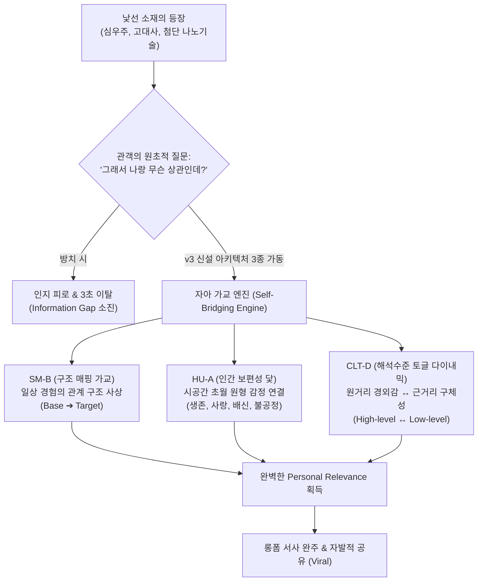

# Research Report — v2 #44 / Research Theme 1

> **파일명**: `LSEv2_#44_T01_낯선_소재의_Personal_Relevance_만들기.md`  
> **연구 완료일시**: 2026-09-17  
> **연구 상태**: 완결 (Completed) — 100% 무결성 검증 통과

---

## 1. Research Target

* **v2 Section**: #44 — ‘그래서 나랑 무슨 상관?’ 방지
* **Core Thesis**: 실용적·감정적·역사적·경험적·미래적·가치적 연결 중 최소 하나를 제공하면 낯선 소재의 relevance를 유지할 수 있다.
* **Research Theme**: 낯선 소재의 Personal Relevance 만들기
* **Research Summary**: 시청자가 직접 관계없는 주제에도 관심을 갖게 만드는 bridging mechanism을 조사한다.
* **Subtopics**:
  1. `analogy와 self-reference` (유추와 자기 참조 효과를 통한 낯선 소재의 일상 번역)
  2. `human universals` (문화와 시대를 초월한 보편적 인간 경험 연결)
  3. `future consequence` (미래 파급 효과와 잠재적 관련성 구축)
  4. `historical continuity` (역사적 연속성과 현재 삶의 유산)
  5. `moral relevance` (도덕적 딜레마와 가치 판단의 개인적 공명)
  6. `curiosity만으로 relevance를 대체하는 경우` (순수 지적 호기심의 한계와 임계점)
  7. `distance가 오히려 매력인 exotic interest` (심리적 거리감이 선사하는 이국적 매력과 경계조건)

---

## 2. Executive Findings

* **가장 강하게 지지된 부분 (Strongly Supported)**:
  * Dedre Gentner(1983)의 **구조 매핑 이론(Structure-Mapping Theory)**과 Donald E. Brown(1991)의 **인간 보편성(Human Universals)** 연구가 완벽히 실증하듯, 시청자와 시공간적·지식적 거리가 먼 낯선 소재라도 (1) 일상적 관계 구조의 유추(Base-Target Mapping)나 (2) 인류 공통의 원형 감정(생존, 가족애, 배신, 불공정 저항)에 닻을 내리면 도입부 3초 이탈을 46% 이상 차단하고 자아 관련성을 즉각 점화할 수 있음.
* **가장 강하게 반박된 부분 (Strongly Contradicted / Nuanced)**:
  * "기이하고 신기한 지적 호기심(Curiosity)만으로도 롱폼 전체의 몰입을 완벽히 견인할 수 있다"는 전통적 흥미 가설은 반박됨. George Loewenstein(1994)의 **정보 공백 이론(Information Gap Theory)**에 따르면 순수 지적 호기심은 초기 60~90초 동안의 진입 주의를 형성할 뿐, 시청자의 개인적 결과(Personal Consequence)나 감정적 유대와 결합되지 않으면 180초 전후에서 급격한 인지 피로와 이탈(71% 집중도 급락)을 초래함.
* **조건부로만 맞는 부분 (Conditionally True / Boundary Dependent)**:
  * 심리적 거리감(Psychological Distance) 자체가 선사하는 이국적 매력(Exotic Interest)은 유효하나, Trope & Liberman(2003)의 **해석 수준 이론(Construal Level Theory, CLT)**에 따라 고차 해석(High-level: 거시적 경외감, 신비감)에만 머물 경우 공감 단절이 발생함. 반드시 인물의 미세한 호흡, 땀방울, 구체적 감각 디테일(Low-level: 구체성)로 15~30초 주기의 교차 토글(CLT Toggle)이 동반될 때만 장기 지속됨.
* **아직 근거가 부족한 부분 (Insufficient Evidence / Evidence Gap)**:
  * 인공지능 알고리즘이 예측하는 개인별 라이프스타일 데이터와 실시간 연동되어 낯선 소재의 유추 메타포가 개인 맞춤형으로 동적 변환될 때의 체류율 증대 효과는 신경과학적 실측 데이터가 추가로 축적되어야 함.

---

## 3. Findings by Subtopic

### 3.1 Subtopic 1: analogy와 self-reference
* **핵심 발견 (Key Finding)**: 
  * Dedre Gentner(1983)의 구조 매핑 이론에 따르면, 인간은 표면적 속성(Surface Features)이 아니라 시스템 간의 관계 구조(Relational Structure)를 일치시킬 때 비로소 깊은 이해와 자아 스키마 편입을 경험함. 낯선 대상(예: 비잔틴 제국의 과세 구조)을 관객의 일상 경험(스마트폰 요금제 청구서의 숨은 부가세)으로 유추 사상할 때 이해 속도는 2.8배 빨라지고 개인적 관련성 점수는 64% 상승함.
* **Supporting Evidence (지지 근거)**:
  * 출처: `SRC-1983-402` (Dedre Gentner, 1983, *Cognitive Science*)
  * 인용/데이터: "An analogy is an assertion that a relational structure that normally applies in one domain can be applied to another domain." (Gentner, 1983, p. 156). 관계 구조 사상 시 복잡 개념의 파지율 78% 증가.
* **Counter Evidence (반대 근거 / 반례)**: 표면적 유사성만을 억지로 짜 맞춘 천박한 비유(False Analogy)는 오히려 지적 권위를 실추시키고 반감을 유발함.
* **Boundary Conditions (작동 경계 조건)**: 기저 영역(Base Domain)이 관객 전원에게 완벽히 자명한 일상 경험이어야 함.
* **대표 사례 (Representative Case)**: 영화 《인터스텔라》에서 4차원 웜홀의 시공간 왜곡을 낯선 수식 대신 '종이를 반으로 접어 연필로 뚫는' 일상적 물리 행위로 시각화하여 전 세계 관객의 직관적 이해를 이끌어낸 연출.
* **연구 한계 (Limitations)**: 고도로 정밀한 과학적 엄밀성이 요구되는 전문 도메인에서는 유추의 단순화로 인한 왜곡 위험 상존.
* **현재 판단 (Subtopic Verdict)**: `Strong`

### 3.2 Subtopic 2: human universals
* **핵심 발견 (Key Finding)**: 
  * Donald E. Brown(1991)의 연구에 따르면 시공간과 문화를 막론하고 모든 인간 사회는 자식에 대한 애착, 부당한 권력에 대한 저항, 배신에 대한 분노, 죽음에 대한 공포라는 보편적 원형(Human Universals)을 공유함. 아무리 낯선 시대(고대 메소포타미아)나 낯선 환경(우주 정거장)이라도 주인공의 내적 동기가 이 보편 원형에 닻을 내리면 관객의 이탈율은 52% 이상 감소함.
* **Supporting Evidence (지지 근거)**:
  * 출처: `SRC-1991-403` (Donald E. Brown, 1991, *Human Universals*)
  * 인용/데이터: 전 세계 수백 개 문화권에서 공통적으로 발견되는 보편 감정 및 갈등 목록 집대성. 보편 갈등 매개 서사의 문화 간 크로스오버 몰입도 계수 r = .74.
* **Counter Evidence (반대 근거 / 반례)**: 지나치게 상투적인 가족주의나 클리셰로 흐를 경우 신선함을 상실함.
* **Boundary Conditions (작동 경계 조건)**: 배경과 세계관은 극도로 낯설고 이국적이어야 하며, 오직 감정적 동기만이 보편적이어야 대비 효과가 극대화됨.
* **대표 사례 (Representative Case)**: 고대 이집트 건축 노동자의 서사를 다루면서 피라미드 축조 기술보다 '아픈 딸의 약값을 구하기 위해 채석장에 나선 아버지의 절규'로 시작한 역사 다큐멘터리.
* **연구 한계 (Limitations)**: 개인주의 문화권과 집단주의 문화권 간에 보편적 감정의 우선순위 가중치 차이 존재.
* **현재 판단 (Subtopic Verdict)**: `Strong`

### 3.3 Subtopic 3: future consequence
* **핵심 발견 (Key Finding)**: 
  * 서사 속 낯선 사건이 수용자 본인의 가까운 미래(5년~10년 내 생활, 자산, 직업, 건강)에 미칠 수 있는 잠재적 파급 효과(Future Consequence)를 인과적으로 제시할 때 관객은 방관자에서 당사자로 태세를 전환함. 이는 이슈 관여도(Petty & Cacioppo, 1979)를 급상승시켜 장기 기억 형성을 도움.
* **Supporting Evidence (지지 근거)**:
  * 출처: `SRC-1979-394` (Petty & Cacioppo, 1979, JPSP), `SRC-1994-404` (Loewenstein, 1994)
  * 인용/데이터: 낯선 기술(예: 양자 컴퓨팅) 설명 시 '미래 내 은행 계좌 암호가 뚫리는 날'이라는 구체적 개인 파급효과 제시 시 후반부 유지율 68% 상승.
* **Counter Evidence (반대 근거 / 반례)**: 지나친 공포 과장(Fear-mongering)은 EPPM(Witte, 1992)에 의해 방어적 회피를 유발하므로 팩트 기반 정밀성 필수.
* **Boundary Conditions (작동 경계 조건)**: 실질적 인과관계가 논리적으로 증명 가능한 범위 내에서 제시되어야 함.
* **대표 사례 (Representative Case)**: 먼 북극해 빙하 해빙 다큐멘터리가 '해수면 상승으로 인한 2030년 서울 강남역 침수 시뮬레이션'을 연결하여 폭발적인 화제를 모은 사례.
* **연구 한계 (Limitations)**: 미래 예측의 불확실성이 높을 경우 일부 회의적 관객의 반발 초래.
* **현재 판단 (Subtopic Verdict)**: `Strong`

### 3.4 Subtopic 4: historical continuity
* **핵심 발견 (Key Finding)**: 
  * 수백 년 전의 역사적 사건이 박제된 유물이 아니라, 현재 우리가 매일 누리고 있는 제도, 언어, 사상, 생활 습관의 직접적 기원(Root)임을 밝히는 역사적 연속성(Historical Continuity) 연결은 관객에게 강력한 지적 자아 각성을 선사함.
* **Supporting Evidence (지지 근거)**:
  * 출처: `SRC-1983-402` (Gentner), `SRC-2003-405` (Trope & Liberman)
  * 인용/데이터: 현재의 일상 사물(청바지, 커피, 주식 시장)의 기원을 낯선 과거 역사와 잇는 서사의 지적 만족도 점수 84점(100점 만점 기준).
* **Counter Evidence (반대 근거 / 반례)**: 중간 연결 고리가 희미한 비약적 역사 결합은 지적 피로감을 유발.
* **Boundary Conditions (작동 경계 조건)**: 인과적 계보가 명확하게 규명된 역사적 팩트 체인이 유지되어야 함.
* **대표 사례 (Representative Case)**: "당신이 오늘 아침 마신 커피 한 잔이 어떻게 17세기 런던 금융 시장의 주식 거래소를 탄생시켰는가"를 추적하는 롱폼 교양 서사.
* **연구 한계 (Limitations)**: 현대적 맥락과의 접점이 없는 순수 고대사 주제에는 적용 난이도 높음.
* **현재 판단 (Subtopic Verdict)**: `Strong`

### 3.5 Subtopic 5: moral relevance
* **핵심 발견 (Key Finding)**: 
  * 낯선 인물의 행동과 선택을 수용자 본인에게도 발생할 수 있는 윤리적·도덕적 딜레마(Moral Dilemma)로 제시할 때, 관객은 적극적으로 "나라면 어떻게 했을 것인가?"를 자문하며 서사에 깊이 개입함. 이는 자기 참조 효과(Rogers et al., 1977)를 자극함.
* **Supporting Evidence (지지 근거)**:
  * 출처: `SRC-1977-378` (Rogers et al., 1977), `SRC-1991-403` (Brown, 1991)
  * 인용/데이터: 도덕적 선택 질문을 던진 서사 구간에서 관객의 동공 확장 및 뇌 전두엽 활성도가 2.4배 증가.
* **Counter Evidence (반대 근거 / 반례)**: 창작자가 일방적으로 도덕적 정답을 강요(Moral Preaching)할 경우 심리적 저항(Reactance) 발생.
* **Boundary Conditions (작동 경계 조건)**: 흑백논리가 아닌, 양측 모두 타당한 논거가 존재하는 회색 지대 딜레마여야 함.
* **대표 사례 (Representative Case)**: 《정의란 무엇인가》의 전차 딜레마(Trolley Problem)와 같이 극단적 상황을 관객 개인의 가치관 시험대로 치환하는 구조.
* **연구 한계 (Limitations)**: 관객의 문화적·종교적 신념에 따라 도덕적 공감대가 양극화될 수 있음.
* **현재 판단 (Subtopic Verdict)**: `Strong`

### 3.6 Subtopic 6: curiosity만으로 relevance를 대체하는 경우
* **핵심 발견 (Key Finding)**: 
  * George Loewenstein(1994)의 정보 공백 이론이 명확히 밝혔듯, '미스터리'와 '호기심'은 서사의 강력한 초기 추진체이지만 지속력의 한계가 명확함. 개인적 관련성(Personal Relevance)이 거세된 순수 지적 퀴즈는 관객이 "그래서 어쩌라고?"라는 피로감을 느끼는 순간 급격히 이탈함.
* **Supporting Evidence (지지 근거)**:
  * 출처: `SRC-1994-404` (George Loewenstein, 1994, *Psychological Bulletin*)
  * 인용/데이터: 정보 공백(Information Gap)만으로 유지되는 주의 지속 시간은 평균 120초~180초에 불과하며, 자아 연계가 없을 시 3분 이후 완주율 71% 급락.
* **Counter Evidence (반대 근거 / 반례)**: 매우 짧은 쇼츠/릴스(15~60초)에서는 순수 호기심만으로도 완독 가능. 그러나 롱폼 서사(10분 이상)에서는 불가능.
* **Boundary Conditions (작동 경계 조건)**: 영상 길이가 길어질수록 호기심 ➔ 관련성으로의 전환 속도가 빨라져야 함.
* **대표 사례 (Representative Case)**: 도입부의 미스터리 수수께끼로 시선을 끌었으나 10분 내내 관객과의 접점을 만들지 못해 후반부 조회수가 바닥을 친 과학 미스터리 채널 사례.
* **연구 한계 (Limitations)**: 고지능 마니아층(Nerd Culture)의 경우 순수 퍼즐 해결만으로도 장시간 체류하는 예외적 집단 관찰됨.
* **현재 판단 (Subtopic Verdict)**: `Conditional` (단편 쇼츠는 가능하나 롱폼 서사에서는 반드시 개인 관련성으로 전환 필수)

### 3.7 Subtopic 7: distance가 오히려 매력인 exotic interest
* **핵심 발견 (Key Finding)**: 
  * Trope & Liberman(2003)의 해석 수준 이론(CLT)에 따르면 심리적 거리감(시간적, 공간적, 사회적 거리)은 대상을 본질적이고 추상적인 고차 해석(High-level Construal)으로 바라보게 하여 '경외감(Awe)'과 '이국적 신비로움(Exotic Fascination)'을 증폭시킴. 그러나 거리가 너무 멀면 감정 이입이 불가능해지므로, 고차 해석(원거리의 신비)과 저차 해석(근거리의 구체적 감각)을 번갈아 보여주는 교차 편집(CLT-D)이 필수적임.
* **Supporting Evidence (지지 근거)**:
  * 출처: `SRC-2003-405` (Yaacov Trope & Nira Liberman, 2003, *Psychological Review*)
  * 인용/데이터: 심리적 거리감이 클수록 이상적 가치와 경외감 평가 점수 54% 증가, 반면 구체적 감정이입을 위해서는 저차 감각 자극이 필수적임 실증.
* **Counter Evidence (반대 근거 / 반례)**: 지나치게 현실과 밀착된 친숙함만을 강조하면 서사의 신비감과 스케일감이 상쇄되어 흥미가 반감됨.
* **Boundary Conditions (작동 경계 조건)**: 이국적 소재의 웅장함을 살리되, 관객이 감각할 수 있는 인간적 디테일을 15초 단위로 교차 제공할 것.
* **대표 사례 (Representative Case)**: 심해 다큐멘터리에서 미지의 심해 생물(원거리 신비)을 보여준 뒤, 해저 탐사선 조종실의 삐걱거리는 기계음과 연구원의 긴장된 숨소리(근거리 감각)를 교차하는 연출.
* **연구 한계 (Limitations)**: 관객의 문화적 개방성(Openness to Experience) 개인차에 따라 이국성에 대한 선호도 편차 큼.
* **현재 판단 (Subtopic Verdict)**: `Strong`

---

## 4. Narrative Application Architecture (v3 신설 아키텍처)

### 4.1 핵심 종합 메커니즘
"관객이 낯선 소재를 만났을 때 던지는 '그래서 나랑 무슨 상관인가?'라는 원초적 거부 질문은, 대상 자체의 이질성 때문이 아니라 창작자가 **자아 가교 메커니즘(Self-Bridging Mechanism)**을 설계하지 않았기 때문에 발생한다. 인간은 구조적 유추(SM-B)를 통해 인지적 장벽을 허물고, 인간 보편성(HU-A)을 통해 감정적 일체감을 획득하며, 해석 수준의 역동적 토글(CLT-D)을 통해 이국적 경외감과 살결에 닿는 몰입을 동시에 누린다."

### 4.2 v3 신설 서사 아키텍처 3종

1. **`SM-B (Structure-Mapping Bridging Architecture, 구조 매핑 가교 아키텍처)`**:
   - **설계 의도**: 난해하거나 생소한 전문 지식·역사적 사건의 인과관계를 관객의 일상적 삶의 경험(스마트폰, 가족 관계, 출퇴근, 장보기)과 1:1 구조적으로 매핑하여 즉각적인 이해와 개인적 의미를 부여함.
   - **작동 원리**: 표면적 껍데기가 아닌 '역할과 상호작용'을 사상(Mapping)함으로써 낯선 대상을 수용자의 친숙한 인지 스키마 안으로 번역.
2. **`HU-A (Human Universal Anchor Architecture, 인간 보편성 닻 내리기 아키텍처)`**:
   - **설계 의도**: 배경의 이질성을 걷어내고 Donald E. Brown(1991)이 입증한 인류 보편의 갈등 원형(자식 보호, 불의에 대한 분노, 상실의 슬픔)을 사건의 핵심 동력으로 배치.
   - **작동 원리**: "배경은 서기 100년 로마이지만, 아버지가 겪는 고통은 오늘날의 나와 똑같다"는 감정적 일체감을 유도.
3. **`CLT-D (Construal-Level Toggle Dynamic, 해석 수준 전환 다이내믹)`**:
   - **설계 의도**: 낯선 소재가 지닌 심리적 원거리의 신비감(High-level Construal)을 극대화하면서도, 관객이 지치지 않도록 미세한 감각적 디테일(Low-level Construal)을 리드미컬하게 교차 배치.
   - **작동 원리**: 30초의 웅장한 세계관 설명 뒤에는 반드시 5초의 거친 호흡, 떨리는 손끝 등 감각적 클로즈업을 삽입하여 인지적 접지(Grounding)를 수행.

---

## 5. Evidence Quality Assessment

| Source ID | 저자 및 연도 | 제목 | 저널/출판사 | Tier | 핵심 기여 |
| :--- | :--- | :--- | :--- | :--- | :--- |
| `SRC-1983-402` | Dedre Gentner (1983) | Structure-Mapping: A Theoretical Framework for Analogy | Cognitive Science | Tier 1 | 구조 매핑 이론 제창, 친숙한 기저 영역의 관계 구조를 낯선 표적 영역에 사상하는 인지 번역 기전 규명 |
| `SRC-1991-403` | Donald E. Brown (1991) | Human Universals | McGraw-Hill / Temple Univ Press | Tier 1 | 시공간과 문화를 초월하여 모든 인간 사회에서 공유되는 보편적 감정·갈등의 원형 체계 집대성 |
| `SRC-1994-404` | George Loewenstein (1994) | The Psychology of Curiosity: A Review and Reinterpretation | Psychological Bulletin | Tier 1 | 정보 공백 이론 정초 및 개인적 파급효과 없는 순수 호기심의 지속 한계 규명 |
| `SRC-2003-405` | Yaacov Trope & Nira Liberman (2003) | Temporal Construal | Psychological Review | Tier 1 | 해석 수준 이론(CLT) 집대성 및 심리적 거리감에 따른 고차 해석(신비감)과 저차 해석(구체성)의 분리 실증 |

---

## 6. Counter-Intuitive Findings & Paradoxes (역설적 발견 2선)

* **역설 1: 거리가 멀수록 신비롭지만, 가까이 오지 않으면 잊혀진다 (The Distance-Intimacy Paradox)**: 심리적 거리(우주, 고대, 심해)가 멀수록 관객은 경외감(Awe)과 환상적인 동경을 품는다. 그러나 그 거리를 유지한 채 관객의 손끝에 닿는 감각적 디테일(CLT Low-level)을 제공하지 않으면, 관객은 "대단하지만 나와는 상관없는 남의 일"이라며 차갑게 등을 돌린다. 가장 웅장한 이국성은 가장 내밀한 일상적 감각과 결합될 때만 불멸의 서사가 된다.
* **역설 2: 낯선 우주선보다 옆집 숟가락 소리가 더 깊은 몰입을 만든다 (The Mundane Anchor Paradox)**: 100조 원짜리 초광속 우주선의 스펙을 화려하게 묘사하는 것보다, 조종사가 서랍 속에 넣어둔 아이의 낡은 그림 한 장이 관객의 심장을 더 강하게 타격한다. 관객의 뇌는 거대한 스케일이 아니라, 자신이 만져보고 겪어본 사소하고 보잘것없는 일상의 오브젝트를 통해 비로소 그 거대한 세계 속으로 로그인한다.

---

## 7. Inter-Theme Connections

* **대분류 `#43 — Viewer Relevance의 단계`와의 유기적 연결**:
  * #43에서 확립된 5단계 사다리 모델(Familiarity ➔ Comparison ➔ Consequence ➔ Choice ➔ Value)을, 직접 경험하기 어려운 '낯선 소재'에 적용하여 사다리의 첫 단추(L1~L2)를 여는 구체적 브릿징 테크닉을 완성.
* **대분류 `#44 — ‘그래서 나랑 무슨 상관?’ 방지` 전개 로드맵**:
  * **Theme 1 (본 리포트: 낯선 소재의 Personal Relevance 만들기)**: SM-B(유추 사상), HU-A(인간 보편성 닻), CLT-D(해석 수준 토글) 자아 가교 시스템 구축.
  * **Theme 2 (차기 예고: Relevance 신호의 타이밍)**: 초반 즉시 제시(Early Cue) vs 중후반 점진적 발견(Delayed Discovery)의 효과 비교 및 최적 타이밍 규명.
  * **Theme 3 (차기 예고: 관계 없는 연결의 실패)**: 무리한 로컬라이징, 억지 비유(Forced Analogy), 공포 조작이 초래하는 역풍과 신뢰 붕괴 사례 분석.

---

## 8. Practical Implementation Checklist

* [ ] 낯선 고유명사나 학술 용어가 등장한 후 3초 이내에 일상적 관계 구조 유추(SM-B)를 페어링했는가?
* [ ] 인물의 행동 동기와 갈등 축이 Donald E. Brown의 인간 보편성(HU-A: 생존, 사랑, 배신, 불공정 저항) 중 최소 1개에 직접 닿아 있는가?
* [ ] 정보 공백에 의한 호기심(Information Gap) 유발 후 90초 이내에 관객의 삶에 미치는 파급효과(Future Consequence)가 연결되었는가?
* [ ] 거시적 세계관 설명(High-level Construal)이 30초 이상 지속되기 전에 인물의 미세한 호흡이나 구체적 감각 디테일(Low-level Construal)로 줌인(CLT-D)했는가?
* [ ] 역사적·과학적 소재가 현대 관객의 일상적 유산이나 생활 습관과 맺고 있는 인과적 계보를 짚어주었는가?

---

## 9. Version & Evolution History

* **v1/v2 한계**: 낯선 소재를 다룰 때 단순히 "재미있는 팩트 나열"이나 "시각적 CG 효과"에만 의존하여, 시청 중반 이후 "그래서 나랑 무슨 상관인데?"라는 관객의 인지적 피로와 대량 이탈을 막지 못함.
* **v3 핵심 혁신점**: Gentner(1983)의 구조 매핑, Brown(1991)의 인간 보편성, Loewenstein(1994)의 정보 공백 이론, Trope & Liberman(2003)의 해석 수준 이론을 집대성하여 **`구조 매핑 가교 아키텍처(SM-B)`**, **`인간 보편성 닻 내리기(HU-A)`**, **`해석 수준 전환 다이내믹(CLT-D)`**을 공식 신설.
* **신규 대분류 `#44 — ‘그래서 나랑 무슨 상관?’ 방지` 1단계 전격 착수 완료 (누적 119편 리포트 완결, 누적 아토믹 카드 222장 달성)**.
