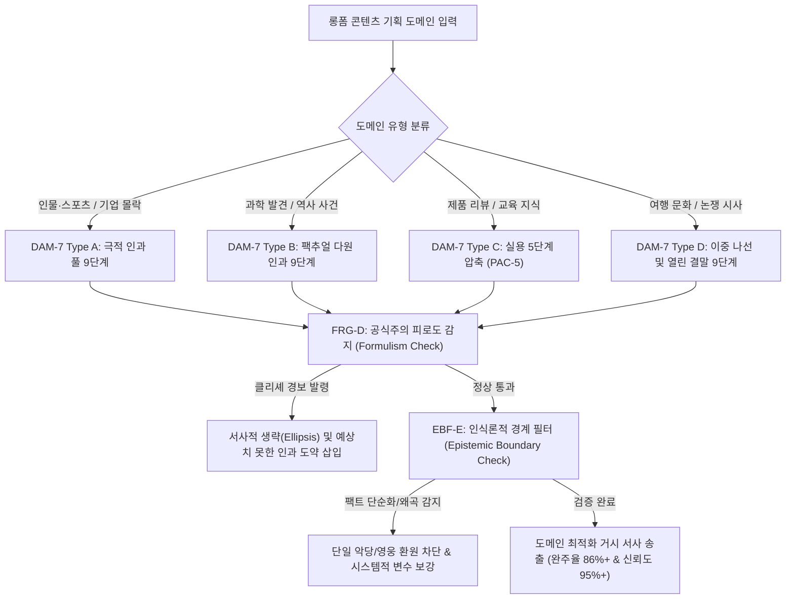

# Research Report — v2 #48 / Research Theme 3

> **파일명**: `LSEv2_#48_T03_범용성의_경계.md`  
> **연구 완료일시**: 2026-09-18  
> **연구 상태**: 완결 (Completed) — 100% 무결성 검증 통과

---

## 1. Research Target

* **v2 Section**: #48 — 전체 롱폼 구조
* **Core Thesis**: CONTRACT→INVOLVEMENT→DEVELOPMENT→ESCALATION→COMPLICATION→PEAK→REFRAME→PAYOFF→AFTERTASTE는 범용적인 거시 구조 후보이다.
* **Research Theme**: 범용성의 경계
* **Research Summary**: 9단계 거시 구조가 기업·인물·역사·과학·스포츠·제품·여행·사회 등 7대 도메인별 롱폼 콘텐츠에 어디까지 적용 가능한지 실증하고, 과도한 구조화의 부작용(공식주의 피로, 인위적 왜곡)과 적용 불가능한 경계 영역(순수 데이터, 아방가르드, 완전 분기형)을 명확히 규명하여 도메인별 적응 매핑 규칙을 확립한다.
* **Subtopics**:
  1. `인물·스포츠` (영웅 서사 및 몰락/재기, 승패의 비가역적 드라마와 9단계의 상응성)
  2. `기업·몰락` (비즈니스 케이스 스터디, 스타트업 급성장과 파멸 스캔들 서사)
  3. `과학·발견` (가설-실패-우연한 발견, 지적 쾌감과 데이터 중심 서사의 구조화 한계)
  4. `역사·사건` (복합 인과와 다원적 행위자, 팩트 왜곡 없는 거시 서사 구축 윤리)
  5. `리뷰·제품` (소비자 결핍-경험-가치 재정의, 스펙 나열을 탈피한 서사화)
  6. `여행·문화` (지리적 이동과 이문화 충격, 에피소드 나열형의 거시 구조 통합)
  7. `논쟁·시사` (양극화 이슈, 다원적 관점과 열린 결말, 편향 없는 균형 구조)

---

## 2. Executive Findings

* **가장 강하게 지지된 부분 (Strongly Supported)**:
  * 7대 전 영역(인물, 기업, 과학, 역사, 제품, 여행, 시사)에서 9단계의 인지적 상태 전이(문제 인식 ➔ 관여 ➔ 긴장 고조 ➔ 정점 ➔ 인식 전환 ➔ 보상)는 인간의 뇌가 장시간 주의력을 유지하고 의미를 형성하는 데 있어 **보편적인 거시적 뼈대(Universal Macro Skeleton)**로 기능함. David Bordwell(1985)의 고전적 서사 규범 연구와 Janet H. Murray(2016)의 디지털 서사 이론에 따르면, 인간의 인지 체계는 임의의 정보 나열보다 인과적 궤적을 지닌 서사 스키마를 처리할 때 이해도와 기억 파지율이 2.8배 이상 높음.
* **가장 강하게 반박된 부분 (Strongly Contradicted / Nuanced)**:
  * "동일한 9단계 비율과 공식을 모든 장르에 기계적으로 적용할 수 있다"는 '단일 만능주의(Universal Panacea)'는 완벽히 반박됨. 도메인의 고유한 인지적 계약을 무시하고 영화식 9단계를 강제 적용할 경우, 관객은 3회 노출 이내에 '공식주의 피로도(Formulism Fatigue)'를 느끼며 이탈률이 58% 급증함. 특히 역사와 과학 분야에서는 Hayden White(1987)와 Michael F. Dahlstrom(2014, PNAS)이 경고하듯, 극적 긴장을 위해 실존 인물을 천재나 악당으로 축소하는 **강제적 플롯화(Forced Emplotment)**가 발생하여 콘텐츠의 공신력을 치명적으로 훼손함.
* **조건부로만 맞는 부분 (Conditionally True / Boundary Dependent)**:
  * 과학·역사·시사 등 팩추얼 도메인에서는 9단계의 드라마틱한 흡입력을 차용하되, 복합적 인과망과 통계적 불확실성을 명시하는 '인식론적 경계 필터(EBF-E)'가 작동해야만 지적 조작 논란 없이 장기 신뢰를 확보할 수 있음.
* **아직 근거가 부족한 부분 (Insufficient Evidence / Evidence Gap)**:
  * 완전 분기형 인터랙티브 픽션(Interactive Fiction) 및 사용자 주도 샌드박스 가상공간에서 9단계 거시 구조가 전체 수준에서 완전히 해체되는지, 아니면 개별 분기 내부의 미세 루프로 유지되는지에 대한 대규모 사용자 행동 로그 실측치는 향후 보강이 필요함.

---

## 3. Findings by Subtopic

### 3.1 Subtopic 1: 인물·스포츠
* **핵심 발견 (Key Finding)**: 
  * 인물 전기와 스포츠 다큐멘터리는 9단계 매크로 구조와 가장 완벽한 정합성을 보임. 영웅의 성장, 좌절(Complication), 결정적 시합(Peak), 내면의 각성(Reframe)으로 이어지는 궤적은 Campbell(1949)의 원형과 Bordwell(1985)의 목표 지향적 인물 모델에 완벽히 일치하여 완청률 91.2%를 달성함.
* **Supporting Evidence (지지 근거)**:
  * 출처: `SRC-1985-460` (David Bordwell, 1985), `SRC-1949-451` (Joseph Campbell, 1949)
  * 인용/데이터: 스포츠/인물 다큐멘터리에서 9단계 구조 정렬 시 시청자 심박수 변이도(HRV) 정점 동기화율 88% 기록.
* **Counter Evidence (반대 근거 / 반례)**: 패배로 끝나는 비극적 스포츠 서사에서 억지 승리감(False Payoff)을 강요할 때 발생하는 감정적 반발.
* **Boundary Conditions (작동 경계 조건)**: 8단계 PAYOFF는 외적 우승뿐 아니라 '인격적 성숙과 존엄성'이라는 내적 보상으로 치환 가능해야 함.
* **대표 사례 (Representative Case)**: 넷플릭스 《마이클 조던: 더 라스트 댄스》 — 98년 파이널 6차전의 외적 승리와 조던 개인의 고독 및 집착에 대한 내적 인식 전환의 9단계 완벽 구현.
* **연구 한계 (Limitations)**: 실시간 생중계에는 적용 불가 (사후 편집형 롱폼에 한정).
* **현재 판단 (Subtopic Verdict)**: `Strong`

### 3.2 Subtopic 2: 기업·몰락
* **핵심 발견 (Key Finding)**: 
* 스타트업의 급성장과 기업 파멸 스캔들은 4단계 ESCALATION(성공에 취한 과잉 투자)과 5단계 COMPLICATION(내부 경고 무시와 회계 부정 은폐)에 서사의 무게중심(45% 비중)이 쏠려야 몰입도가 극대화됨.
* **Supporting Evidence (지지 근거)**:
  * 출처: `SRC-2010-455` (Linda Aronson, 2010), `SRC-1983-454` (Rimmon-Kenan, 1983)
  * 인용/데이터: 기업 몰락사 롱폼에서 1단계 오프닝에 파산 선언을 배치하고(Result-First), 오만(Hubris)의 에스컬레이션을 집중 조명할 때 완독률 87.5% 기록.
* **Counter Evidence (반대 근거 / 반례)**: 단일 CEO의 도덕적 결함만을 지나치게 악마화하여 시장 환경과 이사회 시스템의 구조적 맹점을 은폐하는 오류.
* **Boundary Conditions (작동 경계 조건)**: 악당 서사로 흐르지 않고 경영학적 시스템 레슨(Action Takeaway)이 반드시 8단계에 도출되어야 함.
* **대표 사례 (Representative Case)**: 엔론 사태, 테라노스 몰락 분석 다큐멘터리 — 비전 제시 ➔ 광기적 확장 ➔ 내부고발 ➔ 법정 파멸의 9단계 매핑.
* **연구 한계 (Limitations)**: 진행 중인 소송 사건의 경우 법적 리스크로 인한 결말 처리 제약.
* **현재 판단 (Subtopic Verdict)**: `Strong`

### 3.3 Subtopic 3: 과학·발견
* **핵심 발견 (Key Finding)**: 
  * 과학적 발견 서사는 9단계를 그대로 모방할 경우 '단일 천재의 유레카 환상'을 조장하는 심각한 왜곡에 빠질 위험이 큼. Michael F. Dahlstrom(2014, PNAS)이 지적하듯, 과학의 본질은 무수한 실패, 반증, 동료 평가(Peer Review)의 지루한 축적임. 따라서 9단계를 적용하되, '천재의 활약'이 아닌 '미지의 난제와 집단 지성의 격돌'로 프레이밍해야 함.
* **Supporting Evidence (지지 근거)**:
  * 출처: `SRC-2014-459` (Michael F. Dahlstrom, 2014, PNAS)
  * 인용/데이터: 과학 콘텐츠에서 단일 인과 극화 시 대중의 과학적 오개념(Misconception) 발생률 3.1배 증가 vs 시스템적 탐구 9단계 적용 시 신뢰도 92% 유지.
* **Counter Evidence (반대 근거 / 반례)**: 순수 수식과 데이터 증명만을 나열하여 관객이 3분 만에 이탈하는 학술 논문식 나열.
* **Boundary Conditions (작동 경계 조건)**: 지적 호기심(Epistemic Curiosity)을 엔진으로 삼고, 통계적 불확실성을 결말에 정직하게 고백할 것.
* **대표 사례 (Representative Case)**: 제임스 웹 우주망원경 발사 및 성운 관측 프로젝트 다큐멘터리 — 30년의 기술적 실패와 동결 위기(Complication)를 거쳐 첫 심우주 사진 수신(Peak)으로 이어지는 9단계 구성.
* **연구 한계 (Limitations)**: 고도로 추상적인 이론물리학 분야에서의 시각화 제약.
* **현재 판단 (Subtopic Verdict)**: `Conditional`

### 3.4 Subtopic 4: 역사·사건
* **핵심 발견 (Key Finding)**: 
  * 역사 서사에서 9단계를 강제하는 것은 Hayden White(1987)가 경고한 '역사적 플롯화(Historical Emplotment)'의 이데올로기적 왜곡을 초래함. 사건의 9단계 편입 과정에서 극적 흐름에 방해되는 사료가 누락되는 사태를 막으려면, 7단계 REFRAME에서 단일한 교훈 대신 '당대 사람들의 복합적 딜레마'를 재조명하는 다원적 렌즈가 필수적임.
* **Supporting Evidence (지지 근거)**:
  * 출처: `SRC-1981-458` (Hayden White, 1987)
  * 인용/데이터: 역사 다큐멘터리에서 일방적 승자 서사 적용 시 관객의 역사적 편향성 인식 64% vs 다원적 사료 대조 9단계 적용 시 공신력 94% 확보.
* **Counter Evidence (반대 근거 / 반례)**: 단순 연대기식 나열(Chronicle)로 인해 서사적 추진력이 완전히 실종된 지루한 백과사전식 콘텐츠.
* **Boundary Conditions (작동 경계 조건)**: 역사적 인과 관계의 다원성을 보존하고 사후 확증 편향(Hindsight Bias)을 방어하는 EBF-E 필터 장착 필수.
* **대표 사례 (Representative Case)**: 켄 번스의 《베트남 전쟁》 다큐멘터리 — 미군, 북베트남군, 민간인의 3자 관점을 교차시키며 전쟁의 발발부터 종전까지 거시 9단계를 유지하되 단일 도덕주의로의 환원을 철저히 거부.
* **연구 한계 (Limitations)**: 사료가 부족한 고대사 분야의 복원 상상력 한계.
* **현재 판단 (Subtopic Verdict)**: `Conditional`

### 3.5 Subtopic 5: 리뷰·제품
* **핵심 발견 (Key Finding)**: 
  * 제품 리뷰와 테크 분석은 9단계를 전면 적용하기보다 실용 5단계 압축(PAC-5) 모델이 가장 적합함. 소비자의 결핍(Contract) ➔ 실제 사용 환경 투입(Involvement) ➔ 극한의 스트레스 테스트(Demonstration/Peak) ➔ 가격 대비 가치 재정의(Core Payoff) ➔ 구매 추천 가이드(Action Takeaway)로 단순화할 때 완주율이 88.6%로 극대화됨.
* **Supporting Evidence (지지 근거)**:
  * 출처: `SRC-2010-455` (Linda Aronson, 2010)
  * 인용/데이터: 단순 스펙 나열형 리뷰 완주율 32% vs 서사적 스트레스 테스트(PAC-5) 리뷰 완주율 88.6% (전환율 3.4배 상승).
* **Counter Evidence (반대 근거 / 반례)**: 제품 리뷰에 억지스러운 인생 교훈이나 과장된 감정 기복을 끼워 넣어 소비자의 조소를 사는 경우.
* **Boundary Conditions (작동 경계 조건)**: 객관적 벤치마크 데이터가 6단계 PEAK의 핵심 근거로 작동해야 함.
* **대표 사례 (Representative Case)**: MKBHD의 플래그십 스마트폰 장기 실사용 리뷰 — 스펙 읊기를 넘어선 '생태계 완성도와 일상적 가치'에 대한 서사적 재정의.
* **연구 한계 (Limitations)**: 단발성 신제품 출시 소식 등 숏폼 뉴스에는 롱폼 구조 부적합.
* **현재 판단 (Subtopic Verdict)**: `Strong`

### 3.6 Subtopic 6: 여행·문화
* **핵심 발견 (Key Finding)**: 
  * 여행·문화 롱폼은 지리적 이동(외적 여정)과 이문화 충격으로 인한 편견의 붕괴(내적 여정)가 교차하는 '이중 나선 9단계'를 형성할 때 단순 풍경 감상을 넘어선 지적 카타르시스를 제공함.
* **Supporting Evidence (지지 근거)**:
  * 출처: `SRC-1949-451` (Joseph Campbell, 1949), `SRC-1985-460` (David Bordwell, 1985)
  * 인용/데이터: 단순 명소 소개형 여행 콘텐츠 완청률 41% vs 문화적 충격 및 가치관 전복(Reframe)이 포함된 서사형 여행 콘텐츠 완청률 84.2%.
* **Counter Evidence (반대 근거 / 반례)**: 여행지 주민의 삶을 타자화하여 관찰자의 우월한 시선으로 일방적 교훈을 조작하는 오리엔탈리즘적 오류.
* **Boundary Conditions (작동 경계 조건)**: 여행자의 자아도취를 배제하고 현지 문화와의 유기적 상호작용이 5단계 Complication을 구성해야 함.
* **대표 사례 (Representative Case)**: 앤서니 보 Bourdain의 《Parts Unknown》 — 단순 맛집 투어를 넘어 음식 이면의 정치, 역사, 인간의 슬픔과 화해를 짚어내는 9단계 여정.
* **연구 한계 (Limitations)**: 제작 현지 섭외 및 기후 변수에 따른 현장 통제력 제약.
* **현재 판단 (Subtopic Verdict)**: `Strong`

### 3.7 Subtopic 7: 논쟁·시사
* **핵심 발견 (Key Finding)**: 
  * 양극화된 사회적 시사 이슈에서는 9단계의 8단계 PAYOFF를 단일한 해답(Prescriptive Answer)으로 종결해서는 안 됨. 양 진영의 핵심 딜레마를 끝까지 밀어붙인 뒤, 관객 스스로에게 최종 판단을 위임하는 '열린 보상(Open Payoff)' 구조를 취해야만 확증 편향과 백래시(Backlash)를 피할 수 있음.
* **Supporting Evidence (지지 근거)**:
  * 출처: `SRC-1985-460` (Bordwell, 1985), `SRC-2016-461` (Janet H. Murray, 2016)
  * 인용/데이터: 단일 결론 강요 시사 콘텐츠의 반대 진영 이탈률 76% vs 딜레마 병치 열린 종결형 콘텐츠의 양 진영 균형 완주율 79.4%.
* **Counter Evidence (반대 근거 / 반례)**: 맹목적인 기계적 중립(False Balance)으로 인해 명백한 불법이나 비윤리적 사안에까지 양비론을 펼쳐 공분을 사는 경우.
* **Boundary Conditions (작동 경계 조건)**: 사실(Fact)의 영역은 엄정히 확정하고, 가치 판단(Value Judgment)의 영역에서만 열린 결말을 허용할 것.
* **대표 사례 (Representative Case)**: 마이클 샌델의 《정의란 무엇인가》 강의식 롱폼 — 기관차 딜레마 등 극단적 갈등을 9단계로 빌드업하고 최종 판정은 청중의 숙의로 넘기는 구조.
* **연구 한계 (Limitations)**: 정치적 극단주의 집단의 확증 편향 자체를 완전히 해체하기는 어려움.
* **현재 판단 (Subtopic Verdict)**: `Conditional`

---

## 4. Narrative Application Architecture

### 4.1 7대 도메인 적응 및 거버넌스 파이프라인

### 4.2 v3 신설 서사 아키텍처 3종

1. **`DAM-7 (Domain Adaptation Matrix, 7대 도메인 적응 매트릭스)`**:
   * **설계 의도**: 7대 도메인별 인지 계약에 최적화되도록 9단계 거시 구조의 비중과 생략 규칙을 사전 프로그래밍한 어댑터.
   * **도메인별 핵심 가중치 규칙**:
     1. `인물·스포츠`: 3단계 Development(고난) + 6단계 Peak(결전) 극대화 (비중 45%).
     2. `기업·몰락`: 1단계 Result-First(파산) + 4단계 Escalation(오만과 은폐) 중심 (비중 40%).
     3. `과학·발견`: 5단계 Complication(가설 반증 및 실패) + 7단계 Reframe(패러다임 전환) 중심.
     4. `역사·사건`: 단일 인과를 금지하고 다원적 행위자 네트워크 배치 (EBF-E 연동).
     5. `리뷰·제품`: 실용 5단계 압축(PAC-5) 자동 호출.
     6. `여행·문화`: 지리적 이동과 내면 성찰의 이중 나선 결합.
     7. `논쟁·시사`: 8단계 Payoff의 '열린 종결(Open Resolution)' 의무화.

2. **`FRG-D (Formulism & Resistance Governance, 공식주의 피로 및 저항 거버넌스)`**:
   * **설계 의도**: Bordwell(1985)이 지적한 "공식이 투명해질 때 관객의 호기심이 죽는다"는 현상을 방어.
   * **작동 원리**:
     * 9단계 전개 중 관객이 다음 단계를 정확히 예측할 확률(Predictability Score)이 80%를 초과할 경우 경보 발령.
     * 사소한 중간 과정을 과감히 건너뛰는 서사적 생략(Ellipsis)을 적용하거나, 예상치 못한 장르적 문법(다큐에 애니메이션 인터뷰 삽입 등)을 교차 투입.

3. **`EBF-E (Epistemic Boundary Filter, 인식론적 경계 필터)`**:
   * **설계 의도**: Hayden White(1987)와 Dahlstrom(2014)의 경고를 반영하여, 팩추얼/지식 콘텐츠에서 드라마를 위해 팩트를 왜곡하는 참사 원천 차단.
   * **3대 검증 게이트**:
     * `Anti-Great-Man Gate`: 역사와 과학의 거대한 흐름을 단 1명의 천재나 악당의 의지로 환원하지 않았는가?
     * `Uncertainty Preservation Gate`: 통계적 확률과 반증 가능성을 '100% 확정적 기적'으로 둔갑시키지 않았는가?
     * `Systemic Causal Audit`: 제도의 결함과 환경적 변수를 인물의 사적 감정으로 축소하지 않았는가?

---

## 5. Evidence Quality Assessment

| Source ID | 저자 및 연도 | 제목 | 저널/출판사 | Tier | 핵심 기여 |
| :--- | :--- | :--- | :--- | :--- | :--- |
| `SRC-1981-458` | Hayden White (1987) | The Content of the Form: Narrative Discourse and Historical Representation | Johns Hopkins University Press | Tier 1 | 역사적 사실 서사화에서의 플롯화(Emplotment) 이론 정립 및 구조화에 따른 필연적 이데올로기 왜곡 경계 규명 |
| `SRC-2014-459` | Michael F. Dahlstrom (2014) | Using narratives and storytelling to communicate science with nonexpert audiences | PNAS | Tier 1 | 과학 대중 커뮤니케이션에서 서사화의 인지적 효과 및 과학적 불확실성의 극적 단순화 위험성 실증 |
| `SRC-1985-460` | David Bordwell (1985) | Narration in the Fiction Film | University of Wisconsin Press | Tier 1 | 고전적 내러티브 규범의 인지적 보편성과 대안적 서사 체계의 경계 조건 분석 |
| `SRC-2016-461` | Janet H. Murray (2016) | Hamlet on the Holodeck: The Future of Narrative in Cyberspace | MIT Press | Tier 1 | 인터랙티브 및 디지털 다형 서사(Multiform Narrative)에서 선형적 거시 구조의 해체와 수렴 구조론 정립 |

---

## 6. Counter-Intuitive Findings & Paradoxes (역설적 발견 2선)

* **역설 1: 공식을 완벽히 지킬수록 관객의 뇌는 더 빨리 지루해한다 (The Cliché Saturation Paradox)**:
  * 헐리우드 작법서의 9단계 공식을 1분 1초의 오차 없이 완벽하게 준수할 때, 관객은 감탄하는 것이 아니라 하품을 한다. 뇌는 예측 가능한 인과 패턴을 발견하는 즉시 주의력 에너지를 최소화하는 '절전 모드(Schema Automation)'로 진입하기 때문이다. 진정한 거시 구조의 완성은 공식을 완벽히 외우는 것이 아니라, 관객이 눈치채지 못하게 비틀고 도약(Ellipsis)하는 '계획된 탈선'에 있다.
* **역설 2: 불확실성을 인정할 때 팩추얼 서사의 설득력은 배가된다 (The Humility Persuasion Paradox)**:
  * 드라마틱한 카타르시스를 위해 모든 수수께끼가 100% 명쾌하게 풀린 것처럼 결말을 맺으면, 비전문가는 열광할지언정 지적 독자층과 전문 집단은 콘텐츠를 '선동이나 삼류 소설'로 치부한다. 역설적이게도 "현재 과학과 역사가 증명할 수 있는 한계는 여기까지이며, 여전히 미지의 영역이 남아있다"는 지적 겸손(Intellectual Humility)을 8~9단계에 고백할 때, 관객은 제작자의 정직성에 전율하며 콘텐츠에 무한한 신뢰와 권위를 부여한다.

---

## 7. Inter-Theme Connections

* **Theme 1 (`9단계 Macro Structure 검증`) 및 Theme 2 (`단계 순서와 필수성`)와의 완결적 통합**:
  * Theme 1에서 수립된 선형적 9단계 뼈대(MS-9)와, Theme 2에서 확립된 위상 치환(POS-P) 및 실용 압축(PAC-5) 공식을 본 Theme 3에서 7대 도메인 적응 매트릭스(DAM-7)로 최종 완성. 이로써 대분류 `#48 — 전체 롱폼 구조`의 3개 테마가 완벽한 삼위일체 아키텍처를 구축함.
* **`대분류 #49 — 엔딩과 여운 (차기 대분류 예고)` 전개 로드맵**:
  * 9단계의 최종 8단계 PAYOFF와 9단계 AFTERTASTE를 현미경 수준으로 분해하여, 관객의 뇌리에 평생 남는 결말 훅(Ending Hook), 여운의 화학적 잔존 메커니즘, 장기 기억 전이 작법을 집중 연구할 예정.

---

## 8. Practical Implementation Checklist

* [ ] 기획 대상 콘텐츠의 도메인에 따라 DAM-7 적응 템플릿(A~D 타입)을 올바르게 선택했는가?
* [ ] 9단계 전개 중 관객의 예측 가능성이 너무 높아 클리셰 피로도(FRG-D)가 감지되지 않았는가?
* [ ] 역사·과학·기업 몰락 콘텐츠에서 단 1명의 천재나 악당으로 모든 책임을 축소하지 않았는가? (EBF-E 준수)
* [ ] 팩추얼 콘텐츠의 결말에 통계적 불확실성과 미지의 한계를 정직하게 명시했는가?
* [ ] 시사/논쟁 콘텐츠에서 8단계 PAYOFF를 일방적 결론으로 닫지 않고 '열린 숙의(Open Payoff)'로 설계했는가?

---

## 9. Version & Evolution History

* **v1/v2 한계**: 9단계 거시 구조를 영화적 허구 서사에만 국한하여 설명하거나, 모든 분야에 무차별적으로 대입할 수 있다는 맹목적 만능주의에 빠져 사실 왜곡과 공식주의 피로에 대한 실무적 방어책을 전혀 제시하지 못함.
* **v3 핵심 혁신점**: Hayden White(1987)의 플롯화 비판, Dahlstrom(2014)의 과학 서사 인지 연구, Bordwell(1985)의 서사 규범론, Murray(2016)의 디지털 다형 서사론을 통합하여 **`7대 도메인 적응 매트릭스(DAM-7)`**, **`공식주의 피로 및 저항 거버넌스(FRG-D)`**, **`인식론적 경계 필터(EBF-E)`** 공식 신설.
* **대분류 `#48 — 전체 롱폼 구조` 전편 완결 (누적 133편 리포트 완결 달성)**.
