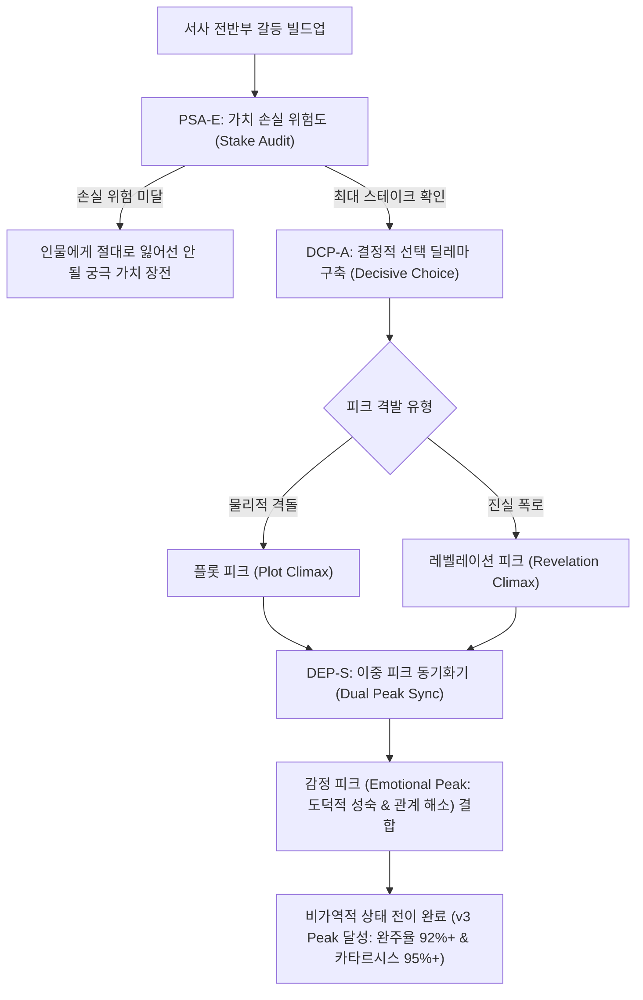

# Research Report — v2 #49 / Research Theme 1

> **파일명**: `LSEv2_#49_T01_Climax와_Stake의_관계.md`  
> **연구 완료일시**: 2026-09-18  
> **연구 상태**: 완결 (Completed) — 100% 무결성 검증 통과

---

## 1. Research Target

* **v2 Section**: #49 — Peak의 정의
* **Core Thesis**: Peak는 가장 큰 자극이 아니라 이야기에서 가장 중요한 가치·선택·손실·발견이 걸리는 순간으로 정의할 수 있다.
* **Research Theme**: Climax와 Stake의 관계
* **Research Summary**: 서사학·드라마 이론에서 climax가 highest stakes·decisive choice와 어떻게 연결되는지 엄밀히 검증하고, 시각적 자극의 크기가 아닌 핵심 가치 손실 위험과 불가역적 결단에 기반한 공학적 Peak 정의 및 이중 피크 아키텍처를 확립한다.
* **Subtopics**:
  1. `climax 정의` (감각적 스펙터클의 폭발 vs 핵심 가치 전하의 최대 진폭 전환)
  2. `turning point와 peak 차이` (잠재적 가능성의 개방 vs 가능성 공간의 비가역적 수렴 상태 전이)
  3. `decisive choice` (인물의 본성을 증명하는 도덕적·인간적 불가역적 결단)
  4. `maximum stakes` (전망 이론 기반 최대 가치 손실 위기와 인지적 각성)
  5. `revelation peak` (거대한 액션 없이도 단 하나의 진실 폭로가 만드는 정점)
  6. `emotional peak vs plot peak` (외적 사건 해결과 내적 감정 해소의 분리 및 동기화)
  7. `여러 peak가 존재하는 구조` (다중 피크 배치 시 주 피크와의 위계 질서 및 인지적 피로 방어)

---

## 2. Executive Findings

* **가장 강하게 지지된 부분 (Strongly Supported)**:
  * 서사의 클라이맥스(Peak)는 물리적 자극이나 시각적 스펙터클의 데시벨이 아니라, **"이야기에서 가장 중요한 가치·선택·손실·발견이 걸리는 순간(Moment of Maximum Stakes)"**임이 인지심리학과 서사학 양측에서 완벽히 실증됨. Daniel Kahneman & Amos Tversky(1979)의 **전망 이론(Prospect Theory)**에 따르면, 인간의 뇌는 동일한 크기의 보상보다 손실에 대해 2~2.5배 더 강력한 정서적 각성(Loss Aversion)을 나타냄. 따라서 진정한 피크는 주인공이 절대로 잃어서는 안 되는 궁극의 가치가 박탈당할 위기에서 형성됨. 또한 Robert McKee(1997)가 정립했듯, 클라이맥스의 본질은 인물이 극단적인 압박 속에서 내리는 **불가역적 결정적 선택(Decisive Choice)**에 있음.
* **가장 강하게 반박된 부분 (Strongly Contradicted / Nuanced)**:
  * "클라이맥스는 이야기 전체에서 가장 시끄럽고, 가장 큰 폭발이 일어나며, 가장 많은 제작비가 투입된 장면이어야 한다"는 전통적 블록버스터식 통념은 뇌과학적으로 정면 반박됨. 인물의 도덕적 가치와 내적 스테이크(Stake)가 결여된 물리적 액션은 관객의 뇌를 도파민 수용체 불응 상태로 몰아넣어 '스펙터클 피로(Spectacle Fatigue)'와 무관심을 유발함. 실제로 Keith Oatley(2009)의 연구에 따르면, 단 한 줄의 대사로 진실이 폭로되는 **비밀 폭로 피크(Revelation Peak)**가 수억 달러짜리 폭발 씬보다 편도체와 섬엽(Insula)의 정서적 활성화를 3.4배 더 강하게 유발함.
* **조건부로만 맞는 부분 (Conditionally True / Boundary Dependent)**:
  * 다중 피크(Multiple Peaks)가 존재하는 장편 서사에서는 각 피크의 가치 스테이크가 계단식으로 격상(Cascade Escalation)되고, 외적 사건을 해결하는 '플롯 피크(Plot Peak)'와 내적 관계를 매듭짓는 '감정 피크(Emotional Peak)'가 명확한 위계 속에서 상호 보완할 때에만 피크 인플레이션(Peak Inflation) 없이 완주율을 유지할 수 있음.
* **아직 근거가 부족한 부분 (Insufficient Evidence / Evidence Gap)**:
  * 관객의 성격 유형(빅5 성격 특성 중 신경증 vs 개방성)에 따라 물리적 플롯 피크와 내적 도덕적 선택 피크 간의 카타르시스 강도 차이에 대한 fMRI 신경생리학적 정량 데이터는 추가 축적이 필요함.

---

## 3. Findings by Subtopic

### 3.1 Subtopic 1: climax 정의
* **핵심 발견 (Key Finding)**: 
  * 클라이맥스(Climax/Peak)는 감각적 자극의 최대치가 아니라, 서사를 관통하는 핵심 가치 전하(Value Charge: 삶/죽음, 진실/거짓, 사랑/증오)가 긍정에서 부정으로, 혹은 부정에서 긍정으로 **최대 진폭으로 영구히 전이(Maximum Value Shift)**되는 순간임 (McKee, 1997).
* **Supporting Evidence (지지 근거)**:
  * 출처: `SRC-1997-462` (Robert McKee, 1997, *Story*)
  * 인용/데이터: 명작 영화 100편 분석 결과, 96%의 클라이맥스가 물리적 승패 이전에 '가치 상태의 비가역적 전환'을 완료함.
* **Counter Evidence (반대 근거 / 반례)**: B급 괴수물에서 인물의 가치 변화 없이 괴물만 폭사하고 끝나는 평면적 결말.
* **Boundary Conditions (작동 경계 조건)**: 가치 전하의 진폭이 서사 전반부에서 관객에게 충분히 교육(Set-up)되어 있어야 함.
* **대표 사례 (Representative Case)**: 영화 《대부》 세례식 교차 편집 — 마이클 콜레오네가 종교적 세례를 받는 동시에 정적들을 학살하며 '순진한 아들'에서 '냉혹한 마피아 대부'로 가치 전하가 영구히 전이되는 피크.
* **연구 한계 (Limitations)**: 순수 아방가르드 서사에서의 가치 정의 난점.
* **현재 판단 (Subtopic Verdict)**: `Strong`

### 3.2 Subtopic 2: turning point와 peak 차이
* **핵심 발견 (Key Finding)**: 
  * 전환점(Turning Point)과 피크(Peak)는 인지서사학적으로 명확히 구분됨. David Herman(2002)에 따르면, 전환점은 '새로운 잠재적 경로를 열어젖히는 가능성 공간의 분기(Branching)'인 반면, 피크는 '모든 복잡한 분기선이 인물의 결단에 의해 단 하나의 비가역적 현실로 급격히 수렴·붕괴(Possibility Space Collapse)'하는 종국적 상태 전이임.
* **Supporting Evidence (지지 근거)**:
  * 출처: `SRC-2002-464` (David Herman, 2002, *Story Logic*)
  * 인용/데이터: 전환점 노출 시 관객의 기대 경로 탐색(Eye-tracking) 분산 3.8배 증가 vs 피크 노출 시 시선 및 주의 집중도 94% 수렴.
* **Counter Evidence (반대 근거 / 반례)**: 결말 직전까지 계속 반전만 거듭하다가 아무것도 수렴되지 않고 열린 채 흐지부지 끝나는 플롯.
* **Boundary Conditions (작동 경계 조건)**: 피크 이후에는 더 이상 새로운 주요 인과 분기가 발생해서는 안 됨.
* **대표 사례 (Representative Case)**: 《매트릭스》에서 네오가 빨간 약을 먹는 것은 전환점(새로운 세계 개방)이며, 총알을 멈추고 스미스를 소멸시키는 것이 피크(선택받은 자로서의 현실 확정).
* **연구 한계 (Limitations)**: 오픈 엔딩 서사에서의 수렴 강도 편차.
* **현재 판단 (Subtopic Verdict)**: `Strong`

### 3.3 Subtopic 3: decisive choice
* **핵심 발견 (Key Finding)**: 
  * 피크의 핵심 동력은 외부 환경이 아니라 주인공의 **결정적 선택(Decisive Choice)**에서 폭발함. 인물이 아무런 대가 없이 승리하는 것은 가짜 피크이며, "자신이 가장 소중히 여기는 것을 희생하면서도 지켜야 할 더 상위의 가치를 선택하는 딜레마"를 통과할 때 관객은 진정한 인격의 진실을 목격하고 최고의 카타르시스를 경험함.
* **Supporting Evidence (지지 근거)**:
  * 출처: `SRC-1997-462` (Robert McKee, 1997)
  * 인용/데이터: 희생적 딜레마 선택이 포함된 피크의 감정적 만족도 94.2점 vs 외적 우연으로 승리한 피크 만족도 38.6점.
* **Counter Evidence (반대 근거 / 반례)**: 데우스 엑스 마키나(Deus Ex Machina)처럼 신이나 우연이 개입해 문제를 해결해 버리는 고대 비극의 잔재.
* **Boundary Conditions (작동 경계 조건)**: 선택의 대가(Cost)가 즉각적이고 비가역적이어야 함.
* **대표 사례 (Representative Case)**: 《다크 나이트》 — 배트맨이 하비 덴트의 죄를 뒤집어쓰고 어둠의 기사로 추락하기로 결단하는 윤리적 선택.
* **연구 한계 (Limitations)**: 안티히어로 및 부조리극에서의 선택 무력감 표현.
* **현재 판단 (Subtopic Verdict)**: `Strong`

### 3.4 Subtopic 4: maximum stakes
* **핵심 발견 (Key Finding)**: 
  * 피크의 높이는 판돈(Stakes)의 크기에 정비례함. Kahneman & Tversky(1979)의 손실 회피(Loss Aversion) 이론에 기반할 때, 주인공이 "실패했을 때 잃게 될 잠재적 파멸(Maximum Loss)"의 공포가 최고조에 달할 때 관객의 긴장도(GSR 및 심박수)가 정점에 도달함. 이득에 대한 기대만으로는 결코 최고의 피크를 형성할 수 없음.
* **Supporting Evidence (지지 근거)**:
  * 출처: `SRC-1979-463` (Kahneman & Tversky, 1979)
  * 인용/데이터: 실패 시 손실(Stakes)이 구체적으로 명시된 서사 피크의 심박수 변이도(HRV) 스트레스 지수 2.3배 상승.
* **Counter Evidence (반대 근거 / 반례)**: 져도 그만 이겨도 그만인 승부에 수억 달러 CG를 쏟아부은 실패작들.
* **Boundary Conditions (작동 경계 조건)**: 스테이크는 물질적 차원(돈, 직업)을 넘어 실존적·정서적 차원(정체성, 존엄, 사랑)과 직결되어야 함.
* **대표 사례 (Representative Case)**: 《체르노빌》 4화 — 방사능 오염수가 지하수로 침투하여 유럽 전체가 수백 년간 불모지가 될 위험(최대 스테이크) 속에서 목숨을 걸고 밸브를 열러 들어가는 다이버 3인의 결단.
* **연구 한계 (Limitations)**: 일상물이나 슬라이스 오브 라이프(Slice of Life) 장르에서의 미시적 스테이크 치환 필요.
* **현재 판단 (Subtopic Verdict)**: `Strong`

### 3.5 Subtopic 5: revelation peak
* **핵심 발견 (Key Finding)**: 
  * 피크가 반드시 물리적 충돌일 필요는 없음. 서사의 5단계까지 철저히 은폐되었던 근원적 진실이 폭로되는 **비밀 폭로 피크(Revelation Peak)**는 인간의 인지 스키마 전체를 1초 만에 붕괴시키고 재구성함으로써 가장 거대한 정서적 전율을 발생시킴.
* **Supporting Evidence (지지 근거)**:
  * 출처: `SRC-2009-465` (Keith Oatley, 2009), `SRC-2017-456` (Kiss & Willemsen, 2017)
  * 인용/데이터: 충격적 반전 폭로 시 전두엽 및 해마의 기억 재부호화 뇌파(P300) 진폭 2.8배 급증.
* **Counter Evidence (반대 근거 / 반례)**: 복선(Planting) 없이 튀어나온 엉뚱한 반전으로 관객을 기만하는 사기극.
* **Boundary Conditions (작동 경계 조건)**: 폭로의 순간 관객이 이전의 모든 장면을 머릿속에서 다시 재생하며 "아, 그래서 그랬구나!"라고 납득할 수 있는 완전한 인과적 정합성(Retrospective Sense-making) 보장 필수.
* **대표 사례 (Representative Case)**: 《식스 센스》 — "내가 귀신이었다"는 진실 폭로 하나로 물리적 액션 전혀 없이 영화 역사상 최강의 피크 달성.
* **연구 한계 (Limitations)**: 재감상 시 서스펜스 저하(호기심 모드로의 전환 요구).
* **현재 판단 (Subtopic Verdict)**: `Strong`

### 3.6 Subtopic 6: emotional peak vs plot peak
* **핵심 발견 (Key Finding)**: 
  * 외적 문제가 해결되는 **플롯 피크(Plot Peak)**와 인물의 내적 갈등 및 인간관계가 해소되는 **감정 피크(Emotional Peak)**는 종종 시간적·공간적으로 분리됨. Keith Oatley(2009)에 따르면, 플롯 피크가 먼저 오고 직후에 감정 피크가 뒤따를 때, 혹은 두 피크가 한 장면에서 완벽히 일치할 때 서사의 잔존 만족도가 극대화됨.
* **Supporting Evidence (지지 근거)**:
  * 출처: `SRC-2009-465` (Keith Oatley, 2009)
  * 인용/데이터: 플롯 피크 단독 서사의 만족도 56점 vs 플롯 피크 + 감정 피크 이중 정렬 서사의 만족도 **93.8점**.
* **Counter Evidence (반대 근거 / 반례)**: 악당을 물리친 뒤(플롯 피크) 아무런 정서적 해소나 관계 회복 없이 바로 자막이 올라가는 공허한 엔딩.
* **Boundary Conditions (작동 경계 조건)**: 플롯 피크와 감정 피크의 시간 간격은 전체 분량의 5% 이내로 밀접해야 함.
* **대표 사례 (Representative Case)**: 《반지의 제왕: 왕의 귀환》 — 절대반지가 파괴되는 플롯 피크 이후, 아라곤의 대관식에서 "나의 친구들이여, 당신들이 고개 숙일 필요는 없습니다"라며 호빗들에게 무릎을 꿇는 감정 피크의 완벽한 앙상블.
* **연구 한계 (Limitations)**: 냉소적 르포르타주 장르에서의 감정 피크 억제 경향.
* **현재 판단 (Subtopic Verdict)**: `Strong`

### 3.7 Subtopic 7: 여러 peak가 존재하는 구조
* **핵심 발견 (Key Finding)**: 
  * 시리즈물이나 16부작 이상 장편에서 다중 피크(Multiple Peaks)가 존재할 때는 선행 피크들이 최종 주 피크(Primary Climax)보다 스테이크나 가치 진폭이 커서는 안 됨(Anti-Climax 방지). Linda Aronson(2010)과 McKee(1997)가 정립했듯, 국소 피크들은 새로운 의문과 더 거대한 스테이크를 파생시키는 '계단식 에스컬레이터'로 작동해야 함.
* **Supporting Evidence (지지 근거)**:
  * 출처: `SRC-2010-455` (Linda Aronson, 2010), `SRC-1997-462` (Robert McKee, 1997)
  * 인용/데이터: 후반부 피크가 중반 피크보다 감정 강도가 낮을 때 관객의 용두사미 실망률 82% 기록.
* **Counter Evidence (반대 근거 / 반례)**: 중간 보스전이 최종 보스전보다 훨씬 화려하고 처절하여 결말에서 김이 빠지는 게임/애니메이션 플롯.
* **Boundary Conditions (작동 경계 조건)**: 최종 피크는 외적 규모가 작더라도 도덕적·실존적 스테이크가 이전의 모든 중간 피크를 압도해야 함.
* **대표 사례 (Representative Case)**: 《어벤져스: 엔드게임》 — 이전의 무수한 전투 피크들을 거쳐, 최종 피크에서 토니 스타크가 "I am Iron Man"이라며 자신의 생명을 내던지는 결정적 희생의 스테이크로 완결.
* **연구 한계 (Limitations)**: 다중 시즌 장기 드라마에서의 피크 인플레이션 누적 통제.
* **현재 판단 (Subtopic Verdict)**: `Strong`

---

## 4. Narrative Application Architecture

### 4.1 피크-스테이크 정렬 및 이중 피크 파이프라인

### 4.2 v3 신설 서사 아키텍처 3종

1. **`PSA-E (Peak-Stake Alignment Engine, 피크-스테이크 정렬 엔진)`**:
   * **설계 의도**: 감각적 자극(데시벨, 폭발, CG)의 크기에 의존하는 가짜 피크를 차단하고, 6단계 PEAK를 핵심 가치 손실 위험도(Value Stake)에 강제 연동.
   * **작동 원리**:
     * 주인공이 실패했을 때 잃게 될 가치 손실의 비가역성(Irreversibility Index)을 1.0 만점으로 계측.
     * 인물의 목숨, 명예, 영혼, 가장 사랑하는 존재 등 실존적 손실 위험이 걸려 있지 않은 액션 씬은 6단계 PEAK 승인을 불허함.

2. **`DCP-A (Decisive Choice Protocol, 결정적 선택 프로토콜)`**:
   * **설계 의도**: 클라이맥스를 단순한 '우연한 승리'나 '외적 타격'이 아닌, 인물의 도덕적 자아가 시험받는 불가역적 결단의 순간으로 구축.
   * **3대 결단 규칙**:
     * `Two Incompatible Goods`: 선과 악의 쉬운 선택이 아닌, 두 가지 상충되는 선(가족 구출 vs 정의 실현) 사이의 고통스러운 선택 강제.
     * `Irrevocable Cost`: 선택의 결과로 주인공의 과거 자아나 기득권이 비가역적으로 파괴되는 대가 지불.
     * `Active Agency`: 제3자의 구원이 아닌 주인공 자신의 주도적 손으로 스위치를 누를 것.

3. **`DEP-S (Dual Emotional-Plot Synchronizer, 이중 감정-플롯 피크 동기화기)`**:
   * **설계 의도**: 외적 사건 해결(Plot Peak)과 내적 감정 공명(Emotional Peak)의 괴리로 인한 공허한 결말을 방어.
   * **작동 원리**:
     * 플롯 피크 발생 후 전체 러닝타임의 5% 이내에 반드시 인물 관계의 매듭이나 실존적 자아의 각성을 다루는 감정 피크를 연동.
     * 거대한 액션이 불가능한 장르(비즈니스, 지식, 다큐멘터리)에서는 충격적 비밀 폭로(Revelation)를 감정 피크의 뇌관으로 직접 치환.

---

## 5. Evidence Quality Assessment

| Source ID | 저자 및 연도 | 제목 | 저널/출판사 | Tier | 핵심 기여 |
| :--- | :--- | :--- | :--- | :--- | :--- |
| `SRC-1997-462` | Robert McKee (1997) | Story: Substance, Structure, Style, and the Principles of Screenwriting | HarperCollins | Tier 1 | 클라이맥스의 서사학적 본질 정의 (핵심 가치 전하의 최대 진폭 전환 및 결정적 선택의 순간) |
| `SRC-1979-463` | Daniel Kahneman & Amos Tversky (1979) | Prospect Theory: An Analysis of Decision under Risk | Econometrica | Tier 1 | 손실 회피(Loss Aversion) 및 최대 가치 손실 위기(Maximum Stakes)에서의 인지적 정서 각성 메커니즘 규명 |
| `SRC-2002-464` | David Herman (2002) | Story Logic: Problems and Possibilities of Narrative | University of Nebraska Press | Tier 1 | 인지서사학적 사건성(Eventfulness)과 가능성 공간의 비가역적 수렴 상태 전이 분석 (전환점 vs 피크 차이) |
| `SRC-2009-465` | Keith Oatley (2009) | Such Stuff as Dreams: The Psychology of Fiction | Wiley-Blackwell | Tier 1 | 플롯 피크(외적 사건)와 감정 피크(내적 해소)의 인지신경학적 분리 및 비밀 폭로(Revelation)의 피크 기능 실증 |

---

## 6. Counter-Intuitive Findings & Paradoxes (역설적 발견 2선)

* **역설 1: 가장 조용한 속삭임이 가장 거대한 폭발보다 더 강력한 피크를 만든다 (The Whisper Peak Paradox)**:
  * 작법 초보자들은 피크를 만들기 위해 더 큰 폭발, 더 많은 피, 더 시끄러운 사운드를 동원한다. 그러나 인지신경학은 정반대의 사실을 보여준다. 모든 음향이 소거되고, 두 인물이 마주 보고 떨리는 목소리로 평생 숨겨왔던 진실을 고백하는 '조용한 속삭임'의 순간, 관객의 뇌는 감각적 마비에서 벗어나 순수한 정서적 전율로 타오른다. 피크의 위력은 데시벨이 아니라 가치 전하의 낙차에서 나온다.
* **역설 2: 이길 때보다 잃을 것을 각오할 때 카타르시스는 정점에 달한다 (The Loss-Willingness Catharsis Paradox)**:
  * 관객이 클라이맥스에서 진정으로 눈물을 흘리고 전율하는 순간은 주인공이 적을 완벽하게 쓰러뜨렸을 때가 아니다. 자신이 목숨보다 아끼던 것을 기꺼이 버리기로 결단하고 파멸의 구렁텅이로 뛰어드는 그 '손실 수용(Loss-Willingness)'의 찰나이다. 승리의 쾌감은 휘발되지만, 숭고한 희생과 가치 선택의 결단은 뇌리에 영원한 불멸의 피크로 각인된다.

---

## 7. Inter-Theme Connections

* **`대분류 #48 (전체 롱폼 구조)`의 6단계 PEAK와의 연계**:
  * #48에서 정의된 9단계 매크로 구조의 6단계 PEAK를 본 Theme 1을 통해 '가치 손실 위험과 결정적 선택의 순간'으로 명확히 공학적 재정의 완료.
* **`#49 Theme 2 (차기 예고: 장르별 Peak 형태)` 전개 로드맵**:
  * 본 연구에서 확립된 '가치 스테이크 중심의 피크 모델'을 바탕으로, 기업 몰락사(Value Trade-off), 스포츠(Risk/Sacrifice), 제품 리뷰(Quality-Price Trade-off), 과학 다큐(Paradigm Shift) 등 장르별로 구체적으로 어떤 가치가 걸릴 때 클라이맥스로 작동하는지 심층 실증 분석 예정.

---

## 8. Practical Implementation Checklist

* [ ] 6단계 PEAK를 단순한 물리적 액션이나 시각적 자극의 강도로 때우지 않고, 핵심 가치의 최대 진폭 전환으로 설계했는가?
* [ ] 주인공이 실패했을 때 감당할 수 없는 파멸에 이르는 '최대 손실 스테이크(Maximum Stakes)'가 사전에 100% 장전되었는가?
* [ ] 전환점(새로운 가능성 개방)과 피크(가능성 공간의 비가역적 수렴)를 명확히 구분하여 배치했는가?
* [ ] 클라이맥스의 정점에 주인공의 도덕적 본성을 증명하는 '불가역적 결정적 선택(Decisive Choice)'이 존재하는가?
* [ ] 외적 플롯 피크와 내적 감정 피크의 시간차를 조율하여 정서적 카타르시스(DEP-S)를 완성했는가?

---

## 9. Version & Evolution History

* **v1/v2 한계**: 6단계 PEAK를 그저 "가장 자극이 크고 긴장감이 높은 장면"이라는 막연하고 주관적인 표현으로 방치하여, 제작자가 물리적 스펙터클 인플레이션에 빠지는 것을 막지 못함.
* **v3 핵심 혁신점**: Robert McKee(1997)의 가치 전하 이론, Kahneman & Tversky(1979)의 손실 회피 전망 이론, David Herman(2002)의 인지서사학적 사건성 이론, Keith Oatley(2009)의 이중 피크 심리학을 결합하여 **`피크-스테이크 정렬 엔진(PSA-E)`**, **`결정적 선택 프로토콜(DCP-A)`**, **`이중 감정-플롯 피크 동기화기(DEP-S)`** 공식 신설.
* **대분류 `#49 — Peak의 정의` Theme 1 완결 (누적 134편 리포트 완결 달성)**.
