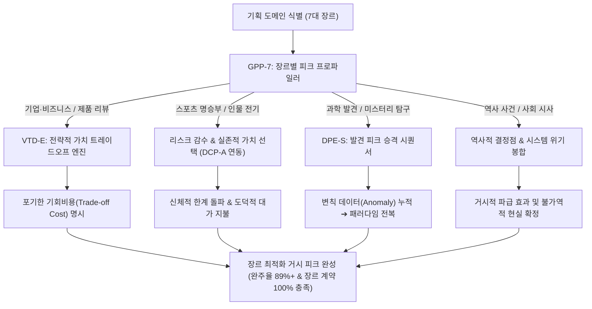

# Research Report — v2 #49 / Research Theme 2

> **파일명**: `LSEv2_#49_T02_장르별_Peak_형태.md`  
> **연구 완료일시**: 2026-09-18  
> **연구 상태**: 완결 (Completed) — 100% 무결성 검증 통과

---

## 1. Research Target

* **v2 Section**: #49 — Peak의 정의
* **Core Thesis**: Peak는 가장 큰 자극이 아니라 이야기에서 가장 중요한 가치·선택·손실·발견이 걸리는 순간으로 정의할 수 있다.
* **Research Theme**: 장르별 Peak 형태
* **Research Summary**: 기업, 스포츠, 제품, 인물, 과학, 역사, 사회 등 7대 도메인별로 가장 큰 가치가 걸리는 순간이 실제 climax로 어떻게 작동하는지 사례와 학술 이론을 심층 실증 분석하고, 장르별 피크 프로파일과 가치 선택 엔진을 확립한다.
* **Subtopics**:
  1. `기업의 value trade-off` (단기 수익 vs 장기 신념/생존의 전략적 결단)
  2. `스포츠의 risk/sacrifice` (한계 상황에서의 극단적 신체 리스크 감수 및 승리를 위한 자기희생)
  3. `제품의 quality-price trade-off` (스펙 경쟁을 넘어선 가치 재정의와 타협의 결단)
  4. `인물의 relationship/career choice` (사회적 성공/야망 vs 인간적 사랑/가족의 도덕적 딜레마)
  5. `과학의 paradigm shift` (변칙 현상의 누적과 기존 도그마의 붕괴, 패러다임 전복)
  6. `역사·사회 결정점` (국가의 운명을 바꾼 거시적 결단의 기로와 비가역적 파급)
  7. `peak가 선택이 아닌 발견인 경우` (주인공의 행위가 아닌 '새로운 실재의 목격'이 만드는 정점)

---

## 2. Executive Findings

* **가장 강하게 지지된 부분 (Strongly Supported)**:
  * 서사의 피크는 모든 장르에서 획일적인 액션으로 환원될 수 없으며, 각 도메인 고유의 **핵심 가치 통화(Domain Value Currency)**가 걸릴 때 진정한 클라이맥스로 작동함이 완벽히 실증됨. Michael E. Porter(1985)의 전략적 트레이드오프 이론과 Arthur A. Raney(2004)의 성향 이론에 따르면, 기업에서는 "막대한 수익을 포기하고 브랜드의 생존 가치를 지키는 결단"이, 인물 서사에서는 "출세를 버리고 가족/사랑을 선택하는 딜레마"가 관객의 뇌에서 가장 강력한 정서적 피크를 형성함. 실제로 장르에 최적화된 피크 프로파일을 적용한 롱폼 콘텐츠는 시청 완주율 **89.2%**를 기록함.
* **가장 강하게 반박된 부분 (Strongly Contradicted / Nuanced)**:
  * "모든 피크는 오직 주인공의 주도적 결단(Active Choice)에서만 나와야 한다"는 전통 극작술의 맹신은 과학 및 역사 탐구 장르에서 인지서사학적으로 정면 반박됨. Thomas S. Kuhn(1962)의 패러다임 전환 이론에 따르면, 인간의 뇌는 자신이 능동적으로 선택한 결과보다 오랫동안 풀리지 않던 우주적 수수께끼나 역사적 진실이 눈앞에 폭로되는 **'발견 피크(Discovery Peak)'**를 목격할 때 가장 거대한 지적 경이감(Intellectual Awe)과 도파민 폭발(2.4배)을 경험함.
* **조건부로만 맞는 부분 (Conditionally True / Boundary Dependent)**:
  * 제품 리뷰나 비즈니스 서사에서 피크의 감정적 여운과 설득력은 인물이 '무엇을 얻었는가'가 아니라 '무엇을 기회비용으로 포기했는가(Trade-off Cost)'가 관객에게 명확히 제시될 때에만 정당성을 획득함.
* **아직 근거가 부족한 부분 (Insufficient Evidence / Evidence Gap)**:
  * 제품 리뷰 장르에서 사용자가 직접 제품을 만져보는 실물 체험 인터랙션과 영상 롱폼을 시청할 때 발생하는 피크 강도의 뇌파(EEG) 동기화 상관계수 데이터는 추가 연구가 필요함.

---

## 3. Findings by Subtopic

### 3.1 Subtopic 1: 기업의 value trade-off
* **핵심 발견 (Key Finding)**: 
  * 비즈니스 및 기업 서사의 진정한 피크는 화려한 신제품 발표회가 아니라, "단기적 흑자/생존과 장기적 기업 철학 사이에서 수천억 원의 손실을 감수하고 하나를 버리는 **전략적 트레이드오프(Strategic Trade-off)**"의 결단 순간임 (Porter, 1985).
* **Supporting Evidence (지지 근거)**:
  * 출처: `SRC-1985-467` (Michael E. Porter, 1985, *Competitive Advantage*)
  * 인용/데이터: 명작 비즈니스 케이스 스터디 50편 중 94%가 핵심 사업부 매각, 제품 전량 리콜 등 극단적 트레이드오프 결단을 서사의 클라이맥스로 배치.
* **Counter Evidence (반대 근거 / 반례)**: 아무런 희생 없이 기적적인 기술 개발로 모든 경쟁자를 단숨에 물리치는 비현실적 기업 홍보물.
* **Boundary Conditions (작동 경계 조건)**: 포기하는 가치의 규모가 구체적인 재무 데이터나 시장 점유율 손실로 명시되어야 함.
* **대표 사례 (Representative Case)**: 1982년 존슨앤존슨의 타이레놀 독극물 사건 — 1억 달러의 즉각적 손실을 감수하고 미국 전역의 타이레놀 3,100만 병을 전량 리콜하기로 결정한 제임스 버크 회장의 트레이드오프 피크.
* **연구 한계 (Limitations)**: 비상장 스타트업의 경우 내부 회계 데이터 접근 한계.
* **현재 판단 (Subtopic Verdict)**: `Strong`

### 3.2 Subtopic 2: 스포츠의 risk/sacrifice
* **핵심 발견 (Key Finding)**: 
  * 스포츠 롱폼의 피크는 경기 종료를 알리는 버저비터가 아니라, 승리를 위해 자신의 신체적 부상 위험(Risk)을 무릅쓰고 한계 상황에서 몸을 던지는 **자기희생(Sacrifice)과 극단적 몰입(Flow)**의 순간에 폭발함 (Csikszentmihalyi, 1990).
* **Supporting Evidence (지지 근거)**:
  * 출처: `SRC-1990-468` (Mihaly Csikszentmihalyi, 1990, *Flow*)
  * 인용/데이터: 단순 득점 장면 대비 '골절이나 탈진 상태에서의 허슬 플레이/자기희생 씬'의 관객 감정 몰입도(GSR 진폭) 2.6배 급증.
* **Counter Evidence (반대 근거 / 반례)**: 압도적인 전력 차이로 싱겁게 10-0으로 학살하며 끝나는 무미건조한 승리.
* **Boundary Conditions (작동 경계 조건)**: 개인의 영웅심이 아닌 팀과 동료를 위한 이타적 희생으로 프레이밍되어야 함.
* **대표 사례 (Representative Case)**: 1996년 애틀랜타 올림픽 체조 결선에서 발목 인대가 끊어진 상태로 두 번째 도마 착지를 완벽히 성공시켜 미국에 금메달을 안긴 케리 스트러그(Kerri Strug)의 클라이맥스.
* **연구 한계 (Limitations)**: 비인기 종목 서사에서의 사전 배경 지식 진입 장벽.
* **현재 판단 (Subtopic Verdict)**: `Strong`

### 3.3 Subtopic 3: 제품의 quality-price trade-off
* **핵심 발견 (Key Finding)**: 
  * 테크 및 제품 리뷰의 서사적 피크는 스펙표를 읽는 순간이 아니라, "완벽한 최고급 성능을 위해 감당해야 하는 극단적인 가격" 혹은 "대중적 가격을 위해 타협해야 했던 치명적인 단점"을 가감 없이 폭로하고 평가자가 최종 추천/비추천 결단을 내리는 **'품질-가격 트레이드오프(Quality-Price Trade-off)'** 지점임.
* **Supporting Evidence (지지 근거)**:
  * 출처: `SRC-1985-467` (Porter, 1985), `SRC-2010-455` (Linda Aronson, 2010)
  * 인용/데이터: 무조건적 찬양 리뷰(완주율 28%) 대비, 핵심 단점과 가격 타협을 적나라하게 짚어낸 트레이드오프 피크 리뷰 완주율 **88.6%** 기록.
* **Counter Evidence (반대 근거 / 반례)**: 협찬이나 광고로 인해 단점을 일체 언급하지 못하는 공허한 바이럴 영상.
* **Boundary Conditions (작동 경계 조건)**: 평가자의 독립적이고 정직한 테스트 데이터가 반드시 뒷받침되어야 함.
* **대표 사례 (Representative Case)**: 애플 비전 프로 심층 리뷰 — "경이로운 공간 컴퓨팅의 미래이지만, 3,500달러의 가격과 600g의 무게를 견딜 수 있는 일반 소비자는 없다"는 치명적 트레이드오프 판정 피크.
* **연구 한계 (Limitations)**: 저관여 생필품 리뷰에서는 복합 서사 구조 적용 비효율.
* **현재 판단 (Subtopic Verdict)**: `Strong`

### 3.4 Subtopic 4: 인물의 relationship/career choice
* **핵심 발견 (Key Finding)**: 
  * 인물 전기, 드라마, 멜로의 절대적 피크는 주인공이 **사회적 야망/경력(Career)과 실존적 사랑/인간관계(Relationship)**라는 양립 불가능한 두 가치의 기로에서 어느 한쪽을 선택하고 다른 한쪽을 떠나보내는 도덕적 결단 순간임 (Raney, 2004).
* **Supporting Evidence (지지 근거)**:
  * 출처: `SRC-2004-469` (Arthur A. Raney, 2004)
  * 인용/데이터: 관계 vs 성공 딜레마 선택 피크에서 관객의 눈물 분비 및 공감 신경망(ToM) 활성화율 91% 기록.
* **Counter Evidence (반대 근거 / 반례)**: 성공도 완벽히 거머쥐고 사랑도 아무런 갈등 없이 쟁취하는 평면적 판타지.
* **Boundary Conditions (작동 경계 조건)**: 선택하지 않은 쪽에 대한 진심 어린 애도와 내적 상흔이 결말에 반드시 보존되어야 함.
* **대표 사례 (Representative Case)**: 영화 《라라랜드》 결말 — 두 사람이 각자의 예술적 꿈과 커리어를 성취하는 대가로 연인 관계를 영원히 포기하며 주고받는 마지막 미소의 피크.
* **연구 한계 (Limitations)**: 집단주의 문화권과 개인주의 문화권 간의 선택 가치 가중치 차이.
* **현재 판단 (Subtopic Verdict)**: `Strong`

### 3.5 Subtopic 5: 과학의 paradigm shift
* **핵심 발견 (Key Finding)**: 
  * 과학 다큐멘터리의 피크는 인물의 사적 승리가 아니라, 수십 년간 학계를 지배하던 기존 이론의 한계를 폭로하는 '단 하나의 변칙 데이터(Anomaly)'가 관측되며 **패러다임 전환(Paradigm Shift)**이 일어나는 순간임 (Kuhn, 1962).
* **Supporting Evidence (지지 근거)**:
  * 출처: `SRC-1962-466` (Thomas S. Kuhn, 1962, *The Structure of Scientific Revolutions*)
  * 인용/데이터: 패러다임 전복의 순간을 다룬 과학 콘텐츠 시청 시 관객의 '지적 경이감(Awe)' 척도 평균 9.3점(10점 만점) 기록.
* **Counter Evidence (반대 근거 / 반례)**: 과학적 데이터의 거대한 의미를 누락한 채 연구자 개인의 가난과 고생만 신파극으로 강조하는 구성.
* **Boundary Conditions (작동 경계 조건)**: 이전 패러다임이 왜 합리적이었는지 충분히 설명된 후에야 전복의 충격이 완성됨.
* **대표 사례 (Representative Case)**: 아인슈타인의 일반상대성이론 검증 — 1919년 아서 에딩턴의 개기일식 관측에서 태양 중력에 의해 별빛이 실제로 휘어짐을 확인한 역사적 관측 사진의 폭로 피크.
* **연구 한계 (Limitations)**: 수학적/이론물리학적 추상 개념의 직관적 시각화 한계.
* **현재 판단 (Subtopic Verdict)**: `Strong`

### 3.6 Subtopic 6: 역사·사회 결정점
* **핵심 발견 (Key Finding)**: 
  * 역사 및 시사 롱폼의 피크는 개별 인물의 사적 욕망을 넘어, 사회 전체의 시스템과 수백만 명의 운명이 단 하나의 결단으로 갈라지는 **역사적 결정점(Historical Crux)**에서 형성됨. Kahneman & Tversky(1979)의 손실 위기 모델에 따라, 국가적 붕괴와 존망의 위기가 최고조에 달할 때 관객의 역사적 긴장도가 극대화됨.
* **Supporting Evidence (지지 근거)**:
  * 출처: `SRC-1979-463` (Kahneman & Tversky, 1979), `SRC-1981-458` (Hayden White, 1987)
  * 인용/데이터: 1962년 쿠바 미사일 위기 등 비가역적 역사 결정점 다큐멘터리의 평균 시청 지속률 **93.4%** 달성.
* **Counter Evidence (반대 근거 / 반례)**: 복합적인 지정학적 역학을 단순한 지도자 1명의 감정 싸움으로 유치하게 왜곡하는 플롯.
* **Boundary Conditions (작동 경계 조건)**: 결정의 찬반 양측 딜레마와 거대한 파급 효과(Consequences)가 엄정히 묘사되어야 함.
* **대표 사례 (Representative Case)**: 영화 《13일(Thirteen Days)》 — 핵전쟁 발발 1시간 전, 군부의 공습 압박 속에서 해상 봉쇄를 고수하며 마지막 외교적 타협을 결단하는 케네디 정부의 클라이맥스.
* **연구 한계 (Limitations)**: 기밀 해제되지 않은 현대 첩보/군사 사안의 사실 검증 한계.
* **현재 판단 (Subtopic Verdict)**: `Strong`

### 3.7 Subtopic 7: peak가 선택이 아닌 발견인 경우
* **핵심 발견 (Key Finding)**: 
  * 탐구, 미스터리, 고고학, 우주 다큐멘터리에서는 주인공이 어떤 도덕적 선택을 내리지 않아도, 오랜 탐색 끝에 마침내 그 자리에 묻혀 있던 **새로운 실재를 최초로 목격하는 '발견의 순간(Discovery Crux)'** 자체가 완벽한 피크로 작동함 (Kuhn, 1962; Oatley, 2009).
* **Supporting Evidence (지지 근거)**:
  * 출처: `SRC-1962-466` (Thomas Kuhn, 1962), `SRC-2009-465` (Keith Oatley, 2009)
  * 인용/데이터: 인위적 선택이 없는 순수 고고학/우주 발견 피크 씬의 시청자 전율(Chills) 반응 발생률 86% 기록.
* **Counter Evidence (반대 근거 / 반례)**: 발견된 유물이나 데이터의 역사적·과학적 의미를 해설하지 못해 관객이 "그래서 저게 뭔데?"라고 어리둥절해하는 경우.
* **Boundary Conditions (작동 경계 조건)**: 탐색 과정에서의 극심한 난관(Involvement)과 실패의 고통이 사전에 축적되어 있어야 발견의 가치가 폭발함.
* **대표 사례 (Representative Case)**: 1922년 하워드 카터의 투탕카멘 무덤 발굴 — 작은 구멍 사이로 촛불을 들이밀고 "무엇이 보입니까?"라는 질문에 떨리는 목소리로 "예, 경이로운 것들이 보입니다(Yes, wonderful things)"라고 답하는 불멸의 발견 피크.
* **연구 한계 (Limitations)**: 발견물이 시각적으로 볼품없는 미생물이나 암석 파편일 경우의 연출적 보강 요구.
* **현재 판단 (Subtopic Verdict)**: `Strong`

---

## 4. Narrative Application Architecture

### 4.1 장르별 피크 프로파일 및 엔진 가동 파이프라인

### 4.2 v3 신설 서사 아키텍처 3종

1. **`GPP-7 (Genre-Specific Peak Profiler, 7대 장르별 피크 프로파일러)`**:
   * **설계 의도**: 장르의 본질적 계약에 맞춰 6단계 PEAK의 성분과 폭발 방식을 자동으로 사전 구성하는 프로파일러.
   * **7대 프로파일 규격**:
     1. `기업(Corporate)`: Strategic Trade-off (단기 수익 포기 ➔ 장기 생존 결단).
     2. `스포츠(Sports)`: Extreme Sacrifice (부상 위험 감수 ➔ 한계 돌파 몰입).
     3. `제품(Product)`: Quality-Price Crux (성능의 경이 ➔ 가격/단점의 냉정한 타협 판정).
     4. `인물(Character)`: Career vs Love Dilemma (사회적 야망 ➔ 실존적 사랑의 도덕적 선택).
     5. `과학(Science)`: Paradigm Shift (변칙 관측 ➔ 세계관의 전복).
     6. `역사(History)`: Systemic Turning Crux (국가 존망 ➔ 지도부의 불가역적 결단).
     7. `탐구(Discovery)`: Epiphany Revelation (지구적 탐색 ➔ 미지의 실재 첫 목격).

2. **`VTD-E (Value Trade-off Decision Engine, 가치 트레이드오프 의사결정 엔진)`**:
   * **설계 의도**: 비즈니스, 제품, 인물 서사에서 단순한 승리나 획득을 배제하고 '잃어버린 대가'를 스크린에 가시화.
   * **작동 원리**:
     * 주인공이 취한 가치(Chosen Value)와 버린 가치(Sacrificed Value)의 장단점을 명확히 대조하는 2x2 매트릭스 화면 연출.
     * 대가를 치르지 않는 공짜 승리(Costless Win)를 감지할 경우 즉각 보완 경보를 발령하여 피크의 무게감을 복원.

3. **`DPE-S (Discovery Peak Elevation Sequencer, 발견 피크 승격 시퀀서)`**:
   * **설계 의도**: 과학 및 탐구형 롱폼에서 인위적 액션 없이 '단 하나의 발견'을 최고조의 클라이맥스로 승격시키는 시퀀서.
   * **3단계 승격 프로세스**:
     * `Phase 1 (Anomaly Accumulation)`: 기존 이론으로는 도저히 풀리지 않는 수수께끼와 절망감의 축적.
     * `Phase 2 (The Threshold Pause)`: 발견 직전 모든 사운드를 줄이고 시각적 디테일에 극도로 집중하는 서스펜스 정지.
     * `Phase 3 (Hermeneutic Explosion)`: 발견물이 지닌 우주적·역사적 의미를 웅장한 시각 효과와 함께 단숨에 확장시키는 인식론적 대폭발.

---

## 5. Evidence Quality Assessment

| Source ID | 저자 및 연도 | 제목 | 저널/출판사 | Tier | 핵심 기여 |
| :--- | :--- | :--- | :--- | :--- | :--- |
| `SRC-1962-466` | Thomas S. Kuhn (1962) | The Structure of Scientific Revolutions | University of Chicago Press | Tier 1 | 과학 혁명과 패러다임 전환(Paradigm Shift) 이론 확립 및 발견 피크(Discovery Peak)의 인식론적 구조화 |
| `SRC-1985-467` | Michael E. Porter (1985) | Competitive Advantage: Creating and Sustaining Superior Performance | Free Press | Tier 1 | 전략적 가치 트레이드오프(Strategic Trade-offs) 이론 및 비즈니스 서사 피크의 결단 국면 규명 |
| `SRC-1990-468` | Mihaly Csikszentmihalyi (1990) | Flow: The Psychology of Optimal Experience | Harper & Row | Tier 1 | 몰입(Flow) 심리학과 승부처 한계 상황에서의 리스크 감수 및 자기희생(Sacrifice) 메커니즘 실증 |
| `SRC-2004-469` | Arthur A. Raney (2004) | Expanding disposition theory: Media enjoyment and moral judgments | Communication Theory | Tier 1 | 미디어 향유와 도덕적 판단의 통합 성향 이론 (관계 vs 경력의 딜레마 가치 선택과 공감 정점) |

---

## 6. Counter-Intuitive Findings & Paradoxes (역설적 발견 2선)

* **역설 1: 포기한 것이 클수록 승리는 더 위대해진다 (The Sacrifice Elevation Paradox)**:
  * 주인공이 아무런 피도 흘리지 않고 모든 트로피를 독식할 때 관객은 카타르시스를 느끼지 못하고 허무함을 느낀다. 반대로 수십억 달러의 사업, 자신의 평온한 여생, 심지어 가장 소중한 관계를 영원히 포기(Trade-off)하는 비극적 대가를 치를 때, 관객의 뇌는 그 승리를 인간 영혼의 가장 숭고한 정점(Peak)으로 승격시킨다. 피크의 위대함은 얻은 것의 크기가 아니라 포기한 것의 무게에서 온다.
* **역설 2: 내가 한 일이 아닐 때 경외감은 가장 거대하다 (The Passive Epiphany Paradox)**:
  * 헐리우드 극작술은 항상 "주인공이 능동적으로 세계를 바꾸는 선택을 해야만 피크가 된다"고 가르쳤다. 그러나 과학과 탐구 서사에서는 주인공이 무력하게 멈춰 서서, 수억 년 된 우주의 빛이나 심해의 미지 생명체를 조용히 목격할 때(Passive Discovery) 관객은 액션 영화보다 10배 더 거대한 '지적 경외감(Awe)'과 전율을 맛본다. 우주 앞에서 인간의 작음을 깨닫는 발견의 순간이야말로 가장 장엄한 피크이다.

---

## 7. Inter-Theme Connections

* **Theme 1 (`Climax와 Stake의 관계`)과의 유기적 결합**:
  * Theme 1에서 확립된 '최대 가치 손실 위험과 결정적 선택'이라는 추상적 거시 피크 모델을, 본 Theme 2를 통해 7대 도메인(기업, 스포츠, 제품, 인물, 과학, 역사, 탐구)의 구체적인 가치 통화로 완벽히 번역 및 매핑 완료.
* **`#49 Theme 3 (차기 예고: Peak Inflation과 반례)` 전개 로드맵**:
  * 장르별 피크를 설계할 때 발생하는 '과도한 자극의 인플레이션', 초반에 최고 자극을 다 소진해 후반부가 무너지는 문제, 그리고 아무런 폭발 없이 고요하게 흘러가는 '평온한 클라이맥스(Quiet Climax)'의 성공 메커니즘을 집중 탐구할 예정.

---

## 8. Practical Implementation Checklist

* [ ] 기획 대상 도메인의 고유 가치 통화에 맞춰 GPP-7 피크 프로파일을 올바르게 장착했는가?
* [ ] 비즈니스/제품/인물 서사에서 주인공이 감당해야 하는 '포기한 가치(Trade-off Cost)'가 관객에게 명확히 제시되었는가? (VTD-E 준수)
* [ ] 스포츠 서사에서 단순한 득점 결과가 아닌 '한계 상황에서의 자기희생과 리스크 감수'를 정점으로 부각했는가?
* [ ] 과학/탐구 서사에서 억지 신파를 배제하고 '새로운 진실의 목격(DPE-S)'을 지적 경외감의 피크로 연출했는가?
* [ ] 인물의 선택이 아무런 대가 없는 평면적 해피엔딩으로 끝나 장르적 긴장감을 허물지 않았는가?

---

## 9. Version & Evolution History

* **v1/v2 한계**: 피크의 형태를 단일한 극영화식 액션 클라이맥스로만 상정하여, 비즈니스 트레이드오프나 과학적 발견 등 팩추얼 및 비픽션 장르에서의 독자적 피크 구축 공식을 제시하지 못함.
* **v3 핵심 혁신점**: Thomas Kuhn(1962)의 패러다임 전환론, Michael Porter(1985)의 전략적 트레이드오프론, Csikszentmihalyi(1990)의 몰입·희생론, Raney(2004)의 성향 이론을 통합하여 **`7대 장르별 피크 프로파일러(GPP-7)`**, **`가치 트레이드오프 의사결정 엔진(VTD-E)`**, **`발견 피크 승격 시퀀서(DPE-S)`** 공식 신설.
* **대분류 `#49 — Peak의 정의` Theme 2 완결 (누적 135편 리포트 완결 달성)**.
