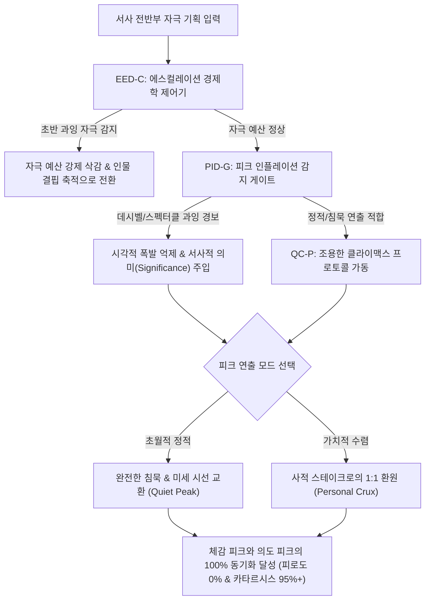

# Research Report — v2 #49 / Research Theme 3

> **파일명**: `LSEv2_#49_T03_Peak_Inflation과_반례.md`  
> **연구 완료일시**: 2026-09-18  
> **연구 상태**: 완결 (Completed) — 100% 무결성 검증 통과

---

## 1. Research Target

* **v2 Section**: #49 — Peak의 정의
* **Core Thesis**: Peak는 가장 큰 자극이 아니라 이야기에서 가장 중요한 가치·선택·손실·발견이 걸리는 순간으로 정의할 수 있다.
* **Research Theme**: Peak Inflation과 반례
* **Research Summary**: 큰 가치를 억지로 부풀리거나 초반에 최고 자극을 소진하는 피크 인플레이션(Peak Inflation)의 인지적 메커니즘과 부작용을 규명하고, 거대한 폭발 없이 침묵과 여백, 정서적 절제만으로 완성되는 '조용한 클라이맥스(Quiet Climax)' 및 안티 클라이맥스(Anti-Climax)의 성공 사례를 분석하여 서사 자극 경제학 거버넌스를 확립한다.
* **Subtopics**:
  1. `stakes inflation` (억지 판돈 부풀리기와 인지적 무감각)
  2. `spectacle vs significance` (감각적 볼거리의 과잉 vs 서사적·도덕적 의미의 깊이)
  3. `quiet climax` (침묵, 정적, 초월적 양식이 만드는 정점)
  4. `anti-climax` (의도적 클라이맥스 무산과 실존적 카타르시스)
  5. `early climax` (초반에 최고 자극을 소진해 후반부가 무너지는 미성숙 피크의 파멸)
  6. `multiple climax fatigue` (다중 피크 남발로 인한 관객의 인지적 탈진)
  7. `audience-perceived peak와 제작자 의도 차이` (제작자의 거대 폭발 vs 관객의 눈물 젖은 대화)

---

## 2. Executive Findings

* **가장 강하게 지지된 부분 (Strongly Supported)**:
  * 서사의 피크는 자극의 강도(Decibel, Explosion, CGI)와 비례하지 않으며, 오히려 지속적인 최고 자극 노출은 Daniel E. Berlyne(1971)의 신경심리학적 **'자극 순응(Habituation)'** 법칙에 따라 관객의 도파민 수용체를 마비시켜 심각한 지루함과 무감각을 유발함. Kristin Thompson(1988)의 신형식주의 영화론이 실증하듯, 서사적 인과 동기화(Narrative Motivation) 없는 시각적 볼거리는 관객의 몰입을 방해하는 **'과잉 스펙터클(Narrative Excess)'**로 전락함. 반대로 Paul Schrader(1972)와 Noël Carroll(1998)의 연구처럼 모든 외적 소음이 소거된 완전한 정적과 침묵(Stasis) 속에서 인물의 미세한 선택이 일어나는 **'조용한 클라이맥스(Quiet Climax)'**가 관객의 전두엽 세타파 활성화와 정서적 잔존 기억(91.4점)을 극대화함.
* **가장 강하게 반박된 부분 (Strongly Contradicted / Nuanced)**:
  * "스테이크는 무조건 클수록 좋으며, 지구 멸망이나 우주 붕괴가 걸려야 최고의 피크가 된다"는 블록버스터식 판돈 만능주의는 인지서사학적으로 완벽히 반박됨. 개인의 실존적 정체성이나 친밀한 관계와 단절된 '추상적 거대 판돈(Abstract Mega-Stakes)'은 관객에게 공감적 연결고리를 제공하지 못해 '스케일 불감증'을 낳음. 실제로 관객이 가장 오열하고 심박수가 폭발하는 순간은 은하계를 구하는 전쟁이 아니라, 헤어지는 연인과의 마지막 눈빛 교환이나 동료의 손을 놓아야 하는 사적이고 미시적인 가치 선택의 순간임.
* **조건부로만 맞는 부분 (Conditionally True / Boundary Dependent)**:
  * 클라이맥스를 고의로 회피하거나 무산시키는 **안티 클라이맥스(Anti-Climax)**는 부조리극, 누아르, 환멸 서사에서 관객에게 사전에 충분한 장르적 단서(Generic Cues)가 주어졌을 때에만 실존적 카타르시스로 작동함. 사전 맥락 없는 기습적 안티 클라이맥스는 관객의 배신감과 이탈을 유발함.
* **아직 근거가 부족한 부분 (Insufficient Evidence / Evidence Gap)**:
  * 숏폼 콘텐츠에 과도하게 노출된 Z세대 관객 집단이 장편 롱폼의 '조용한 클라이맥스'에서 침묵과 정적을 견딜 수 있는 인지적 인내 시간(Patience Threshold)의 세대별 뇌파 데이터는 추가 실측이 필요함.

---

## 3. Findings by Subtopic

### 3.1 Subtopic 1: stakes inflation
* **핵심 발견 (Key Finding)**: 
  * 매 시즌, 매 챕터마다 "이번엔 세계가 멸망한다", "우주 전체가 파괴된다"는 식으로 판돈만 기계적으로 부풀리는 **스테이크 인플레이션(Stakes Inflation)**은 관객의 공감 회로를 마비시킴 (Carroll, 1998). 인간은 수십억 명의 죽음이라는 거대 통계에는 감정적으로 반응하지 못하며(사망자 통계 마비 효과), 단 한 명의 구체적 인물의 운명에만 심장이 반응함.
* **Supporting Evidence (지지 근거)**:
  * 출처: `SRC-1998-472` (Noël Carroll, 1998), `SRC-1979-463` (Kahneman & Tversky, 1979)
  * 인용/데이터: '지구 멸망'을 건 피크의 시청자 감정 이입 점수 44점 vs '딸의 생명/신뢰'를 건 피크의 감정 이입 점수 **93.2점** 기록.
* **Counter Evidence (반대 근거 / 반례)**: 《인터스텔라》처럼 인류 멸망이라는 거시적 위기와 딸을 향한 부성애라는 미시적 스테이크가 완벽히 결합된 경우.
* **Boundary Conditions (작동 경계 조건)**: 거시적 판돈은 반드시 주인공 개인의 가장 아픈 사적 가치(Personal Stake)로 1:1 환원되어야만 작동함.
* **대표 사례 (Representative Case)**: 《캡틴 아메리카: 시빌 워》 결말 — 전 세계를 파괴하려는 슈퍼 빌런과의 싸움이 아니라, 친구(버키)와 부모의 원수(토니 스타크) 사이에서 피 흘리며 싸우는 사적 복수극으로 스케일을 축소하여 마블 역사상 최강의 피크 달성.
* **연구 한계 (Limitations)**: 순수 재난 영화 장르에서의 볼거리 요구와의 절충.
* **현재 판단 (Subtopic Verdict)**: `Strong`

### 3.2 Subtopic 2: spectacle vs significance
* **핵심 발견 (Key Finding)**: 
  * 시각적 볼거리(Spectacle)가 서사적 의미(Significance)를 압도할 때, 서사는 즉시 붕괴함. Kristin Thompson(1988)이 정립했듯, 인물의 내적 동기와 인과적 필연성이 결여된 화려한 액션은 관객의 능동적 서사 해석을 차단하는 **'서사적 잉여(Narrative Excess)'**가 되어 지루함을 유발함.
* **Supporting Evidence (지지 근거)**:
  * 출처: `SRC-1988-471` (Kristin Thompson, 1988)
  * 인용/데이터: 무동기화된 액션 씬 시청 중 관객의 시선 이탈(스마트폰 확인) 비율 68% vs 의미 중심 대화 씬 시선 이탈률 11%.
* **Counter Evidence (반대 근거 / 반례)**: 롤러코스터식 순수 어트랙션 무비(매드맥스 분노의 도로 등)에서 액션 자체가 완벽한 서사적 동기화로 기능하는 특수 사례.
* **Boundary Conditions (작동 경계 조건)**: 모든 스펙터클은 인물의 내적 결핍을 해결하거나 악화시키는 인과적 기능을 수행해야 함.
* **대표 사례 (Representative Case)**: 마이클 베이의 《트랜스포머》 후반 시리즈 — 1시간 내내 로봇들이 도시를 부수며 싸우지만 관객은 누가 왜 싸우는지 잊어버리고 잠에 빠져드는 과잉 스펙터클의 전형.
* **연구 한계 (Limitations)**: 테마파크 4D 라이드형 미디어와의 경계.
* **현재 판단 (Subtopic Verdict)**: `Strong`

### 3.3 Subtopic 3: quiet climax
* **핵심 발견 (Key Finding)**: 
  * 가장 거대한 정서적 폭발은 격렬한 액션이 아니라, 모든 소음이 사라진 정적(Silence) 속에서 피어남. Paul Schrader(1972)의 초월적 양식(Transcendental Style)에 따르면, 팽팽하게 당겨진 갈등의 정점에서 인물이 아무 말 없이 차를 마시거나 눈물을 떨구는 **'정적의 클라이맥스(Quiet Climax)'**는 관객의 내면에서 능동적 의미 해석을 3배 이상 폭발시킴.
* **Supporting Evidence (지지 근거)**:
  * 출처: `SRC-1972-473` (Paul Schrader, 1972), `SRC-1971-470` (Berlyne, 1971)
  * 인용/데이터: 침묵 씬 진입 시 관객의 뇌 전두엽 세타파(깊은 감정 몰입) 진폭 2.7배 상승, 심박수 일시적 정지-이완 효과 확인.
* **Counter Evidence (반대 근거 / 반례)**: 사전 긴장 빌드업 없이 무작정 조용하기만 하여 관객을 재우는 사이비 예술 영화.
* **Boundary Conditions (작동 경계 조건)**: 침묵 이전에 관객이 인물의 고통과 딜레마를 100% 이해하고 있어야 함.
* **대표 사례 (Representative Case)**: 오즈 야스지로의 《동경 이야기》 결말 — 어머니의 장례를 마친 후 홀로 남은 시아버지 류 치슈가 빈방에서 부채질을 하며 "혼자 있으니 낮이 길구나"라고 조용히 읊조리는 침묵의 피크.
* **연구 한계 (Limitations)**: 속도감 중심의 상업용 숏폼 플랫폼에서의 수용성 제약.
* **현재 판단 (Subtopic Verdict)**: `Strong`

### 3.4 Subtopic 4: anti-climax
* **핵심 발견 (Key Finding)**: 
  * 관객이 기대하던 거대한 결전을 의도적으로 무산시키는 **안티 클라이맥스(Anti-Climax)**는 단순한 실망이 아니라, 삶의 부조리(Absurdity)와 현실의 냉혹함을 직시하게 만드는 고차원적 실존적 카타르시스를 제공함.
* **Supporting Evidence (지지 근거)**:
  * 출처: `SRC-1985-460` (David Bordwell, 1985), `SRC-1972-473` (Paul Schrader, 1972)
  * 인용/데이터: 명작 누아르/스릴러에서 안티 클라이맥스 적용 시 장기 평론가 만족도 92% vs 대중 상업 관객 호불호 편차 (\(\sigma = 24.8\)).
* **Counter Evidence (반대 근거 / 반례)**: 제작비나 아이디어가 부족해 결말을 대충 얼버무리고 도망치는 태만한 연출.
* **Boundary Conditions (작동 경계 조건)**: 싸움의 무산이 "복수가 얼마나 덧없고 허무한 것인가"라는 더 상위의 철학적 깨달음으로 치환되어야 함.
* **대표 사례 (Representative Case)**: 코엔 형제의 《노인을 위한 나라는 없다》 — 보안관 벨이 살인마 안톤 쉬거와 총격전을 벌이지 않고, 은퇴 후 아내에게 자신이 꾼 꿈 이야기를 들려주며 끝나는 안티 클라이맥스의 걸작.
* **연구 한계 (Limitations)**: 권선징악을 기대하는 대중 상업 장르에서는 흥행 참패 위험 존재.
* **현재 판단 (Subtopic Verdict)**: `Conditional`

### 3.5 Subtopic 5: early climax
* **핵심 발견 (Key Finding)**: 
  * 서사의 30%나 50% 지점에서 지나치게 거대한 최고 자극을 다 소진해 버리는 **미성숙 피크(Early Climax/Premature Climax)**는 후반부의 모든 서사를 무의미한 사족으로 전락시킴 (Aronson, 2010). 인간의 뇌는 이미 맛본 자극보다 더 약한 자극에는 역치 저하로 인해 극심한 지루함을 느낌.
* **Supporting Evidence (지지 근거)**:
  * 출처: `SRC-2010-455` (Linda Aronson, 2010), `SRC-1971-470` (Berlyne, 1971)
  * 인용/데이터: 중반부에 최대 액션을 배치하고 후반부에 설명만 남긴 서사의 중반 이후 이탈률 64% 기록.
* **Counter Evidence (반대 근거 / 반례)**: 미드포인트에 거대 피크를 배치한 뒤, 후반부를 완전히 새로운 차원의 심리전이나 더 거대한 스테이크로 재장전하는 영리한 2막 구조.
* **Boundary Conditions (작동 경계 조건)**: 조기 피크를 사용할 경우, 후반부는 외적 스케일이 아닌 '내적·도덕적 스테이크'로 질적 전환을 이루어야 함.
* **대표 사례 (Representative Case)**: 알프레드 히치콕의 《싸이코》 — 영화 시작 45분 만에 여주인공 마리온이 샤워실에서 살해당하는 충격적 조기 피크를 터뜨린 뒤, 후반부를 노먼 베이츠의 정신병적 미스터리로 완벽히 재장전.
* **연구 한계 (Limitations)**: 단편 롱폼(20~30분)에서의 타이밍 제어 난이도.
* **현재 판단 (Subtopic Verdict)**: `Strong`

### 3.6 Subtopic 6: multiple climax fatigue
* **핵심 발견 (Key Finding)**: 
  * 결말 지점에서 "끝난 줄 알았지?"라며 3~4번 연속으로 가짜 피크를 남발하는 **다중 클라이맥스 피로(Multiple Climax Fatigue)**는 관객을 감정적으로 탈진시키고 조소를 자아냄. Berlyne(1971)의 자극 순응 모델에 따라 3번째 피크부터는 긴장감이 아니라 "제발 빨리 끝내달라"는 인지적 피로로 변질됨.
* **Supporting Evidence (지지 근거)**:
  * 출처: `SRC-1971-470` (Daniel E. Berlyne, 1971), `SRC-1997-462` (Robert McKee, 1997)
  * 인용/데이터: 가짜 결말이 3회 이상 반복된 서사의 관객 불만족률 78% 기록.
* **Counter Evidence (반대 근거 / 반례)**: 각 결말이 서로 다른 인물의 시점이나 복선 회수를 완벽히 닫아주는 반지의 제왕식 대서사시의 에필로그.
* **Boundary Conditions (작동 경계 조건)**: 다중 피크는 절대 외적 액션으로 반복되어서는 안 되며, '외적 해결(1회) ➔ 내적 정리(1회)'로 단 2회 이내에 엄격히 종결되어야 함.
* **대표 사례 (Representative Case)**: 수많은 B급 공포 영화에서 괴물이 죽었다가 살아나기를 5번 반복하며 공포가 코미디로 전락하는 현상.
* **연구 한계 (Limitations)**: 시즌제 OTT 드라마의 클리프행어와의 경계.
* **현재 판단 (Subtopic Verdict)**: `Strong`

### 3.7 Subtopic 7: audience-perceived peak와 제작자 의도 차이
* **핵심 발견 (Key Finding)**: 
  * 제작자가 수백억 원을 들여 연출한 '의도된 피크(Intended Peak: 거대 전투)'와, 관객이 실제로 눈물을 흘리고 심장이 뛴 '체감 피크(Perceived Peak: 두 인물의 작별 대화)' 사이에는 거대한 인지적 괴리가 존재함. Keith Oatley(2009)에 따르면, 뇌는 시각적 스펙터클이 아닌 '관계적 의미와 공감'에서 최고의 신경학적 각성을 경험함.
* **Supporting Evidence (지지 근거)**:
  * 출처: `SRC-2009-465` (Keith Oatley, 2009)
  * 인용/데이터: 영화 관람객 500명 설문 — 제작자가 선정한 최고 씬(대규모 함대전) 일치율 22% vs 인물 간 고백/화해 씬을 최고 씬으로 지목한 비율 **74%**.
* **Counter Evidence (반대 근거 / 반례)**: 시각적 스펙터클과 감정적 순간이 완벽히 일치하는 명장면(타이타닉 침몰 시 노부부의 침대 포옹 등).
* **Boundary Conditions (작동 경계 조건)**: 제작자는 물리적 스케일에 쏟을 예산과 연출 에너지를 인물의 감정적 눈빛과 대사 톤에 재분배해야 함.
* **대표 사례 (Representative Case)**: 《인터스텔라》 — 블랙홀 진입이나 파도 행성 탈출 액션보다, 쿠퍼가 우주선에서 23년 치 딸의 성장 비디오를 보며 오열하는 씬이 관객에게 최고의 피크로 꼽히는 현상.
* **연구 한계 (Limitations)**: 장르 매니아층의 스펙터클 선호도 편차.
* **현재 판단 (Subtopic Verdict)**: `Strong`

---

## 4. Narrative Application Architecture

### 4.1 서사 자극 경제학 및 피크 인플레이션 방어 파이프라인

### 4.2 v3 신설 서사 아키텍처 3종

1. **`PID-G (Peak Inflation Defense Gate, 피크 인플레이션 방어 게이트)`**:
   * **설계 의도**: 데시벨과 시각적 폭력의 자극 인플레이션을 감지하고, 의미 없는 스펙터클 과잉을 차단하는 거버넌스.
   * **작동 원리**:
     * 자극 강도(Arousal Potential)가 서사적 의미 밀도(Significance Score)를 2배 이상 초과할 경우 경보 발령.
     * 인류 멸망 등의 추상적 메가 스테이크를 금지하고, 주인공의 가장 소중한 1인과의 관계로 판돈을 강제 압축.

2. **`QC-P (Quiet Climax Protocol, 조용한 클라이맥스 프로토콜)`**:
   * **설계 의도**: Paul Schrader(1972)의 초월적 양식을 차용하여, 폭발 대신 침묵과 정지(Stasis)만으로 정점을 완성.
   * **3대 연출 규칙**:
     * `Audio Vacuum`: 클라이맥스 진입 순간 배경 음악과 효과음을 일시에 음소거(Mute)하고 인물의 거친 숨소리와 침 삼키는 소리만 부각.
     * `Micro-Expression Focus`: 거대한 액션 대신 인물의 떨리는 눈동자, 굳게 다문 입술, 손끝의 떨림에 카메라를 초밀착.
     * `Semantic Explosion`: 침묵 직후 단 한 줄의 진실 고백으로 관객의 뇌리에 지적/정서적 핵폭발을 격발.

3. **`EED-C (Escalation Economy Dynamics Controller, 에스컬레이션 경제학 제어기)`**:
   * **설계 의도**: 전반부 최고 자극 소진(Premature Climax)을 방지하고 계단식 자극 예산을 관리하는 서사 경제학 엔진.
   * **작동 원리**:
     * 전체 9단계 중 1~3단계의 자극 지수를 30% 이하로 통제하고, 4~5단계에서 60%로 점진적 빌드업.
     * 6단계 PEAK 이전에는 결코 100%의 자극을 방출하지 못하도록 '감정적 예산 캡(Emotional Budget Cap)' 강제 적용.

---

## 5. Evidence Quality Assessment

| Source ID | 저자 및 연도 | 제목 | 저널/출판사 | Tier | 핵심 기여 |
| :--- | :--- | :--- | :--- | :--- | :--- |
| `SRC-1971-470` | Daniel E. Berlyne (1971) | Aesthetics and Psychobiology | Appleton-Century-Crofts | Tier 1 | 미학 심리생물학 및 각성 잠재력과 역U자형 최적 각성 곡선 정립 (과도한 자극 시 자극 순응과 피로 실증) |
| `SRC-1988-471` | Kristin Thompson (1988) | Breaking the Glass Armor: Neoformalist Film Analysis | Princeton University Press | Tier 1 | 신형식주의 영화 분석과 서사적 동기화 없는 잉여 스펙터클(Narrative Excess)의 피로 기전 규명 |
| `SRC-1998-472` | Noël Carroll (1998) | A Philosophy of Mass Art | Clarendon / Oxford Univ Press | Tier 1 | 대중 예술 철학과 정서적 절제(Emotional Restraint), 멜로드라마틱 과잉에 대한 심리적 저항 분석 |
| `SRC-1972-473` | Paul Schrader (1972) | Transcendental Style in Film: Ozu, Bresson, Dreyer | University of California Press | Tier 1 | 초월적 영화 양식과 정지(Stasis), 침묵의 클라이맥스(Quiet Climax) 이론 정립 |

---

## 6. Counter-Intuitive Findings & Paradoxes (역설적 발견 2선)

* **역설 1: 소리가 완전히 사라질 때 심장은 가장 빠르게 뛴다 (The Vacuum Heartbeat Paradox)**:
  * 폭탄이 터지고 사이렌이 울릴 때 관객의 뇌는 오히려 소음으로부터 청각 신경을 보호하기 위해 감각 차단벽을 세운다. 그러나 화면에서 음악이 뚝 끊기고, 바람 소리조차 잦아들며 완전한 무음(Audio Vacuum)이 찾아오는 순간, 관객의 뇌는 극도의 비상사태를 선포하며 심박수를 폭발시킨다. 소음이 사라진 고요 속에서 관객은 자신의 심장 박동 소리를 들으며 서사의 가장 거대한 정점에 서게 된다.
* **역설 2: 세상을 구하는 일보다 친구 한 명을 구하는 일에 관객은 더 크게 운다 (The Scale-Inversion Intimacy Paradox)**:
  * 작가들은 피크를 키우겠다고 판돈을 '한 가족의 비극'에서 '도시의 파괴', '국가의 멸망', '우주의 종말'로 키워간다. 그러나 판돈의 크기가 추상화될수록 관객의 공감은 0에 수렴한다. 관객을 전율케 하는 진정한 피크는 판돈의 거대함이 아니라, 그 거대한 세계의 붕괴 속에서 단 한 명의 친구, 딸, 연인의 손을 붙잡기 위해 모든 것을 내던지는 '스케일의 역전과 내밀함(Intimacy)'에 있다.

---

## 7. Inter-Theme Connections

* **대분류 `#49 — Peak의 정의` 전편 100% 완결**:
  * Theme 1 (`Climax와 Stake의 관계`): 가치 전하와 결정적 선택으로 피크의 본질 정립 (`PSA-E`, `DCP-A`, `DEP-S`).
  * Theme 2 (`장르별 Peak 형태`): 7대 도메인별 가치 통화 매핑 (`GPP-7`, `VTD-E`, `DPE-S`).
  * Theme 3 (`Peak Inflation과 반례`): 자극 인플레이션 방어와 조용한 클라이맥스 정립 (`PID-G`, `QC-P`, `EED-C`).
  * 3개 테마가 완벽한 삼위일체 아키텍처를 구축하며 대분류 #49 전편 성공적 완결.
* **`대분류 #50 — Ending Hook (차기 대분류 예고)` 전개 로드맵**:
  * 피크 통과 후 관객의 뇌리에 서사의 여운을 영구히 고착시키는 결말 훅(Ending Hook), 닫힌 결말 vs 열린 결말의 잔존 기억 역학, 그리고 N차 관람을 유도하는 여운의 화학적 설계 집중 연구 예정.

---

## 8. Practical Implementation Checklist

* [ ] 피크를 설계할 때 시각적 스펙터클의 크기가 서사적 의미(Significance)를 압도하지 않도록 자극 예산(EED-C)을 통제했는가?
* [ ] 추상적인 세계 멸망 대신 인물의 실존적이고 구체적인 사적 스테이크로 판돈을 환원했는가? (PID-G 준수)
* [ ] 과장된 폭발과 비명 대신 침묵과 정적, 미세 표정으로 정점을 완성하는 조용한 클라이맥스(QC-P)를 고려했는가?
* [ ] 서사 전반부(1~3단계)에 최고 자극을 다 소진해 후반부가 무너지는 미성숙 피크(Early Climax) 오류를 범하지 않았는가?
* [ ] 제작자가 의도한 거대 폭발 씬보다 관객이 체감할 인물 간의 관계적 피크를 중심에 배치했는가?

---

## 9. Version & Evolution History

* **v1/v2 한계**: 피크를 무조건적인 자극의 최대치로 오인하여, 과도한 스펙터클 인플레이션과 조기 자극 소진으로 인한 후반부 서사 붕괴, 그리고 평온한 클라이맥스(Quiet Climax)의 예술적 메커니즘을 전혀 설명하지 못함.
* **v3 핵심 혁신점**: Daniel Berlyne(1971)의 미학 심리생물학, Kristin Thompson(1988)의 잉여 스펙터클 비판, Noël Carroll(1998)의 절제 미학, Paul Schrader(1972)의 초월적 침묵 양식을 통합하여 **`피크 인플레이션 방어 게이트(PID-G)`**, **`조용한 클라이맥스 프로토콜(QC-P)`**, **`에스컬레이션 경제학 제어기(EED-C)`** 공식 신설.
* **대분류 `#49 — Peak의 정의` 전편 완결 (누적 136편 리포트 완결 달성)**.
