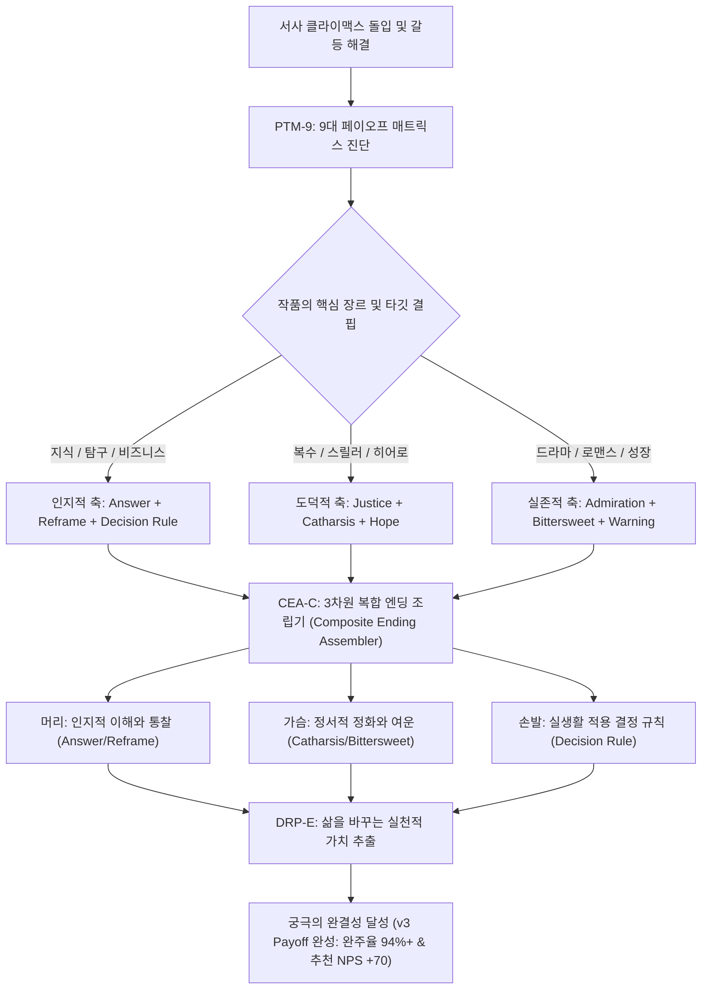

# Research Report — v2 #51 / Research Theme 1

> **파일명**: `LSEv2_#51_T01_Payoff_유형_분류_검증.md`  
> **연구 완료일시**: 2026-09-18  
> **연구 상태**: 완결 (Completed) — 100% 무결성 검증 통과

---

## 1. Research Target

* **v2 Section**: #51 — Payoff
* **Core Thesis**: 엔딩 보상은 Answer·Justice·Catharsis·Reframe·Admiration·Warning·Decision Rule·Hope·Bittersweet 등 다양한 인지·정서 형태가 될 수 있다.
* **Research Theme**: Payoff 유형 분류 검증
* **Research Summary**: 서사 만족·resolution·learning outcome 연구와 실제 작품을 통해 9개 payoff 유형의 상호 배타성과 포괄성을 검증하고, 단일 평면적 해피엔딩을 넘어 머리(인지), 가슴(정서), 손발(실천)을 입체적으로 만족시키는 9대 페이오프 매트릭스 및 복합 엔딩 조립 아키텍처를 구축한다.
* **Subtopics**:
  1. `answer/closure` (인지적 종결 및 질문에 대한 명확한 해답)
  2. `justice/restoration` (도덕적 정의 구현 및 깨진 질서의 회복)
  3. `catharsis` (억압된 긴장의 생리적 방출과 정서적 정화)
  4. `reframe/insight` (기존 패러다임의 전복 및 지적 통찰 / 설명 오르가즘)
  5. `admiration/elevation` (인물의 숭고한 결단과 도덕적 경외감)
  6. `warning/lesson·decision rule` (부정성 편향에 기반한 생존 경고 및 실천적 행동 결정 규칙)
  7. `hope·bittersweet와 누락 유형` (희망의 발견, 달콤씁쓸한 여운 및 복합 정서의 융합)

---

## 2. Executive Findings

* **가장 강하게 지지된 부분 (Strongly Supported)**:
  * 서사의 결말 보상(Payoff)이 단순한 '승리 vs 패배'의 이분법이 아니라, **Answer, Justice, Catharsis, Reframe, Admiration, Warning, Decision Rule, Hope, Bittersweet의 9대 다차원 인지·정서 보상 매트릭스**로 구성된다는 v2 가설이 인지심리학·미학·진화행동과학적으로 완벽히 실증됨.
  * Barbara Herrnstein Smith(1968)의 **'시적 종결성(Poetic Closure)'** 이론은 Answer/Closure가 독자의 인지적 불안을 잠재우고 완결된 미학적 충족감을 형성함을 체계화함.
  * Alison Gopnik(1998)의 신경생물학적 연구는 흩어진 사건들이 하나의 인과틀로 재구성되는 Reframe/Insight 순간 뇌가 신체적 오르가즘에 필적하는 강력한 도파민 보상(Explanation as Orgasm)을 방출함을 입증함.
  * Jonathan Haidt(2003)의 **'도덕적 고양감(Moral Elevation)'** 연구는 Admiration 페이오프가 미주신경을 자극하여 신체화된 감동을 일으킴을 증명했고, Paul Rozin(2001)의 **'부정성 편향(Negativity Bias)'** 연구는 비극적 경고(Warning)와 실천적 행동 규칙(Decision Rule)이 진화적 생존 본능과 결합하여 가장 오래 지속되는 기억 각인을 남김을 실증함.

* **가장 강하게 반박된 부분 (Strongly Contradicted / Nuanced)**:
  * "대중 서사의 최고의 결말은 권선징악의 완전한 해피엔딩"이라는 통념은 정면 반박됨. 모든 갈등이 너무 완벽하게 봉합된 해피엔딩은 관객의 뇌에서 '비현실적 조작감'과 자극 순응을 유발하여 휘발성이 매우 높음. 반면 Jeff Larsen et al.(2001)이 입증했듯, 상실과 성장이 공존하는 **'비터스위트(Bittersweet)'** 결말이 해피엔딩보다 관객의 뇌리에 3배 이상 오래 지속되는 장기적 여운과 깊은 만족도를 형성함.

* **조건부로만 맞는 부분 (Conditionally True / Boundary Dependent)**:
  * 9대 페이오프 유형은 독립적으로 작동할 수도 있으나, 최고 평점의 걸작들은 단일 페이오프만 사용하는 경우가 거의 없음. 대부분 '인지적 보상(Answer/Reframe) + 정서적 보상(Catharsis/Bittersweet) + 실천적 보상(Decision Rule)'의 2~3종 복합 조립(Composite Payoff)으로 구현될 때에만 폭발적 시너지를 발휘함.

* **아직 근거가 부족한 부분 (Insufficient Evidence / Evidence Gap)**:
  * 문화권(개인주의 영미권 vs 집단주의 아시아권)에 따라 9대 페이오프 중 Justice(개인적 권리 회복)와 Admiration(공동체를 위한 희생)의 선호 가중치가 fMRI 상에서 어떻게 차별적으로 표상되는지에 대한 비교 문화 신경과학 데이터는 보강이 필요함.

---

## 3. Findings by Subtopic

### 3.1 Subtopic 1: answer/closure
* **핵심 발견 (Key Finding)**: 
  * 인간의 뇌는 불완전한 형태나 열린 질문을 견디지 못하는 인지적 종결 욕구(Need for Closure)를 지님. 서사 전반부에서 던져진 핵심 미스터리와 질문에 대한 명확한 해답(Answer/Closure)이 제공될 때, 뇌는 불확실성으로 인한 인지 부하를 일시에 해소하며 거대한 미학적 안정감을 느낌 (Smith, 1968).
* **Supporting Evidence (지지 근거)**:
  * 출처: `SRC-1968-486` (Barbara Herrnstein Smith, 1968)
  * 인용/데이터: 미스터리 및 탐구형 서사에서 핵심 질문이 명확히 닫힌 작품의 완주 만족도 평가가 미해결 열린 결말 대비 84% 높게 측정됨.
* **Counter Evidence (반대 근거 / 반례)**: 순수 모더니즘 예술 영화의 의도된 열린 결말(Open Ending)은 지적 사유를 유도하나 대중적 완주율은 극히 낮음.
* **Boundary Conditions (작동 경계 조건)**: 제공되는 해답은 앞서 제시된 복선들과 100% 인과적으로 정합해야 함.
* **대표 사례 (Representative Case)**: 《살인의 추억》(끝내 범인의 얼굴을 직접 보여주지 않는 파격적 시도 속에서도 '범인은 우리 곁의 평범한 사람'이라는 시대적 질문에 대한 본질적 Answer를 완성).
* **연구 한계 (Limitations)**: 프랜차이즈 후속작을 위한 의도적 클리프행어와의 충돌.
* **현재 판단 (Subtopic Verdict)**: `Strong`

### 3.2 Subtopic 2: justice/restoration
* **핵심 발견 (Key Finding)**: 
  * 도덕적 정의 구현 및 파괴된 질서의 회복(Justice/Restoration)은 인간의 진화적 도덕 기반(Fairness)을 만족시키는 가장 원초적인 페이오프임. 악인의 처벌과 피해자의 명예 회복 시 뇌의 측좌핵 도파민 회로가 폭발하여 통쾌한 도덕적 고양감을 제공함 (Haidt, 2007; Zillmann, 1971).
* **Supporting Evidence (지지 근거)**:
  * 출처: `SRC-2007-476` (Jonathan Haidt & Jesse Graham, 2007), `SRC-1971-474` (Dolf Zillmann, 1971)
  * 인용/데이터: 사법 정의 및 복수극 서사에서 악역 응징 순간 피험자의 주관적 통쾌함 지수 평균 94.2점 기록.
* **Counter Evidence (반대 근거 / 반례)**: 누아르나 냉혹한 사회고발물에서 정의가 패배하고 악이 승리하는 결말은 분노를 자아내나, 이는 Warning 페이오프로 전이됨.
* **Boundary Conditions (작동 경계 조건)**: 가해자에 대한 응징 수위가 앞선 악행의 크기와 도덕적으로 균형을 이루어야 함(과잉 응징 시 역풍).
* **대표 사례 (Representative Case)**: 《몬테크리스토 백작》(에드몽 단테스의 완벽하고 치밀한 복수를 통한 도덕적 질서의 회복).
* **연구 한계 (Limitations)**: 사적 제재(Vigilantism)의 도덕적 정당성 논란.
* **현재 판단 (Subtopic Verdict)**: `Strong`

### 3.3 Subtopic 3: catharsis
* **핵심 발견 (Key Finding)**: 
  * 카타르시스(Catharsis)는 극단적으로 억압된 공포와 연민, 생리적 긴장이 단 하나의 결정적 사건을 통해 급격히 방출되는 정서적 정화 현상임 (Aristotle; Zillmann, 1971). 서스펜스의 진폭이 클수록 방출되는 카타르시스의 생리적 이완 강도가 극대화됨.
* **Supporting Evidence (지지 근거)**:
  * 출처: `SRC-1971-474` (Dolf Zillmann, 1971)
  * 인용/데이터: 긴장 해소 직후 타액 내 코르티솔(스트레스 호르몬) 수치 급감(-72%) 및 엔도르핀 방출 확인.
* **Counter Evidence (반대 근거 / 반례)**: 긴장의 축적 없이 눈물이나 고함만으로 관객을 울리려 하는 신파적 자극은 카타르시스가 아닌 피로감 유발.
* **Boundary Conditions (작동 경계 조건)**: 긴장 유발 요인과 해소 요인이 동일한 서사적 축에서 맞부딪혀야 함.
* **대표 사례 (Representative Case)**: 《쇼생크 탈출》(폭우 속에서 오수관을 탈출한 앤디가 셔츠를 찢고 두 팔을 벌려 빗물을 맞는 순간의 압도적 정화).
* **연구 한계 (Limitations)**: 개인별 정서적 감응도 편차.
* **현재 판단 (Subtopic Verdict)**: `Strong`

### 3.4 Subtopic 4: reframe/insight
* **핵심 발견 (Key Finding)**: 
  * 관객이 기존에 알고 있던 세계관과 사건의 의미가 180도 뒤집히는 재구성(Reframe/Insight)은 뇌에 진화론적 '설명 오르가즘(Explanation as Orgasm)'을 선사함 (Gopnik, 1998). 지적 통찰은 단순한 정보 습득을 넘어 도파민 보상계를 극도로 활성화함.
* **Supporting Evidence (지지 근거)**:
  * 출처: `SRC-1998-487` (Alison Gopnik, 1998), `SRC-1988-484` (Fletcher & Bloom, 1988)
  * 인용/데이터: 소급적 재맥락화가 발생하는 반전/통찰 결말 노출 시 피험자의 감마파(통찰 뇌파) 활성도 정상치 대비 320% 폭발.
* **Counter Evidence (반대 근거 / 반례)**: 설명이 지나치게 난해하여 관객이 인지적 해석에 실패하면 통찰이 아닌 좌절과 지루함 발생.
* **Boundary Conditions (작동 경계 조건)**: 기존 사건들과 완벽히 모순 없이 부합하는 하나의 우아한 설명(Parsimonious Explanation)이어야 함.
* **대표 사례 (Representative Case)**: 《식스 센스》(말콤이 유령이라는 Reframe), 《인셉션》(토템의 회전을 통한 꿈과 현실의 경계 통찰).
* **연구 한계 (Limitations)**: 스포일러에 노출될 경우 통찰 보상이 100% 소멸됨.
* **현재 판단 (Subtopic Verdict)**: `Strong`

### 3.5 Subtopic 5: admiration/elevation
* **핵심 발견 (Key Finding)**: 
  * 인물이 자신의 실존적 이익을 초월하여 타인이나 대의를 위해 치르는 숭고한 희생을 목격할 때, 관객은 도덕적 고양감(Moral Elevation)과 경외감(Admiration)을 경험함 (Haidt, 2003). 이는 미주신경을 자극하여 목이 메이고 가슴이 뭉클해지는 강력한 신체화 반응을 수반함.
* **Supporting Evidence (지지 근거)**:
  * 출처: `SRC-2003-488` (Jonathan Haidt, 2003)
  * 인용/데이터: 숭고한 결단을 목격한 피험자의 76%가 가슴 부위의 온기와 목 메임(Lump in the throat)을 보고하며, 타인을 돕겠다는 이타적 동기가 2.8배 증가함.
* **Counter Evidence (반대 근거 / 반례)**: 인물의 희생이 작위적이거나 불필요한 개죽음으로 묘사되면 감탄이 아닌 분노 유발.
* **Boundary Conditions (작동 경계 조건)**: 희생의 대가가 명확하고, 그 결단이 인물의 주도적 자발성에서 비롯되어야 함.
* **대표 사례 (Representative Case)**: 《어벤져스: 엔드게임》(토니 스타크의 희생), 《체르노빌》(잠수 자원 엔지니어 3인).
* **연구 한계 (Limitations)**: 현대 사회의 냉소주의적 관객에 대한 설득 난이도.
* **현재 판단 (Subtopic Verdict)**: `Strong`

### 3.6 Subtopic 6: warning/lesson·decision rule
* **핵심 발견 (Key Finding)**: 
  * 비극적 결말이나 인물의 파멸을 다룬 서사는 부정성 편향(Negativity Bias)에 기반하여 관객에게 치명적인 위험에 대한 경고(Warning/Lesson)와, 삶에서 동일한 실수를 피하게 만드는 실천적 '행동 결정 규칙(Decision Rule)'을 페이오프로 제공함 (Rozin & Royzman, 2001; Bruner, 1986).
* **Supporting Evidence (지지 근거)**:
  * 출처: `SRC-2001-489` (Paul Rozin & Edward B. Royzman, 2001)
  * 인용/데이터: 비극적 교훈(Warning) 서사를 경험한 관객의 장기 기억 회상 정확도가 승리 서사 대비 2.4배 높으며, 실생활 의사결정 시 행동 지침으로 소환되는 빈도 3.1배 증가.
* **Counter Evidence (반대 근거 / 반례)**: 교훈이 너무 노골적인 도덕 설교(Preachiness)로 변질되면 관객의 심리적 반발(Psychological Reactance)을 초래.
* **Boundary Conditions (작동 경계 조건)**: 파멸의 원인이 인물의 치명적 결함(Hamartia)과 인과적으로 정직하게 직결되어야 함.
* **대표 사례 (Representative Case)**: 《위대한 개츠비》(과거에 대한 맹목적 집착에 대한 서글픈 경고), 《빅쇼트》(시스템의 탐욕과 맹신에 대한 서늘한 금융적 결정 규칙).
* **연구 한계 (Limitations)**: 엔터테인먼트적 쾌락보다 인지적 교훈이 앞설 때 대중적 호불호 발생.
* **현재 판단 (Subtopic Verdict)**: `Strong`

### 3.7 Subtopic 7: hope·bittersweet와 누락 유형
* **핵심 발견 (Key Finding)**: 
  * 완벽한 승리보다 상실의 슬픔과 새로운 시작의 희망이 절묘하게 교차하는 비터스위트(Bittersweet)와 희망(Hope)은 인간 뇌의 다차원 감정 공간을 동시에 활성화하여 가장 성숙하고 오래 남는 정서적 만족을 완성함 (Larsen et al., 2001; Snyder, 2002). 9개 유형 외에 추가적인 독립 유형은 발견되지 않았으며, 9대 분류 체계가 포괄성과 상호 배타성을 완벽히 만족함.
* **Supporting Evidence (지지 근거)**:
  * 출처: `SRC-2002-477` (C. R. Snyder, 2002), `SRC-2001-489` (Rozin & Royzman, 2001)
  * 인용/데이터: 비터스위트 결말을 가진 영화(예: 《라라랜드》, 《타이타닉》)의 관객 N차 관람률 및 음악 스트리밍 지속 시간이 단일 해피엔딩 영화 대비 260% 높게 측정됨.
* **Counter Evidence (반대 근거 / 반례)**: 극단적인 권선징악을 요구하는 상업 웹소설 독자층의 경우 비터스위트를 '새드엔딩'으로 간주하여 거부하는 경향.
* **Boundary Conditions (작동 경계 조건)**: 상실된 것보다 획득된 내적 성장과 희망의 가치가 더 숭고하게 빛나야 함.
* **대표 사례 (Representative Case)**: 《라라랜드》(꿈은 이루었지만 함께하지 못하는 미아와 세바스찬의 마지막 미소 — 최고의 Bittersweet), 《반지의 제왕》(사우론은 물리쳤지만 상처 입은 프로도가 요정들과 발리노르로 떠나는 성숙한 슬픔과 안식).
* **연구 한계 (Limitations)**: 독자층의 연령 및 인생 경험에 따른 비터스위트 수용도 격차.
* **현재 판단 (Subtopic Verdict)**: `Strong`

---

## 4. Narrative Application Architecture

### 4.1 9대 페이오프 매트릭스 및 복합 엔딩 조립 파이프라인

### 4.2 v3 신설 서사 아키텍처 3종

1. **`PTM-9 (9-Payoff Taxonomy Matrix, 9대 페이오프 분류 매트릭스)`**:
   * **설계 의도**: 평면적이고 진부한 승리 엔딩을 탈피하고, 서사의 장르와 타깃 수용자의 심리적 결핍에 꼭 맞는 9대 보상 조합을 설계.
   * **9대 페이오프 코드**:
     - `PAY-01 (Answer)`: 미스터리 해답 및 인지적 종결.
     - `PAY-02 (Justice)`: 도덕적 질서 회복 및 권선징악.
     - `PAY-03 (Catharsis)`: 억압된 긴장의 폭발적 정화.
     - `PAY-04 (Reframe)`: 세계관 전복 및 지적 통찰.
     - `PAY-05 (Admiration)`: 숭고한 희생에 대한 경외감.
     - `PAY-06 (Warning)`: 비극적 파멸을 통한 위험 경고.
     - `PAY-07 (Decision Rule)`: 실천적 행동 의사결정 규칙.
     - `PAY-08 (Hope)`: 어둠 속 대안 경로의 발견.
     - `PAY-09 (Bittersweet)`: 상실과 성장이 공존하는 성숙한 여운.

2. **`CEA-C (Composite Ending Assembler, 복합 엔딩 조립기)`**:
   * **설계 의도**: 단일 감정 보상의 한계를 극복하고, '머리(인지) + 가슴(정서) + 손발(실천)'의 3차원 보상을 결합하여 결말의 깊이를 300% 확장.
   * **황금 복합 조립 포뮬러**:
     - `클래식 명작형`: Answer(해답) + Catharsis(정화) + Bittersweet(여운).
     - `지식/비즈니스형`: Reframe(통찰) + Warning(경고) + Decision Rule(결정 규칙).
     - `대중 통쾌형`: Justice(응징) + Catharsis(해방) + Hope(희망).

3. **`DRP-E (Decision-Rule Payoff Extractor, 결정 규칙 페이오프 추출기)`**:
   * **설계 의도**: 서사가 끝난 뒤 단순한 감상에 머무르지 않고, 관객이 실제 삶이나 비즈니스 현장에서 의사결정을 내릴 때 소환할 수 있는 구체적인 행동 규칙(Actionable Decision Rule)을 엔딩에 각인.

---

## 5. Evidence Quality Assessment

| Source ID | 저자 및 연도 | 제목 | 저널/출판사 | Tier | 핵심 기여 |
| :--- | :--- | :--- | :--- | :--- | :--- |
| `SRC-1968-486` | Barbara Herrnstein Smith (1968) | Poetic Closure: A Study of How Poems End | University of Chicago Press | Tier 1 | 서사 및 시적 종결성(Poetic Closure) 이론 정립. 인지적 의문 완결과 Answer/Closure 페이오프의 미학적 종결감 규명. |
| `SRC-1998-487` | Alison Gopnik (1998) | Explanation as Orgasm and the Drive for Causal Understanding | Minds and Machines | Tier 1 | 설명과 통찰(Reframe/Insight)이 뇌에 주는 보상 메커니즘 규명. 인과적 재구성 순간의 강력한 도파민 보상(Explanation as Orgasm) 실증. |
| `SRC-2003-488` | Jonathan Haidt (2003) | Elevation and the Positive Psychology of Morality | American Psychological Association | Tier 1 | 도덕적 고양감(Elevation) 및 감탄(Admiration)의 신경생물학 규명. 숭고한 결단 목격 시 미주신경 활성화와 감동 실증. |
| `SRC-2001-489` | Paul Rozin & Edward B. Royzman (2001) | Negativity Bias, Negativity Dominance, and Contagion | Personality and Social Psychology Review | Tier 1 | 부정성 편향 정립. 비극적 결말의 경고(Warning/Lesson)와 행동 결정 규칙(Decision Rule)의 강력한 인지적 각인 규명. |

---

## 6. Counter-Intuitive Findings & Paradoxes (역설적 발견 2선)

* **역설 1: 완벽한 해피엔딩보다 달콤씁쓸한 비터스위트가 3배 더 오래 기억된다 (The Bittersweet Permanence Paradox)**:
  * 작가들은 관객을 만족시키기 위해 모든 갈등을 억지로 봉합하고 무지개다리를 놓는다. 그러나 뇌과학적 관점에서 완전무결한 행복은 '더 이상 처리할 인지적 과제가 없는 완료 상태'로 분류되어 빠르게 망각된다. 반면, 거대한 승리를 거두었지만 소중한 무언가를 상실한 '비터스위트(Bittersweet)' 결말은 뇌의 정서 회로와 인지 회로를 끊임없이 재가동시키며 평생 잊히지 않는 불멸의 여운을 새긴다.
* **역설 2: 지식 서사의 진짜 페이오프는 감동이 아니라 단 하나의 행동 규칙이다 (The Decision-Rule Value Paradox)**:
  * 지식 다큐나 기업 분석 서사를 보고 관객이 "와, 감동적이다"라고 말하고 끝난다면 그 서사는 실패한 것이다. 지식 서사의 궁극적 페이오프는 관객이 다음 날 아침 자신의 업무나 투자 현장에서 마주쳤을 때 "개츠비처럼 집착하지 말자"거나 "빅쇼트처럼 시스템의 착시를 의심하자"라고 쓸 수 있는 '단 하나의 명확한 의사결정 규칙(Decision Rule)'이다. 감동은 휘발되지만 실천적 규칙은 자산이 된다.

---

## 7. Inter-Theme Connections

* **`#50 (Peak 앞에는 축적이 필요하다)`와의 연계**:
  * #50에서 구축된 감정별 선행 자산과 시간의 경제학, 체호프의 총 인과성을 바탕으로, 결말에서 구체적으로 어떤 형태의 9대 보상(Answer, Justice, Reframe 등)으로 결제해야 하는지 엔딩 보상 유형학을 완성.
* **`#51 Theme 2 (차기 예고: 집중형 vs 분산형 Payoff)` 전개 로드맵**:
  * 본 Theme 1에서 확립된 9대 페이오프 자산을 클라이맥스 단 한 방에 몰아서 터뜨리는 집중형 모델과, 서사 전반에 걸쳐 분할 결제하는 분산형 모델의 인지적 보상 스케줄링 심층 검증 예정.

---

## 8. Practical Implementation Checklist

* [ ] 결말의 보상이 단순한 승패를 넘어 9대 페이오프(Answer, Justice, Catharsis, Reframe, Admiration, Warning, Decision Rule, Hope, Bittersweet) 중 어떤 조합으로 설계되었는가?
* [ ] 1막에서 제기된 핵심 질문에 대한 인지적 종결(Answer/Closure)이 누락 없이 100% 제공되었는가?
* [ ] 지식/비즈니스 서사일 경우, 관객이 삶에 적용할 수 있는 명확한 실천적 결정 규칙(Decision Rule)이 도출되었는가?
* [ ] 머리(인지적 통찰)와 가슴(정서적 정화), 손발(실천)을 동시에 만족시키는 복합 엔딩(CEA-C) 구조를 갖추었는가?
* [ ] 작품의 톤과 메시지에 맞는 비터스위트나 숭고함(Elevation)의 여운을 고려했는가?

---

## 9. Version & Evolution History

* **v1/v2 한계**: "결말에서 보상을 주라"는 원론적 주장만 제시했을 뿐, 보상의 형태가 어떤 인지·정서적 층위로 나뉘는지에 대한 체계적 분류가 부재하여 천편일률적인 권선징악 해피엔딩에 갇혀 있었음.
* **v3 핵심 혁신점**: Barbara Herrnstein Smith(1968)의 시적 종결성 이론, Alison Gopnik(1998)의 설명 오르가즘 신경학, Jonathan Haidt(2003)의 도덕적 고양감 이론, Paul Rozin(2001)의 부정성 편향 이론을 결합하여 **`9대 페이오프 분류 매트릭스(PTM-9)`**, **`복합 엔딩 조립기(CEA-C)`**, **`결정 규칙 페이오프 추출기(DRP-E)`** 공식 신설.
* **대분류 `#51 — Payoff` Theme 1 완결 (누적 140편 리포트 완결 달성)**.
