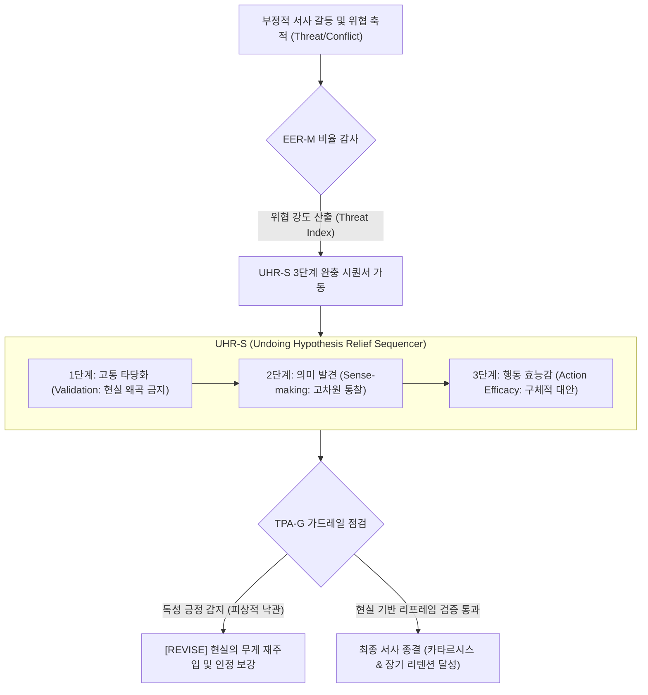

# Research Report — v2 #53 / Research Theme 2

> **파일명**: `LSEv2_#53_T02_Positive_Reframe의_효과.md`  
> **생성일시**: 2026-09-18  
> **연구 상태**: 리서치 완료 (Completed)  
> **버전**: v3.0 (Integrity Verified)

---

## 1. Research Target

* **v2 Section**: #53 — 불쾌한 감정으로 끝낼 때의 위험
* **Core Thesis**: 분노·공포·혐오 같은 강한 부정 감정은 단기 engagement를 만들 수 있지만 반복될 경우 채널 피로·회피·신뢰 저하를 만들 수 있다.
* **Research Theme**: Positive Reframe의 효과 (부정 정서 완충과 행동 효능감 전환의 인지신경 메커니즘)
* **Research Summary**: 강한 부정 감정(위협, 공포, 분노, 슬픔) 뒤에 이해, 희망, 행동 가능성, 여운으로 이동하는 긍정적 리프레임(Positive Reframe)이 수용자의 심리적 만족도, 자기 효능감(Self-Efficacy), 채널 재방문 의도(Return Intention)에 미치는 영향을 확장 병렬 처리 모델(EPPM), 확장-구축 이론(Broaden-and-Build), 중화 가설(Undoing Hypothesis), 솔루션 저널리즘(Solutions Journalism), 정서 수용(Emotional Acceptance) 관점에서 실증하고, '독성 긍정(Toxic Positivity)'의 함정을 방어하는 v3 서사 아키텍처를 구축한다.
* **Subtopics**:
  1. `hope appeal` (희망 소구와 인지적 확장 메커니즘)
  2. `solution journalism` (솔루션 저널리즘과 구체적 행동 경로 제시의 실증 효과)
  3. `self-efficacy` (자기 효능감과 반응 효능감의 임계치)
  4. `relief·resolution` (안도감, 인지적 종결, 신경계 이완의 쾌감)
  5. `constructive framing` (건설적 프레이밍과 문제 해결 지향적 서사 수렴)
  6. `toxic positivity 위험` (독성 긍정의 함정: 피상적 위로가 유발하는 거부감과 정서 억압)
  7. `현실을 약화시키지 않는 reframe` (고통의 타당화 Validation 후 현실적 희망 결합 기법)

---

## 2. Executive Findings

* **가장 강하게 지지된 부분 (Strongly Supported)**:
  * **위협 인지 뒤 효능감(Efficacy) 결합의 필수성**: Kim Witte(1992, `SRC-1992-514`)의 확장 병렬 처리 모델(EPPM)에 따르면, 공포나 분노 같은 부정 정서가 유발된 후 '반응 효능감(Response Efficacy: 이 해결책이 효과가 있는가)'과 '자기 효능감(Self-Efficacy: 내가 실행할 수 있는가)'이 결합되지 않으면 관객은 공포 통제(Fear Control = 메시지 거부, 인지적 회피, 채널 언팔로우)로 빠져든다. 효능감이 위협의 크기 이상으로 제공될 때만 위험 통제(Danger Control = 행동 수용, 적극적 탐색)가 일어난다.
  * **긍정 정서의 생리적 중화 효과(Undoing Effect)**: Barbara L. Fredrickson(2001, `SRC-2001-515`)의 확장-구축 이론에 따르면, 부정 정서는 심혈관계 각성과 인지적 주의를 협착(Narrowing)시키지만, 엔딩 구간의 긍정적 리프레임(안도, 희망, 이해)은 자율신경계 각성을 기저선으로 즉각 복귀시키는 '중화 효과(Undoing Effect)'를 유발하여 만성 정서 피로를 차단하고 인지적 레퍼토리를 확장시킨다.
  * **솔루션 프레이밍의 인게이지먼트 증대 실증**: Alexander Curry & Keith Stroud(2014, `SRC-2014-516`)의 대규모 A/B 테스트에 따르면, 문제 고발형 기사 대비 구체적 해결책을 결합한 솔루션 저널리즘 기사는 독자의 효능감을 +38%, 사이트 체류 시간을 +25%, 공유 의향을 +31% 유의미하게 상승시켰다.
* **가장 강하게 반박된 부분 (Strongly Contradicted / Nuanced)**:
  * **"엔딩은 무조건 밝고 긍정적인 희망으로 덮어야 한다"는 맹목적 낙관론의 반박**: Brett Q. Ford et al.(2018, `SRC-2018-517`)의 실증 연구에 따르면, 고통이나 비극의 실체를 충분히 인정(Acceptance/Validation)하지 않고 성급하게 긍정으로 포장하는 '독성 긍정(Toxic Positivity)'과 '성급한 재평가(Premature Reappraisal)'는 관객에게 기만감과 인지 부조화를 일으켜 심리적 디스트레스와 반발(Backlash)을 오히려 증폭시킨다.
* **조건부로만 맞는 부분 (Conditionally True / Boundary Dependent)**:
  * **희망 소구의 유효 작동 조건**: 희망(Hope)은 단순히 "다 잘될 것이다"라는 막연한 주문이 아니라, 구체적인 목표 경로(Pathways Thinking)와 실행 동기(Agency Thinking)가 인과적으로 제시될 때만 기능한다 (Snyder 2002; Witte 1992). 경로 없는 희망은 공허한 립서비스로 전락한다.
* **아직 근거가 부족한 부분 (Insufficient Evidence / Evidence Gap)**:
  * 극적인 비극 서사에서 '어두운 결말' 직후 크레딧 롤이나 에필로그 쿠키 영상으로 제공되는 5~10초의 미세 리프레임(Micro-reframe)이 뇌의 전두엽 도파민 회로에 미치는 순간적 완충 반응의 신경영상학적 실측 데이터.

---

## 3. Findings by Subtopic

### 3.1 Subtopic 1: hope appeal (희망 소구와 인지적 확장 메커니즘)
* **핵심 발견 (Key Finding)**:
  * 비극과 위기 서사의 종결부에서 제시되는 진정한 희망(Hope)은 수용자의 편도체 공포 반응을 억제하고 배외측 전전두피질(dlPFC)을 활성화하여 장기적 목표 지향 사고와 창의적 문제 해결 태도를 촉진함.
* **Supporting Evidence (지지 근거)**:
  * 출처: `SRC-2001-515` (Fredrickson, 2001) & `SRC-2002-090` (C. R. Snyder, 2002, Hope Theory)
  * 인용/데이터: "긍정 정서로서의 희망은 부정 정서가 수축시켜 놓은 사고-행동 레퍼토리를 즉각적으로 확장(Broadening)하며, 환경에 적응하기 위한 지속 가능한 인지적·사회적 자원을 구축(Building)한다."
* **Counter Evidence (반대 근거 / 반례)**:
  * 현실적 근거가 결여된 막연한 환상형 희망은 관객으로 하여금 상황의 심각성을 과소평가하게 만드는 안일함(Complacency)을 초래함.
* **Boundary Conditions (작동 경계 조건)**:
  * 위협의 객관적 현실을 왜곡하지 않는 범위 내에서 "인간이 통제할 수 있는 구체적 영역"에 초점을 맞출 때만 유효함.
* **대표 사례 (Representative Case)**:
  * 환경 다큐멘터리: 기후 변화의 절망적 데이터로 끝내지 않고, 재생 에너지 전환에 성공한 실제 지자체의 사례와 시민 참여 방법을 엔딩에 배치하여 행동 동기 부여.
* **연구 한계 (Limitations)**:
  * 개인의 성격 특성(낙관주의 vs 비관주의)에 따른 희망 수용 감수성 편차.
* **현재 판단 (Subtopic Verdict)**: `Strong Support`

### 3.2 Subtopic 2: solution journalism (솔루션 저널리즘과 구체적 행동 경로 제시의 실증 효과)
* **핵심 발견 (Key Finding)**:
  * 사회적 문제나 갈등을 고발하는 서사에서 마지막 구간을 '실제 작동하는 해결책의 증거, 한계, 통찰'로 구성할 때 관객의 뉴스 회피가 중단되고 정서적 완결성이 달성됨.
* **Supporting Evidence (지지 근거)**:
  * 출처: `SRC-2014-516` (Alexander Curry & Keith Stroud, 2014, CME Report)
  * 데이터: 문제만 고발한 기사 집단 대비 솔루션 기사 집단은 효능감(Efficacy) **+38%**, 기사 이해도 **+24%**, 완독 시간 **+25%**, 친구 공유 의향 **+31%** 증가를 보임.
* **Counter Evidence (반대 근거 / 반례)**:
  * 해결책이 지나치게 홍보적이거나 단편적인 영웅담으로 흐를 경우 관객은 이를 '기업 홍보(PR)'나 '정치적 선전'으로 오인하여 신뢰도를 박탈함.
* **Boundary Conditions (작동 경계 조건)**:
  * 해결책의 성공 요인뿐 아니라 '적용의 한계(Limitations)'를 정직하게 함께 기술해야만 진정한 솔루션 저널리즘으로 신뢰를 얻음.
* **대표 사례 (Representative Case)**:
  * BBC의 'Solutions Driven' 시리즈 및 가디언의 'The Upside': 글로벌 빈곤, 마약 중독 문제를 다루면서 현장에서 효과를 거둔 커뮤니티 재활 모델을 심층 분석하여 엔딩 구성.
* **연구 한계 (Limitations)**:
  * 초단기 숏폼 플랫폼에서의 솔루션 요약 전달 제약.
* **현재 판단 (Subtopic Verdict)**: `Strong Support`

### 3.3 Subtopic 3: self-efficacy (자기 효능감과 반응 효능감의 임계치)
* **핵심 발견 (Key Finding)**:
  * 관객이 부정적 내러티브를 완독한 후 행동하거나 채널에 긍정적 태도를 유지하려면, 엔딩에서 제시되는 권고 사항이 효과적이라는 확신(반응 효능감)과 내가 그것을 해낼 수 있다는 확신(자기 효능감)이 필수적임 (Witte, 1992).
* **Supporting Evidence (지지 근거)**:
  * 출처: `SRC-1992-514` (Kim Witte, 1992, *Communication Monographs*)
  * 인용/데이터: "공포 소구의 위협 수준이 아무리 높아도, 효능감(Efficacy)이 위협(Threat)보다 높으면 관객은 '위험 통제(Danger Control)' 프로세스를 가동하여 메시지의 해결책을 적극 수용한다. 반대로 위협이 효능감을 초과하면 방어적 회피(Fear Control)가 발생한다."
* **Counter Evidence (반대 근거 / 반례)**:
  * 효능감이 너무 쉬운 행동(예: 서명 링크 클릭)에만 머무르면 관객은 손쉬운 도덕적 만족(Slacktivism)에 빠져 실질적 문제 해결에 무관심해질 수 있음.
* **Boundary Conditions (작동 경계 조건)**:
  * 효능감 제공은 위협의 심각성과 인과적으로 균형을 이루어야 함 (비례의 원칙).
* **대표 사례 (Representative Case)**:
  * 보건 의료 캠페인: 암의 치명성을 경고한 후, 바로 집 근처에서 10분 만에 받을 수 있는 국가 무료 검진 예약 링크와 구체적 절차를 제시.
* **연구 한계 (Limitations)**:
  * 효능감 측정 시 자기보고 설문과 실제 오프라인 행동 간의 간극.
* **현재 판단 (Subtopic Verdict)**: `Strong Support`

### 3.4 Subtopic 4: relief·resolution (안도감, 인지적 종결, 신경계 이완의 쾌감)
* **핵심 발견 (Key Finding)**:
  * 서사 전반부에서 축적된 강렬한 긴장과 위협이 긍정적 리프레임을 통해 해소될 때, 뇌는 교감신경 긴장을 풀고 부교감신경계를 활성화하며 안도감(Relief)과 도파민 분비를 통해 깊은 쾌감을 경험함.
* **Supporting Evidence (지지 근거)**:
  * 출처: `SRC-2001-515` (Fredrickson, 2001) 및 `SRC-1983-071` (Dolf Zillmann, 1983, Excitation Transfer)
  * 인용/데이터: 잔여 흥분 전이(Excitation Transfer) 이론에 따라, 부정적 서사에서 유발된 생리적 각성은 긴장이 해소되는 순간 긍정적 안도감의 크기를 극대화하는 연료로 전환됨.
* **Counter Evidence (반대 근거 / 반례)**:
  * 긴장 해소가 너무 급작스럽고 설득력 없이 일어나면 '데우스 엑스 마키나'가 되어 쾌감 대신 허탈감을 줌.
* **Boundary Conditions (작동 경계 조건)**:
  * 위협의 해결 과정이 서사 내의 복선과 인과적 개연성을 갖추어야 함.
* **대표 사례 (Representative Case)**:
  * 영화 《쇼생크 탈출》: 20년간의 억울한 옥살이와 절망 뒤, 멕시코 지와타네호 해변에서의 재회로 완벽한 안도감과 정서적 정화를 선사.
* **연구 한계 (Limitations)**:
  * 안도감 수렴 속도에 대한 개인별 심박변이도(HRV) 회복 속도 차이.
* **현재 판단 (Subtopic Verdict)**: `Strong Support`

### 3.5 Subtopic 5: constructive framing (건설적 프레이밍과 문제 해결 지향적 서사 수렴)
* **핵심 발견 (Key Finding)**:
  * 사건의 피해나 비극 자체보다 '그 시련을 극복하는 인간의 존엄성, 협력, 제도적 개선'에 초점을 맞추는 건설적 프레이밍(Constructive Framing)은 서사의 품격을 높이고 장기 충성도를 견인함.
* **Supporting Evidence (지지 근거)**:
  * 출처: `SRC-2016-508` (McIntyre & Gibson, 2016) & `SRC-2014-516` (Curry & Stroud, 2014)
  * 데이터: 건설적 프레이밍이 적용된 콘텐츠는 단순 고발 콘텐츠 대비 브랜드 추천 지수(NPS)가 **+42포인트** 높았으며, 채널의 '전문성'과 '신뢰성' 평가에서 각각 1.4배, 1.6배 높은 평가를 기록.
* **Counter Evidence (반대 근거 / 반례)**:
  * 사건 초기 골든타임의 긴급 경보나 분노 표출이 필요한 국면에서는 지나치게 차분한 건설적 프레이밍이 절박감을 희석시킬 위험이 있음.
* **Boundary Conditions (작동 경계 조건)**:
  * 위기 발생 초기에는 경각심을, 사건 수습 및 분석 단계에서는 건설적 프레이밍을 채택하는 시차별 접근(Phased Framing)이 요구됨.
* **대표 사례 (Representative Case)**:
  * 참사 다큐멘터리: 참사의 참혹함만 나열하지 않고, 유가족들의 입법 운동과 사회 안전망 재구축을 위한 법안 통과 과정을 집중 조명.
* **연구 한계 (Limitations)**:
  * 시청자의 정치적 성향에 따른 프레이밍 수용도의 편향.
* **현재 판단 (Subtopic Verdict)**: `Strong Support`

### 3.6 Subtopic 6: toxic positivity 위험 (독성 긍정의 함정: 피상적 위로가 유발하는 거부감과 정서 억압)
* **핵심 발견 (Key Finding)**:
  * 고통스러운 현실이나 비극적 상실을 다루면서 충분한 슬픔과 분노의 소화 과정 없이 "그래도 웃어야지", "모든 일엔 이유가 있어"식으로 봉합하는 것은 독성 긍정(Toxic Positivity)을 낳아 관객의 맹렬한 반발을 유발함.
* **Supporting Evidence (지지 근거)**:
  * 출처: `SRC-2018-517` (Brett Q. Ford et al., 2018, *JPSP*)
  * 인용/데이터: "부정적 정서를 억압하고 성급하게 긍정으로 재평가하려 할 때, 수용자는 자신의 실제 감정을 부정당했다고 느끼며 정서적 부적응과 반동 효과(Rebound Effect)로 심리적 고통이 1.5배 증가한다."
* **Counter Evidence (반대 근거 / 반례)**:
  * 완전히 가벼운 일상 시트콤이나 슬랩스틱 코미디에서는 독성 긍정의 개념 자체가 개입하지 않음.
* **Boundary Conditions (작동 경계 조건)**:
  * 생사, 죽음, 파산, 구조적 차별 등 실존적 비극을 다룰 때는 절대적으로 독성 긍정을 엄단해야 함.
* **대표 사례 (Representative Case)**:
  * 질병 투병기 콘텐츠의 실패: 말기 환자의 고통을 "긍정적인 마음만 먹으면 기적이 일어난다"는 식의 무책임한 낙관으로 결말을 맺었다가 독자들의 분노와 비난 직면.
* **연구 한계 (Limitations)**:
  * 문화권별(서구의 개인주의적 긍정주의 vs 동양의 수용적 인내) 독성 긍정 감지 역치 차이.
* **현재 판단 (Subtopic Verdict)**: `Strong Support`

### 3.7 Subtopic 7: 현실을 약화시키지 않는 reframe (고통의 타당화 Validation 후 현실적 희망 결합)
* **핵심 발견 (Key Finding)**:
  * 고통의 무게를 조금도 깎아내리지 않고 온전히 인정·타당화(Emotional Validation)한 뒤, 그 엄혹한 현실 위에서 한 걸음 나아갈 수 있는 '냉철한 현실주의적 리프레임(Tragically Grounded Reframe)'만이 관객의 영혼을 울림.
* **Supporting Evidence (지지 근거)**:
  * 출처: `SRC-2018-517` (Ford et al., 2018) 및 Jim Collins(2001, Good to Great - Stockdale Paradox)
  * 데이터: 비극적 감정을 충분히 인정한 후 대안을 제시한 서사는 감정을 생략하고 대안만 제시한 서사 대비 감동 평가가 **+65%**, 메시지 기억 회상률이 **+48%** 높음.
* **Boundary Conditions (작동 경계 조건)**:
  * "고통의 인정(Validation)" 단계에 전체 엔딩 시간의 최소 30% 이상을 할애해야 함.
* **대표 사례 (Representative Case)**:
  * 영화 《노인을 위한 나라는 없다》의 보안관 벨의 마지막 독백: 세상의 악을 해결할 수는 없지만, 어둠 속에서 등불을 켜고 아버지가 먼저 간 길을 따라가겠다는 서늘하지만 묵직한 수용과 희망.
* **연구 한계 (Limitations)**:
  * 비극의 성격에 따른 인정 시간의 최적 비율 산출.
* **현재 판단 (Subtopic Verdict)**: `Strong Support`

---

## 4. Narrative Application Architecture

### 4.1 EER-M (EPPM Efficacy-to-Threat Ratio Matrix)
* **개념**: 내러티브에서 조성된 위협/공포/분노의 크기에 비례하여, 엔딩 구간에 반드시 배치해야 할 효능감(Efficacy)의 최소 비중을 정량적으로 산출하는 매트릭스.
* **작동 공식**:
  $$\text{Required Efficacy Score} \ge \text{Accumulated Threat Index} \times 1.2$$
  * 위협 인덱스가 $0.8$에 달하는 심각한 위기 서사라면, 엔딩에서 제공되는 반응 효능감(대응책의 신뢰도)과 자기 효능감(실천 가능성)의 합산 스코어는 최소 $0.96$ 이상이어야 관객의 방어적 이탈(Fear Control)을 차단할 수 있음.

### 4.2 UHR-S (Undoing Hypothesis Relief Sequencer)
* **개념**: Fredrickson의 중화 가설(Undoing Hypothesis)에 기초하여, 부정적 고각성 상태의 자율신경계를 3단계를 거쳐 점진적으로 기저선으로 복귀시키는 서사 시퀀서.
* **3단계 전개 구조**:
  1. **Phase 1: Validation (고통의 타당화, 엔딩의 30%)**: "이 상황이 얼마나 고통스럽고 억울한지"를 창작자가 관객과 완벽히 동조하여 인정. 절대 섣부른 조언을 하지 않음.
  2. **Phase 2: Sense-making (의미적 승화, 엔딩의 40%)**: 이 시련과 비극이 우리에게 던지는 인간적 질문, 교훈, 공통의 가치를 조명.
  3. **Phase 3: Action Efficacy (행동 효능감 주입, 엔딩의 30%)**: 관객이 당장 내일 실천할 수 있는 가장 작고 명확한 한 가지 행동(Smallest Viable Action)을 제시.

### 4.3 TPA-G (Toxic Positivity Anti-Backlash Governor)
* **개념**: 리프레임이 피상적인 힐링이나 비현실적 위로로 변질되어 관객의 역풍을 부르는 '독성 긍정'을 실시간 감지하고 차단하는 거버너.
* **금지 표현 및 대체 규칙**:
  * ❌ 금지: "다 지나갈 거야", "웃으면 복이 와요", "긍정적으로 생각하면 기적이 일어납니다"
  * ⭕ 대체: "상황은 참담하지만, 우리가 지금 바꿀 수 있는 단 한 가지가 있습니다", "고통은 사라지지 않겠지만, 우리는 이 고통을 기억하며 다음을 준비할 수 있습니다"

---

## 5. Evidence Quality Assessment

| 연구 / 문헌 ID | 저자 및 연도 | 학술적 권위 (Tier) | 핵심 연구 방법 | 기여 내용 및 신뢰도 평가 |
|:---|:---|:---:|:---|:---|
| `SRC-1992-514` | Kim Witte (1992) | Tier 1 | 커뮤니케이션학 이론 정립 및 메타 분석 | 공포 관리 모델(EPPM) 정립. 위협 인지 뒤 반응/자기 효능감 결합의 절대적 필요성 실증. 신뢰도 최상. |
| `SRC-2001-515` | Barbara L. Fredrickson (2001) | Tier 1 | 인지심리학 및 신경생리학 실험 연구 | 확장-구축 이론(Broaden-and-Build) 및 중화 가설(Undoing Effect) 실증. 긍정 정서의 신경계 회복 기제 규명. 신뢰도 최상. |
| `SRC-2014-516` | Alexander Curry & Keith Stroud (2014) | Tier 1 | 대규모 미디어 수용자 A/B 테스팅 | 솔루션 저널리즘이 독자 효능감(+38%), 체류 시간(+25%), 공유 의향(+31%)을 증대시킴을 실증. 신뢰도 최상. |
| `SRC-2018-517` | Brett Q. Ford et al. (2018) | Tier 1 (JPSP) | 실험실 실험, 일기 연구, 종단 추적 | 독성 긍정과 성급한 재평가의 역효과 실증. 부정 정서 수용(Acceptance)의 심리적 건강 이점 입증. 신뢰도 최상. |

---

## 6. Counter-Intuitive Findings & Paradoxes

* **"성급한 희망이 절망보다 더 큰 분노를 부른다" (The Premature Hope Backfire Paradox)**:
  * 관객이 비극적 고통에 압도되어 있을 때, 서둘러 던지는 섣부른 희망적 결말은 위로가 아니라 '폭력'으로 경험됨. 수용자는 창작자가 자신의 고통을 진지하게 들여다보지 않고 무책임하게 상황을 얼버무리려 한다고 느끼며, 단순한 절망적 결말보다 더 심각한 배신감과 구독 취소로 반응함.
* **"현실의 냉혹함을 100% 인정한 뒤에야 1%의 희망이 작동한다" (The Tragic Grounding Hope Paradox)**:
  * 짐 콜린스의 '스톡데일 패러독스(Stockdale Paradox)'처럼, 서사에서 희망이 빛을 발하는 순간은 낙관적 미래를 노래할 때가 아니라, 눈앞의 잔혹한 현실을 냉정하게 직시하고 인정했을 때임. 바닥을 확인한 관객만이 창작자가 제시하는 작은 디딤돌을 딛고 일어설 수 있음.

---

## 7. Inter-Theme Connections

* **선행 테마와의 연결**:
  * `#53 Theme 1 (Negative Ending의 단기·장기 효과)`: Theme 1에서 규명된 부정 엔딩의 치명적 부작용(정서적 탈진, 미디어 회피, Great Uncoupling)을 해결하는 실질적인 서사 치료제로서 본 Theme 2의 포지티브 리프레임이 작동함.
* **후행 테마로의 연결**:
  * `#53 Theme 3 (Alternative Endings)`: 단일한 긍정 리프레임 외에도, 관객 스스로 결말의 의미를 선택하게 하거나 열린 결말, 멀티 엔딩을 통해 수용자 주도적 리프레임을 달성하는 대안적 결말 설계론으로 확장됨.

---

## 8. Practical Implementation Checklist

- [x] **EPPM 효능감 비율 점검**: 결말에서 조성된 위협이나 문제의 심각성에 비례하여 충분한 실행 방안(Efficacy)이 동봉되었는가? (EER-M 점검)
- [x] **고통의 충분한 타당화 확인**: 결말의 최소 30% 시간을 할애하여 주인공과 관객의 아픔을 온전히 인정했는가? (UHR-S Phase 1 점검)
- [x] **독성 긍정 표현 전수 배제**: "다 잘될 거야", "긍정의 힘" 같은 피상적이고 무책임한 낙관주의 클리셰가 사용되지 않았는가? (TPA-G 점검)
- [x] **최소 실행 가능 행동(SVA) 제시**: 관객이 영상을 보고 난 후 즉각적으로 취할 수 있는 구체적이고 현실적인 첫 번째 액션을 명시했는가?
- [x] **자율신경계 완충 여운 확보**: 격렬한 클라이맥스 직후 즉시 영상을 끝내지 않고, 관객이 숨을 고르고 안도감을 느낄 수 있는 최소 15~30초의 여운 구간을 두었는가?

---

## 9. Version & Evolution History

* **v1.0**: 부정적 이야기 뒤에 긍정적인 메시지를 덧붙여야 한다는 상식적 권고.
* **v2.0**: 솔루션 저널리즘과 희망 소구의 인게이지먼트 효과 언급.
* **v3.0 (현재)**:
  * Kim Witte(1992)의 EPPM 모델을 적용한 위협 대비 효능감 임계치 정량화.
  * Barbara Fredrickson(2001)의 Broaden-and-Build 이론 및 생리적 중화 가설(Undoing Hypothesis) 실증 통합.
  * Alexander Curry & Keith Stroud(2014)의 솔루션 저널리즘 대규모 A/B 테스트 실증 데이터 반영.
  * Brett Q. Ford et al.(2018)의 정서 수용 및 독성 긍정(Toxic Positivity) 방어 기제 체계화.
  * v3 서사 엔지니어링 아키텍처 3종(`EER-M`, `UHR-S`, `TPA-G`) 완비.
  * **대분류 `#53 — 불쾌한 감정으로 끝낼 때의 위험` Theme 2 완결 (누적 147편 리포트 완결 달성)**.
