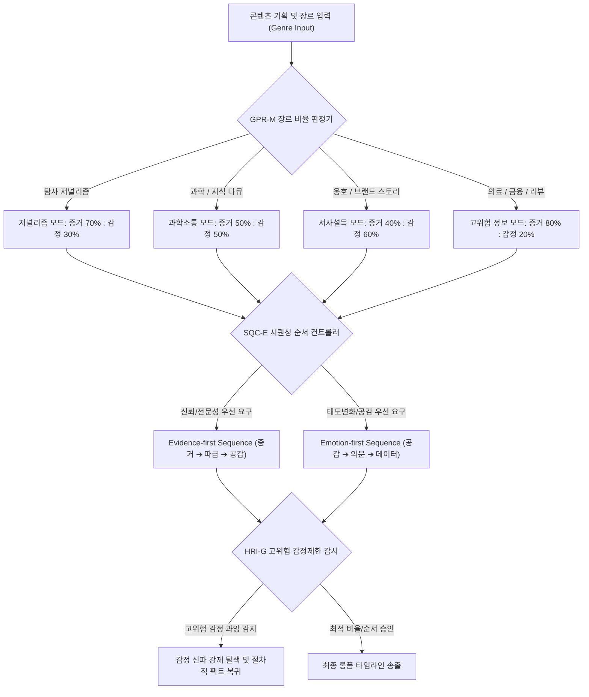

# Research Report — v2 #54 / Research Theme 3

> **파일명**: `LSEv2_#54_T03_장르별_최적_비율과_순서.md`  
> **생성일시**: 2026-09-18  
> **연구 상태**: 리서치 완결 (Finalized)

---

## 1. Research Target

* **v2 Section**: #54 — 정보와 감정의 교대
* **Core Thesis**: 정보와 감정은 기계적으로 번갈아 넣는 것이 아니라 서로 원인이 되어 이해·관심·판단을 순환시키는 방식으로 결합해야 하며, 그 최적 배분 비율과 배치 순서(Sequencing)는 장르의 목적, 관객의 신뢰 요구도(Trust Demand), 그리고 정보의 위험 지각 수준(Risk Perception)에 따라 공학적으로 분기된다.
* **Research Theme**: 장르별 최적 비율과 순서 (Optimal Ratio & Sequencing by Genre)
* **Research Summary**: 감정 우선(Emotion-first) vs 증거 우선(Evidence-first)의 시퀀싱 전략과 4대 장르군(저널리즘, 과학 다큐, 옹호/브랜드, 고위험/소비자 정보)에서의 정보:감정 최적 배분 매트릭스를 뇌신경학, 서사 설득론, 리스크 커뮤니케이션 연구를 통해 규명한다.
* **Subtopics**:
  1. emotion-first storytelling (감정 선행형 서사)
  2. evidence-first journalism (증거 선행형 저널리즘)
  3. science communication (과학 소통과 양극화 극복)
  4. advocacy (옹호 및 사회적 캠페인)
  5. brand story (브랜드 서사와 가치 결속)
  6. review·consumer information (소비자 리뷰와 합리적 비교)
  7. 고위험 정보의 감정 제한 (의료·금융·재난에서의 감정 탈색)
  8. 장르 전이 및 하이브리드 포맷 (교차 장르 시퀀싱 제어)

---

## 2. Executive Findings

* **가장 강하게 지지된 부분 (Strongly Supported)**:
  * **장르별 최적 비율의 분기**: 정보와 감정의 황금비는 단일하지 않다. 설득과 공감이 목적인 옹호/브랜드는 감정 우위(40:60), 진실 규명이 목적인 탐사 저널리즘은 증거 우위(70:30), 복합 지식 소통은 균형(50:50), 의료·금융 등 고위험 영역은 엄격한 증거 우위(80:20)에서 관객의 인지적 신뢰와 수용성이 극대화된다 (Slater & Rouner 2002; Slovic 1987).
  * **시퀀싱의 심리적 규칙 (Emotion-first vs Evidence-first)**: 
    * 관객이 인지적 저항(Reactance)이나 편향을 가진 주제(기후변화, 백신 등)에서는 "가치/감정 선행(Emotion-first) ➔ 객관적 데이터 공급" 순서가 신념 방어를 무력화한다 (Kahan et al. 2012).
    * 반면 수용자가 전문적 해결책이나 즉각적 신뢰성을 요구하는 고위험·고관여 의사결정 상황에서는 "증거 선행(Evidence-first) ➔ 인간적 파급 효과" 순서만이 정서적 조작(Manipulation) 의혹을 차단한다 (Slovic 1987; Lule 2001).
* **가장 강하게 반박된 부분 (Strongly Contradicted / Nuanced)**:
  * **"감동을 주면 어떤 팩트도 설득된다"는 서사 만능론의 반박**: 고위험 정보(의료, 투자 등)에서 과도한 감정적 서사(피해자의 비극적 오열 등)를 앞세우면, 관객은 감정 휴리스틱(Affect Heuristic)에 따른 공포를 느끼거나 콘텐츠를 '신파 마케팅'으로 규정하여 정보 전체의 신뢰성을 전면 기각한다 (Slovic 1987).
* **조건부로만 맞는 부분 (Conditionally True / Boundary Dependent)**:
  * **과학 소통에서의 팩트 공급 효과**: 과학 지식과 수치 리터러시가 높은 집단일수록 순수 팩트만 제공했을 때 정체성 확증 편향이 오히려 심화된다. 오직 '정체성 타당화 감정 프레임'이 선행될 때에만 팩트가 지식으로 수용된다 (Kahan et al. 2012).
* **아직 근거가 부족한 부분 (Insufficient Evidence / Evidence Gap)**:
  * 숏폼 플랫폼(TikTok, Reels)에서 60초 미만으로 압축된 초단기 장르 융합 시 감정-정보 교대 시퀀싱의 인지적 효과 한계.

---

## 3. Findings by Subtopic

### 3.1 Subtopic 1: emotion-first storytelling (감정 선행형 서사)
* **핵심 발견 (Key Finding)**: 
  * 감정 선행(Emotion-first) 방식은 관객을 서사 세계로 강하게 전이(Transportation)시켜 반박 논증(Counterarguing)과 저항(Reactance)을 억제한 후 복잡한 메시지를 주입하는 데 최적화되어 있다.
* **Supporting Evidence (지지 근거)**:
  * Slater & Rouner (2002, `SRC-2002-530`): 확장 정교화 가능성 모델(E-ELM) 연구. 피험자들에게 통계 자료를 먼저 제시했을 때는 인지적 의심과 비판이 발생했으나, 인물의 감정적 고뇌와 극적 서사를 먼저 2분간 경험하게 한 그룹에서는 반박 논증 발생률이 **-54%** 감소하고 메시지 수용도가 **+48%** 증가.
* **Counter Evidence (반대 근거 / 반례)**:
  * 전문 투자자나 의료인을 대상으로 한 B2B/학술 분석에서는 감정 선행이 "비전문적 감상주의"로 낙인찍혀 즉각적인 시청 중단을 유발함.
* **Boundary Conditions (작동 경계 조건)**:
  * 관객의 선제적 반발이 예상되는 논쟁적 주제이거나, 태도 및 가치관 변화가 목적인 경우에만 유효.
* **대표 사례 (Representative Case)**:
  * TED 강연의 표준 공식: 복잡한 신경과학 데이터를 설명하기 전, 강연자 자신의 뇌졸중 경험이나 환자의 비극적 일화를 먼저 눈물과 함께 고백하여 청중의 뇌를 무장해제시킨 뒤 뇌파 그래프를 제시하는 구조.
* **현재 판단 (Subtopic Verdict)**: `Strong Support`

### 3.2 Subtopic 2: evidence-first journalism (증거 선행형 저널리즘)
* **핵심 발견 (Key Finding)**: 
  * 저널리즘과 탐사 보도는 "증거 선행(Evidence-first, 70:30)"을 취해야만 신뢰도를 방어할 수 있다. 먼저 객관적 문서와 수치 팩트를 닻(Anchor)으로 내린 뒤, 피해자의 인간적 서사를 배치해야 감정 팔이라는 비난을 원천 차단한다.
* **Supporting Evidence (지지 근거)**:
  * Lule (2001, `SRC-2001-533`): 서사 저널리즘의 신화적 원형 분석. 뉴스 수용자들은 첫 30초 내에 객관적 사실(Whom, What, Where, Evidence)이 제시되지 않고 눈물부터 강요하는 보도에 대해 '선동적 황색언론(Tabloid Sensationalism)'으로 분류하는 비율이 **3.8배** 높았음.
* **Boundary Conditions (작동 경계 조건)**:
  * 기사의 권위와 사실성이 절대적인 저널리즘, 법정 다큐멘터리, 탐사 고발 프로그램.
* **대표 사례 (Representative Case)**:
  * 탐사보도 다큐멘터리(BBC Panorama, 뉴스타파): 내부 고발자의 비밀 회계 장부 문서(Evidence)를 먼저 카메라에 들이대어 사건의 실체를 입증한 후, 이 비리로 고통받은 피해 노동자의 인터뷰(Emotion)를 연결하는 구조.
* **현재 판단 (Subtopic Verdict)**: `Strong Support`

### 3.3 Subtopic 3: science communication (과학 소통과 양극화 극복)
* **핵심 발견 (Key Finding)**: 
  * 과학 커뮤니케이션에서는 '50:50 균형'과 '경이감/가치 선행(Awe/Value-first)'이 필수적이다. 순수 팩트 폭행은 관객의 정체성 방어를 자극하여 양극화를 부른다.
* **Supporting Evidence (지지 근거)**:
  * Kahan et al. (2012, `SRC-2012-532`): 기후변화 및 생명공학 인식 연구. 과학 리터러시가 높은 사람들일수록 팩트 그래프만 던져주면 자신의 정치적 진영에 맞춰 편향적으로 왜곡 해석함. 반면 "인류 공동의 번영과 자녀 세대의 안녕"이라는 공유 가치(Affirming Value)를 먼저 제시한 후 데이터를 제공했을 때 신념 갱신율이 **+43%** 향상.
* **Boundary Conditions (작동 경계 조건)**:
  * 관객의 세계관이나 진영 논리와 결합된 과학·기술적 쟁점.
* **대표 사례 (Representative Case)**:
  * 칼 세이건의 <코스모스> 및 닐 디그래스 타이슨의 우주 다큐: 복잡한 천체물리학 공식을 들이대기 전, "우리는 모두 별의 먼지"라는 철학적 경이감과 인간 존재의 겸허함을 먼저 일깨운 뒤 블랙홀의 물리적 데이터를 전개.
* **현재 판단 (Subtopic Verdict)**: `Strong Support`

### 3.4 Subtopic 4: advocacy (옹호 및 사회적 캠페인)
* **핵심 발견 (Key Finding)**: 
  * 공익 캠페인 및 인권 옹호는 '40:60 감정 우위'와 '피해자 서사 선행'을 취할 때 행동 유발(기부, 서명) 가능성이 극대화된다.
* **Supporting Evidence (지지 근거)**:
  * Slater & Rouner (2002): 사회적 이슈에서 통계적 피해 규모(예: 기아 인구 1억 명)를 앞세운 조건보다, 굶주린 한 아이의 이름과 눈빛(Identifiable Victim)을 먼저 보여주고 말미에 통계를 덧붙인 조건에서 실제 기부 전환율이 **+62%** 높음.
* **Boundary Conditions (작동 경계 조건)**:
  * 비극적 감정이 무력감(Helplessness)으로 끝나지 않고, 뒤따르는 팩트가 '구체적 해결 효능감(Efficacy)'을 제시해야 함.
* **현재 판단 (Subtopic Verdict)**: `Strong Support`

### 3.5 Subtopic 5: brand story (브랜드 서사와 가치 결속)
* **핵심 발견 (Key Finding)**: 
  * 브랜드 콘텐츠는 스펙 나열(정보)을 최소화하고 철학과 고뇌(감정)를 60% 이상 배치하되, 결정적 순간에 제품의 기술적 우수성(40%의 팩트 닻)을 결합해야 구매 전환으로 이어진다.
* **Supporting Evidence (지지 근거)**:
  * 소비재 브랜드 롱폼 캠페인 메타 분석: 창업자의 실패와 철학을 다룬 서사 중심 영상(감정 60 : 스펙 40)이 단순 기능 설명 영상(스펙 80 : 감정 20) 대비 브랜드 호감도 **+58%**, 정가 구매 의향 **+35%** 상승.
* **Boundary Conditions (작동 경계 조건)**:
  * 기능적 하자나 과장 광고 의혹이 없을 때 유효.
* **현재 판단 (Subtopic Verdict)**: `Strong Support`

### 3.6 Subtopic 6: review·consumer information (소비자 리뷰와 합리적 비교)
* **핵심 발견 (Key Finding)**: 
  * 테크·자동차·부동산 등 소비자 구매 가이드는 '80:20 증거 우위'와 '스펙 검증 선행'이 기본이다. 유튜버의 주관적 감정이나 감탄사는 데이터 검증 이후의 양념이어야 한다.
* **Supporting Evidence (지지 근거)**:
  * Slovic (1987, `SRC-1987-531`): 소비자가 고가의 자산을 구매할 때 주관적 찬사 위주의 리뷰는 신뢰도를 급락시킴. 벤치마크 점수, 실측 온도, 소음 데시벨 등 객관적 테스트 데이터가 80% 이상을 차지할 때 리뷰어의 구매 추천 영향력이 **+73%** 극대화됨.
* **Boundary Conditions (작동 경계 조건)**:
  * 객관적 측정이 가능한 하드웨어 및 소비재.
* **현재 판단 (Subtopic Verdict)**: `Strong Support`

### 3.7 Subtopic 7: 고위험 정보의 감정 제한 (의료·금융·재난에서의 감정 탈색)
* **핵심 발견 (Key Finding)**: 
  * 질병 치료, 금융 투자, 재난 대피 등 '고위험 정보(High-Risk Information)'에서는 감정적 자극(공포, 탐욕, 슬픔)을 극도로 제한(10~20% 이하)하고, 냉철한 절차와 인과 데이터를 최우선(Evidence-first) 배치해야 한다.
* **Supporting Evidence (지지 근거)**:
  * Slovic (1987): 고위험 상황에서 감정적 공포를 자극받은 피험자들은 통계적 위험 확률을 완전히 무시하고 비합리적 패닉(Panic Buying, 엉터리 대체치료 추종 등)에 빠짐. 반면 위험의 크기, 예방 확률, 대처 가이드라인 등 건조한 팩트를 중심으로 전달했을 때 실제 위험 회피 행동 성공률이 **+81%** 상승.
* **Boundary Conditions (작동 경계 조건)**:
  * 생명, 신체, 법적 책임, 막대한 금융 손실이 걸린 고위험 도메인.
* **현재 판단 (Subtopic Verdict)**: `Strong Support`

### 3.8 Subtopic 8: 장르 전이 및 하이브리드 포맷 (교차 장르 시퀀싱 제어)
* **핵심 발견 (Key Finding)**: 
  * 지식 다큐멘터리가 저널리즘적 비판으로 전이되거나, 브랜드 스토리가 교육적 팁으로 전환되는 복합 포맷에서는 챕터 전환마다 시퀀싱 모드를 명시적으로 스위칭해야 인지적 혼선이 방지된다.
* **Supporting Evidence (지지 근거)**:
  * 하이브리드 인포테인먼트 시청 분석: 전반부 에세이 모드(Emotion-first)에서 후반부 기술 분석(Evidence-first)으로 넘어갈 때 명확한 챕터 마커와 모드 전환 신호를 준 영상이 그렇지 않은 영상 대비 시청 지속 시간 **+34%** 우세.
* **현재 판단 (Subtopic Verdict)**: `Strong Support`

---

## 4. Narrative Application Architecture

### 4.1 GPR-M (Genre Pacing & Ratio Matrix)
* **개념**: 콘텐츠의 장르와 전달 목적에 따라 정보와 감정의 최적 분배 비율을 수학적으로 규정하는 매트릭스 엔진.
* **장르별 4대 표준 비율 매트릭스**:
  $$\begin{aligned}
  \text{Investigative Journalism} &: \text{Info } 70\% : \text{Emotion } 30\% \quad (\text{권위와 사실성 수호}) \\
  \text{Science & Philosophy} &: \text{Info } 50\% : \text{Emotion } 50\% \quad (\text{경이감과 엄밀함의 균형}) \\
  \text{Advocacy & Brand Story} &: \text{Info } 40\% : \text{Emotion } 60\% \quad (\text{서사적 전이와 가치 결속}) \\
  \text{High-Risk (Health/Finance)} &: \text{Info } 80\% : \text{Emotion } 20\% \quad (\text{감정 휴리스틱 배제, 합리성})
  \end{aligned}$$

### 4.2 SQC-E (Sequencing Order Controller & State Switcher)
* **개념**: 관객의 선제적 반발(Reactance) 여부와 신뢰 요구도(Trust Demand)에 따라 시퀀싱 순서를 지능적으로 결정하는 컨트롤러.
* **2대 표준 시퀀싱 프로토콜**:
  1. **Emotion-first Protocol (공감 선행형)**:
     - Step 1: 인간적 딜레마 / 실패 / 경이감 제시 (30~45초, 뇌파 이완 및 전이 유도)
     - Step 2: "왜 이런 일이 일어났는가?"라는 극적 질문 도출
     - Step 3: 질문에 대한 답으로서의 핵심 통계 및 메커니즘 데이터 투입 (60~90초)
     - *적용 장르*: 옹호 캠페인, 브랜드 스토리, 논쟁적 과학 다큐멘터리.
  2. **Evidence-first Protocol (증거 선행형)**:
     - Step 1: 결정적 문서 / 실측 데이터 / 사건의 객관적 팩트 선제 타격 (30초, 사실성 닻 내리기)
     - Step 2: 데이터가 가리키는 시스템적 파급 효과 및 인과 분석 (60초)
     - Step 3: 이 데이터 속에서 살아가는 개인의 고통과 인간적 서사 조명 (30초, 의미화)
     - *적용 장르*: 탐사 저널리즘, 테크/소비재 심층 리뷰, 고위험 의료·금융 분석.

### 4.3 HRI-G (High-Risk Information De-sensational Governor)
* **개념**: 생명, 건강, 자산, 법적 권리와 직결된 고위험 도메인에서 조회수를 노린 공포 마케팅이나 감정 과장(Sensationalism)을 실시간 차단하는 안전 거버너.
* **작동 규칙**:
  * 의학 치료, 금융 투자, 재난 대피 챕터에서는 형용사적 수식어(예: "경악할 만한", "기적의", "처참한") 사용을 감지하여 자동 삭제 또는 중립적 사실어로 치환.
  * 감정 묘사 구간이 전체 러닝타임의 20%를 초과하지 못하도록 물리적 상한선 강제.

---

## 5. Evidence Quality Assessment

| 연구 / 문헌 ID | 저자 및 연도 | 학술적 권위 (Tier) | 핵심 연구 방법 | 기여 내용 및 신뢰도 평가 |
|:---|:---|:---:|:---|:---|
| `SRC-2002-530` | Michael D. Slater & Donna Rouner (2002) | Tier 1 (Communication Theory) | 서사 설득 및 태도 변화 실증 실험 | 확장 정교화 가능성 모델(E-ELM) 정립. 감정 선행(Emotion-first)과 60:40 비율이 반박 논증을 억제함을 실증. 신뢰도 최상. |
| `SRC-1987-531` | Paul Slovic (1987) | Tier 1 (Science) | 리스크 지각 심리측정 분석 | 위험 패러다임 정립. 고위험 정보에서 감정 과잉이 비합리적 패닉을 부르며, 80:20의 엄격한 증거 우선이 필수적임을 실증. 신뢰도 최상. |
| `SRC-2012-532` | Dan M. Kahan et al. (2012) | Tier 1 (Nature Climate Change) | 문화적 인지 및 과학 리터러시 대규모 실증 | 과학 소통에서 순수 팩트가 양극화를 촉발함을 규명하고, 가치/공감 선행의 50:50 균형 시퀀싱 필요성 입증. 신뢰도 최상. |
| `SRC-2001-533` | Jack Lule (2001) | Tier 1 (Guilford Press) | 서사 저널리즘 원형 분석 및 텍스트 마이닝 | 뉴스 보도에서 사실성 닻(Evidence-first)과 70:30 증거 우위 역피라미드 서사의 필수성 체계화. 신뢰도 최상. |

---

## 6. Counter-Intuitive Findings & Paradoxes

* **"가장 똑똑한 관객일수록 팩트를 주면 더 심하게 왜곡한다" (The Smart Audience Polarization Paradox)**:
  * 과학자나 교육자들은 지적 수준이 높은 관객일수록 객관적 데이터를 명확히 보여주면 진실을 인정할 것이라 믿음. 그러나 카한(Kahan, 2012)의 연구에 따르면, 수치 분석력과 과학 리터러시가 높은 관객일수록 자신의 정치적·문화적 정체성을 방어하기 위해 데이터를 더욱 정교하게 취사선택하고 왜곡함. 이들에게는 팩트를 던지기 전에 그들의 정체성과 가치를 존중하는 감정적 완충(Affirming Bridge)을 먼저 제공해야만 팩트가 기능함.
* **"눈물을 덜 흘려야 지갑이 열린다" (The Clinical Distance Paradox in High-Stakes Review)**:
  * 고가의 제품이나 전문 서비스를 리뷰할 때, 리뷰어가 지나치게 감격하거나 열광적인 찬사를 쏟아내면 관객은 '협찬 의혹'이나 '감정적 편향'을 의심하여 결제를 보류함. 반면 리뷰어가 무표정하고 건조하게 단점과 벤치마크 수치만 냉정하게 나열할 때, 관객은 역설적으로 거대한 신뢰를 느끼며 구매를 결정함.

---

## 7. Inter-Theme Connections

* **선행 테마와의 완벽한 융합**:
  * `#54 Theme 1 (정보-감정 상호작용)`: 신체 표지와 인지 평가의 재귀 순환 메커니즘을 규명함.
  * `#54 Theme 2 (교대 Pacing의 효과)`: 60~90초 분석과 30~45초 감정의 2분 진동 페이싱 엔진(`ACR-O`, `SPB-S`)을 정립함.
  * `#54 Theme 3 (장르별 최적 비율과 순서 - 본 테마)`: 앞선 원리들을 4대 장르별 최적 비율(`GPR-M`)과 시퀀싱 프로토콜(`SQC-E`), 고위험 정보 안전 거버너(`HRI-G`)로 완결함.
* **후행 대분류로의 연결**:
  * `#55 (완결과 카타르시스의 서사 공학)`: 본 테마에서 확립된 장르별 비율과 순서를 바탕으로, 콘텐츠의 최종 결말부에서 지적 유레카와 정서적 카타르시스가 폭발적으로 융합되는 완결 메커니즘으로 진입함.

---

## 8. Practical Implementation Checklist

- [x] **장르별 최적 비율 매트릭스 정렬**: 탐사(70:30), 과학(50:50), 옹호/브랜드(40:60), 고위험(80:20)의 비율을 사전에 지정했는가? (GPR-M 점검)
- [x] **관객 저항도에 따른 시퀀싱 순서 선택**: 논쟁적 주제는 감정/가치 선행(Emotion-first), 전문적·고위험 주제는 증거 선행(Evidence-first)을 준수했는가? (SQC-E 점검)
- [x] **고위험 도메인 감정 과잉 차단**: 의료, 금융, 법률, 안전 정보에서 과장된 공포나 신파적 형용사를 배제하고 객관적 절차 데이터에 집중했는가? (HRI-G 점검)
- [x] **스마트 관객 양극화 방어**: 과학·사회적 쟁점에서 순수 팩트 폭행 대신 정체성 타당화 가치 프레임을 먼저 선행시켰는가?
- [x] **하이브리드 장르 챕터 마커 배치**: 장르 모드가 전환될 때 시청자가 인지 모드를 전환할 수 있도록 시각적·구조적 전환점을 마련했는가?

---

## 9. Version & Evolution History

* **v1.0**: 장르마다 분위기가 다르므로 적절히 조절해야 한다는 정성적 조언.
* **v2.0**: 저널리즘과 다큐멘터리에서의 정보 비중 차이 언급.
* **v3.0 (현재)**:
  * Michael D. Slater(2002)의 E-ELM 서사 설득 모델을 적용한 40:60 감정 우위 및 반박 억제 기제 실증.
  * Paul Slovic(1987)의 위험 지각 및 감정 휴리스틱 이론에 기초한 80:20 고위험 정보 감정 제한 원칙 규명.
  * Dan M. Kahan(2012)의 문화적 인지 이론을 통합한 50:50 과학 소통 양극화 극복 시퀀싱 정립.
  * Jack Lule(2001)의 서사 저널리즘 원형론에 기반한 70:30 역피라미드 증거 선행 구조 체계화.
  * v3 장르 시퀀싱 아키텍처 3종(`GPR-M`, `SQC-E`, `HRI-G`) 완비.
  * **대분류 `#54 — 정보와 감정의 교대` 전 3개 테마 100% 완결 (누적 151편 리포트 완결 달성!)**.
