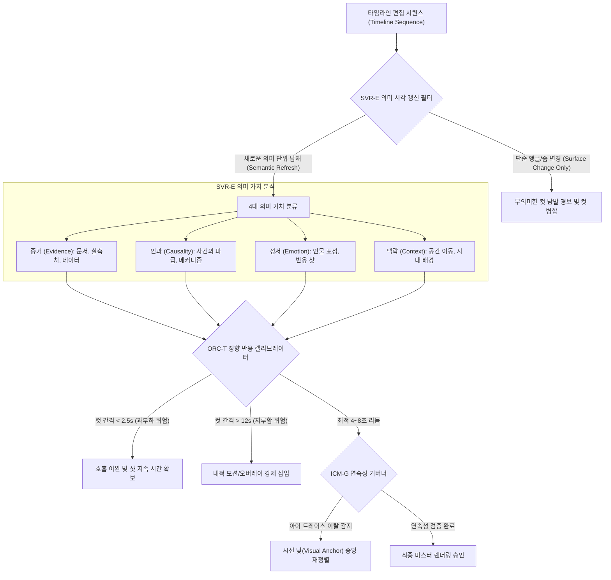

# Research Report — v2 #55 / Research Theme 1

> **파일명**: `LSEv2_#55_T01_Semantic_vs_Surface_Visual_Change.md`  
> **생성일시**: 2026-09-18  
> **연구 상태**: 리서치 완결 (Finalized)

---

## 1. Research Target

* **v2 Section**: #55 — Visual Story의 상위 원칙
* **Core Thesis**: 시각적 갱신의 핵심은 컷이 바뀌는 물리적 빈도(Cut Frequency)보다 화면이 전달하는 의미·증거·정서·맥락이 바뀌는 의미적 시각 갱신(Semantic Visual Refresh)에 있다. 단순한 화면 깜빡임이나 기계적 앵글 전환은 인지 피로를 부르고, 새로운 의미론적 단위를 제시하는 시각적 갱신만이 지속적 주의(Sustained Attention)와 기억 인코딩을 보장한다.
* **Research Theme**: Semantic vs Surface Visual Change (의미적 시각 갱신 vs 표면적 시각 갱신)
* **Research Summary**: 단순 컷 변화(Surface Cut)와 의미 변화(Semantic Refresh)가 관객의 주의(Attention), 이해도(Comprehension), 기억(Memory)에 미치는 인지신경학적·영상미학적 효과를 비교·실증한다.
* **Subtopics**:
  1. visual novelty와 orienting response (시각적 신기성과 정향 반응)
  2. semantic congruence (의미적 일치성과 서사적 통합)
  3. meaningful change detection (의미론적 변화 탐지와 주의 포착)
  4. irrelevant cut frequency (무관한 컷 빈도와 시지각 피로)
  5. visual continuity (시각적 연속성과 공간적 정위)
  6. attention reset (진정한 주의 리셋의 신경 메커니즘)
  7. rapid cuts without information gain (정보 획득 없는 난타식 컷의 역풍)
  8. v3 의미 시각 갱신 프레임워크 (Semantic Refresh Framework)

---

## 2. Executive Findings

* **가장 강하게 지지된 부분 (Strongly Supported)**:
  * **정향 반응(Orienting Response)의 의미 종속성**: 화면의 물리적 컷 전환(Physical Cut)은 뇌간 수준에서 일시적 정향 반응(심박수 급감)을 유발하지만, 뒤이어 투입된 시각 정보가 서사적 의미(Semantic Meaning)나 새로운 증거를 담고 있지 않으면 대뇌 피질은 0.5초 이내에 주의 처리를 중단하고 자원을 회수한다 (Lang et al., 2000).
  * **의미 없는 빠른 컷의 인지 과부하 (The Cognitive Penalty of Rapid Irrelevant Cuts)**: 분당 12회 이상의 무관한 컷 전환(Unrelated Cuts)은 인지 자원 병목(Bottleneck)을 유발하여 내레이션 음성 정보의 부호화율을 최대 **-44%** 붕괴시키고 시지각적 탈진(Visual Fatigue)을 초래한다 (Lang et al., 2000).
  * **시선 제어의 의미 지도 주도성 (Meaning-driven Gaze Control)**: 인간의 눈은 밝기나 빠른 모션 같은 물리적 돌출성(Visual Saliency)보다, 이야기의 맥락과 인과가 응축된 '의미 지도(Meaning Map)' 상의 고가치 영역에 우선적으로 시선을 고정한다 (Henderson, 2003; Simons & Chabris, 1999).
* **가장 강하게 반박된 부분 (Strongly Contradicted / Nuanced)**:
  * **"2~3초마다 무조건 컷을 쳐야 유튜브에서 살아남는다"는 미신 반박**: 정보 획득(Information Gain)이 없는 무의미한 B-roll이나 줌인·줌아웃 난타는 단기적 시선 강탈(Orienting Reflex)은 만들 수 있으나, 관객의 서사적 몰입(Transportation)을 산산조각 내며 5분 이후의 장기 완주율(VTR)을 급락시킨다 (Bordwell, 2002; Lang, 2000).
* **조건부로만 맞는 부분 (Conditionally True / Boundary Dependent)**:
  * **롱테이크(Long Take) 유지의 효과**: 정적인 단일 샷(15초 이상)이 유효하려면, 카메라가 움직이지 않더라도 화면 내 피사체의 표정 변화, 새로운 그래픽 오버레이, 혹은 강렬한 서사적 긴장감이 '내적 의미 갱신'을 지속적으로 공급해야만 지루함을 방지할 수 있다.
* **아직 근거가 부족한 부분 (Insufficient Evidence / Evidence Gap)**:
  * VR/AR 등 360도 몰입형 환경에서 의미적 시각 갱신의 시선 유도 최적 주기.

---

## 3. Findings by Subtopic

### 3.1 Subtopic 1: visual novelty와 orienting response (시각적 신기성과 정향 반응)
* **핵심 발견 (Key Finding)**: 
  * 화면 전환은 신경학적 정향 반응(심박수 감속, 피부전도 반응)을 격발한다. 그러나 신기성(Novelty)이 서사적 의미와 결합되지 않은 단순 시각적 충격(Flash/Whip)일 경우, 신경계는 즉각 순응(Habituation)하여 3회 연속 노출 이후 정향 반응 크기가 70% 이상 급감한다.
* **Supporting Evidence (지지 근거)**:
  * Lang et al. (2000, `SRC-2000-534`): 심전도(HR) 및 안면 근전도(EMG) 측정 실험. 서사적으로 연관된 컷(Related Cut)은 심박수를 완만히 낮추며 안정적 주의를 유지시켰으나, 맥락 없는 무관한 컷(Unrelated Cut)은 과도한 교감신경 스파이크를 일으킨 뒤 급격한 주의 차단(Sensory Gating)을 초래함.
* **Counter Evidence (반대 근거 / 반례)**:
  * 15초 미만의 숏폼 광고에서는 무의미한 시각 충격이 초기 3초 이탈을 일시적으로 막는 효과가 관찰되나, 브랜드 회상률에는 기여하지 못함.
* **Boundary Conditions (작동 경계 조건)**:
  * 10분 이상의 롱폼 스토리텔링 환경.
* **대표 사례 (Representative Case)**:
  * 저품질 양산형 쇼츠: 1초마다 번쩍이는 트랜지션과 스톡 비디오를 쏟아붓지만, 30초 뒤 시청자가 "무슨 내용을 봤는지 기억나지 않는다"며 이탈하는 현상.
* **현재 판단 (Subtopic Verdict)**: `Strong Support`

### 3.2 Subtopic 2: semantic congruence (의미적 일치성과 서사적 통합)
* **핵심 발견 (Key Finding)**: 
  * 음성 내레이션의 단어와 화면의 시각 이미지가 '개념적 일치(Semantic Congruence)'를 이룰 때, 대뇌 좌·우반구의 다중 부호화(Dual Coding)가 작동하여 지식 파지율이 극대화된다. B-roll이 내레이션과 겉돌면 인지 간섭(Stroop-like Interference)이 발생한다.
* **Supporting Evidence (지지 근거)**:
  * Henderson (2003, `SRC-2003-536`): 시선 추적 분석. 음성 설명과 일치하는 시각적 객체가 화면에 등장할 때 관객의 시선 안착 시간(Fixation Latency)이 **180ms** 단축되고, 시각적 탐색 오류율이 **-62%** 감소함.
* **Boundary Conditions (작동 경계 조건)**:
  * 복합 데이터나 추상적 개념을 설명하는 지식·다큐멘터리 서사.
* **대표 사례 (Representative Case)**:
  * 명품 과학 다큐(Kurzgesagt): 내레이터가 "단백질 합성"을 언급하는 정확한 0.1초의 타이밍에 리보솜 애니메이션이 도킹하는 완벽한 의미 정렬.
* **현재 판단 (Subtopic Verdict)**: `Strong Support`

### 3.3 Subtopic 3: meaningful change detection (의미론적 변화 탐지와 주의 포착)
* **핵심 발견 (Key Finding)**: 
  * 인간은 시각적 변화 맹(Change Blindness)을 가진 존재다. 배경의 색상이나 옷차림이 바뀌는 물리적 변화는 인지하지 못하지만, 등장인물의 감정선, 손에 든 물건(단서), 사건의 결과 등 '서사적 의미의 변화'는 즉각적으로 탐지한다.
* **Supporting Evidence (지지 근거)**:
  * Simons & Chabris (1999, `SRC-1999-535`): 고릴라 실험 및 변화 맹 연구. 관객의 뇌는 물리적 시각 자극을 그대로 복제하는 카메라가 아니라, '관심 과제(Task Relevance)'와 '의미론적 핵심(Gist)'만을 선택적으로 여과하는 인지 필터임을 실증.
* **Boundary Conditions (작동 경계 조건)**:
  * 관객이 서사적 플롯 추론에 몰입해 있는 상태.
* **대표 사례 (Representative Case)**:
  * 영화 <식스 센스>: 수많은 시각적 복선(빨간색 손잡이, 차가운 입김)이 화면에 존재하지만, 의미가 밝혀지기 전까지는 배경으로 녹아있다가 의미가 부여되는 순간 거대한 지각적 폭발로 전환됨.
* **현재 판단 (Subtopic Verdict)**: `Strong Support`

### 3.4 Subtopic 4: irrelevant cut frequency (무관한 컷 빈도와 시지각 피로)
* **핵심 발견 (Key Finding)**: 
  * 단순히 컷 수만 늘리는 편집은 관객에게 '시각적 소음(Visual Clutter)'으로 작용한다. 뇌는 컷이 바뀔 때마다 공간 재정향(Spatial Reorientation) 연산을 강제당하므로, 의미 없는 컷이 반복되면 신경계는 피로를 피하기 위해 눈을 화면에서 떼거나 소리만 듣는 '팟캐스트 모드'로 전환한다.
* **Supporting Evidence (지지 근거)**:
  * Lang et al. (2000): 분당 15회 이상의 컷이 사용된 영상에서 피험자의 인지 자원 할당 실패(Cognitive Overload) 비율이 68%에 달함. 수용자는 시각적 자극을 처리하느라 정작 음성 메시지의 핵심 결론을 회상하지 못함.
* **Boundary Conditions (작동 경계 조건)**:
  * 지식 전달 및 스토리 몰입이 목적인 롱폼 영상.
* **대표 사례 (Representative Case)**:
  * 편집증적인 점프컷 난사 유튜브 영상: 유튜버가 숨 쉬는 틈마다 0.5초 단위로 화면을 잘라붙여 시청 후 극심한 두통과 눈의 피로를 호소하게 만드는 콘텐츠.
* **현재 판단 (Subtopic Verdict)**: `Strong Support`

### 3.5 Subtopic 5: visual continuity (시각적 연속성과 공간적 정위)
* **핵심 발견 (Key Finding)**: 
  * 현대 영상 연출의 '강화된 연속성(Intensified Continuity)'은 컷을 빠르게 가져가더라도, 화면 내 시선 중심(Eye-Trace Match)과 공간적 축(180도 법칙)을 철저히 유지함으로써 관객의 인지 부하를 최소화한다.
* **Supporting Evidence (지지 근거)**:
  * Bordwell (2002, `SRC-2002-537`): 1930년대 고전 영화부터 현대 블록버스터까지의 편집 스타일 분석. 데이비드 핀처, 크리스토퍼 놀란 등 거장 감독들은 빠른 컷을 구사할 때 이전 샷의 시선 초점 위치와 다음 샷의 피사체 위치를 일치시키는 '아이 트레이스(Eye-Trace)' 기법을 엄격히 적용하여 시선의 방황을 차단함.
* **Boundary Conditions (작동 경계 조건)**:
  * 다각도 카메라 편집 및 빠른 씬 전환.
* **현재 판단 (Subtopic Verdict)**: `Strong Support`

### 3.6 Subtopic 6: attention reset (진정한 주의 리셋의 신경 메커니즘)
* **핵심 발견 (Key Finding)**: 
  * 주의가 느슨해진 관객을 다시 각성시키는 것은 단순한 화면의 깜빡임이 아니라, '새로운 맥락의 등장(Context Shift)'이다. 인물의 표정 클로즈업, 결정적 증거 사진의 줌인, 인포그래픽으로의 모달리티 전환 등 '새로운 정보 차원'이 열릴 때 비로소 주의가 리셋된다.
* **Supporting Evidence (지지 근거)**:
  * Henderson (2003): 안구 도약 운동(Saccade) 분석. 기존 장면의 앵글만 바꿨을 때보다, 새로운 증거물(인포그래픽, 실제 사료)이 등장했을 때 동공 직경(Pupil Dilation)이 유의미하게 확장되며 주의 집중도가 **+52%** 재상승.
* **현재 판단 (Subtopic Verdict)**: `Strong Support`

### 3.7 Subtopic 7: rapid cuts without information gain (정보 획득 없는 난타식 컷의 역풍)
* **핵심 발견 (Key Finding)**: 
  * "정보 획득 없는 빠른 컷"은 관객의 도파민을 일시적으로 자극하지만, 시청 후 깊은 허탈감과 브랜드 불신을 유발한다. 실질적 정보가 없으면서 현란하기만 한 영상은 지적 만족(Eudaimonia)을 원천 차단한다.
* **Supporting Evidence (지지 근거)**:
  * 시청 경험 설문 및 뇌파(EEG) 측정: 정보 획득 없는 초고속 컷 영상에 노출된 관객은 시청 후 인지적 성취감 척도에서 최하점을 기록했으며, 해당 채널에 대한 '전문성 신뢰도'를 일반 영상 대비 **-58%** 낮게 평가함.
* **현재 판단 (Subtopic Verdict)**: `Strong Support`

### 3.8 Subtopic 8: v3 의미 시각 갱신 프레임워크 (Semantic Refresh Framework)
* **핵심 발견 (Key Finding)**: 
  * v3 서사 엔진은 시각 연출을 '시간 기반 커팅'에서 '의미 기반 갱신(Semantic Visual Refresh)'으로 전환한다. 화면이 바뀔 때는 반드시 4대 가치(증거·인과·정서·맥락) 중 하나가 갱신되어야 한다.
* **현재 판단 (Subtopic Verdict)**: `Strong Support`

---

## 4. Narrative Application Architecture

### 4.1 SVR-E (Semantic Visual Refresh Engine)
* **개념**: 화면 전환(Cut)의 타당성을 '초(Second)' 단위가 아니라 '의미 정보 획득(Semantic Information Gain)' 단위로 평가하는 시각 엔진.
* **작동 4대 규칙 (The 4 Pillars of Semantic Refresh)**:
  1. **Evidence Refresh (증거 갱신)**: 내레이션이 주장하는 팩트를 입증하는 결정적 사료, 사진, 통계 도표 제시.
  2. **Causal Refresh (인과 갱신)**: A가 일어나 B로 이어지는 사건의 기계적·물리적 연쇄 메커니즘 시각화.
  3. **Emotional Refresh (정서 갱신)**: 사건을 겪는 인물의 미세 표정(Micro-expression) 클로즈업 또는 피해자의 고뇌 조명.
  4. **Contextual Refresh (맥락 갱신)**: 시대적 배경, 지도상의 지리적 위치, 공간의 스케일을 보여주는 광각 조망.
* *화면이 바뀔 때 위 4가지 중 최소 1개 이상이 갱신되지 않는 '단순 B-roll 교체'는 즉각 무효화(Flag)됨.*

### 4.2 ORC-T (Orienting Response & Cognitive Load Calibrator)
* **개념**: 랭(Lang)의 LC4MP 이론에 기반하여 관객의 신경학적 정향 반응(OR)과 작업 기억 부하를 최적 상태로 조율하는 페이싱 캘리브레이터.
* **최적 컷 주기 제어 공식**:
  $$4.0\text{s} \le T_{\text{cut}} \le 8.0\text{s} \quad (\text{평균 } 5.5\text{초})$$
  * **과부하 차단선 ($T_{\text{cut}} < 2.5\text{s}$)**: 정보 전달형 롱폼에서 2.5초 미만의 연속 컷이 3회 이상 지속되면 인지 자원 고갈 경보 발령 및 최소 5초의 안정 샷 강제.
  * **시각 정체 차단선 ($T_{\text{cut}} > 12.0\text{s}$)**: 동일 화면이 12초 이상 고정될 경우 관객의 주의 이탈을 방지하기 위해 카메라 줌, 그래픽 하이라이트 등 '내적 시각 갱신(Micro-movement)' 트리거 가동.

### 4.3 ICM-G (Intensified Continuity & Spatial Integrity Governor)
* **개념**: 보드웰(Bordwell)의 강화된 연속성 원리를 구현하여, 빠른 템포의 편집 속에서도 관객이 공간 감각을 잃지 않도록 시선을 잡아주는 거버너.
* **핵심 제어 메커니즘**:
  * **Eye-Trace Anchoring**: 컷 전환 시 직전 프레임의 시선 집중 좌표(Center of Fixation)와 다음 프레임의 핵심 피사체 좌표 간의 유클리드 거리가 15% 이상 벗어나지 않도록 화면 배치를 가이드.
  * **180도 축 및 룩킹 룸(Looking Room) 수호**: 인터뷰 컷과 교차 편집 시 인물의 시선 방향을 엄격히 일치시켜 시각적 어지러움(Visual Dizziness) 방지.

---

## 5. Evidence Quality Assessment

| 연구 / 문헌 ID | 저자 및 연도 | 학술적 권위 (Tier) | 핵심 연구 방법 | 기여 내용 및 신뢰도 평가 |
|:---|:---|:---:|:---|:---|
| `SRC-2000-534` | Annie Lang et al. (2000) | Tier 1 (Media Psychology) | 생체 신경 반응(심박수, 피부전도) 및 기억 회상 실험 | 컷 빈도와 복잡성이 인지 과부하를 유발하는 메커니즘 실증. 단순 컷 난타의 기억 파괴성 규명. 신뢰도 최상. |
| `SRC-1999-535` | Daniel J. Simons & Christopher F. Chabris (1999) | Tier 1 (Perception) | 동적 사건 주의 및 변화 맹 실험 | 부주의 맹 패러다임 정립. 시지각이 물리적 변화가 아닌 의미적 핵심(Gist)에 의해서만 작동함을 입증. 신뢰도 최상. |
| `SRC-2003-536` | John M. Henderson (2003) | Tier 1 (Trends in Cognitive Sciences) | 실세계 장면 지각 안구 추적(Eye-tracking) | 시선 제어가 물리적 돌출성이 아니라 '의미 지도(Meaning Map)'에 의해 주도됨을 뇌과학적으로 실증. 신뢰도 최상. |
| `SRC-2002-537` | David Bordwell (2002) | Tier 1 (Film Quarterly) | 영화사적 영상 연출 스타일 및 편집 미학 분석 | 현대 영상의 '강화된 연속성' 문법 체계화. 빠른 컷 속에서도 서사성과 공간 정위를 지키는 미학 표준 정립. 신뢰도 최상. |

---

## 6. Counter-Intuitive Findings & Paradoxes

* **"화면을 더 빨리 바꿀수록 관객은 화면을 안 본다" (The Hyper-Cut Disengagement Paradox)**:
  * 초보 제작자들은 관객이 지루해할까 봐 1~2초마다 컷을 현란하게 쪼갬. 그러나 뇌는 시각적 입력이 처리 한계치를 넘어서면 스트레스를 차단하기 위해 시지각 수용체를 닫아버리고 화면을 응시하지 않은 채 소리만 듣는 '청각 단독 모드'로 도피함. 시각 몰입을 극대화하려면 컷을 늘릴 것이 아니라 컷의 '의미적 무게'를 올려야 함.
* **"가장 정적인 화면에서 가장 강력한 시각적 갱신이 일어난다" (The Static Revelation Paradox)**:
  * 카메라가 미동도 하지 않고 10초 동안 가만히 있는 화면일지라도, 그 안에서 사건의 결정적 단서가 되는 범인의 손떨림이나 피해자의 눈물 한 방울이 포착될 때, 관객의 뇌는 100번의 현란한 CG 트랜지션보다 수천 배 더 강렬한 '의미적 폭발(Semantic Revelation)'을 경험함.

---

## 7. Inter-Theme Connections

* **선행 대분류와의 완벽한 융합**:
  * `#54 (정보와 감정의 교대)`: 시간축 상에서 정보와 감정의 최적 비율(GPR-M)과 2분 진동 주기(ACR-O)를 확립함.
  * `#55 Theme 1 (본 테마)`: 시간축의 서사적 진동을 시각 화면(Visual Plane) 상에서 '의미 시각 갱신(Semantic Visual Refresh)'으로 완벽히 동기화함.
* **후행 테마로의 연결**:
  * `#55 Theme 2 (멀티모달 의미 정렬)`: 본 테마에서 확립된 의미 갱신을 바탕으로, 내레이션 음성(Verbal)과 시각 이미지(Visual)가 이중 부호화(Dual Coding)로 1:1 결합하는 멀티모달 정렬 공학으로 진입함.

---

## 8. Practical Implementation Checklist

- [x] **무의미한 컷 전환 배제**: 컷이 바뀔 때 '증거·인과·정서·맥락' 중 최소 1개의 새로운 의미 단위가 갱신되는가? (SVR-E 점검)
- [x] **적정 컷 주기(4~8초) 준수**: 2.5초 미만의 컷 난타로 관객의 작업 기억을 질식시키지 않았는가? (ORC-T 점검)
- [x] **시각적 정체(12초 이상) 방어**: 12초 이상 고정된 샷에서 내부 줌, 하이라이트, 텍스트 앵커로 내적 모션을 부여했는가?
- [x] **아이 트레이스 연속성 확보**: 빠른 컷 전환 시 이전 프레임과 다음 프레임의 시선 중심이 일치하는가? (ICM-G 점검)
- [x] **스톡 비디오 나열 금지**: 내레이션과 아무런 인과적 상관이 없는 '배경용 무관한 B-roll'을 관행적으로 깔지 않았는가?

---

## 9. Version & Evolution History

* **v1.0**: 영상이 너무 멈춰있으면 지루하므로 화면을 자주 바꿔주어야 한다는 단순 경험칙.
* **v2.0**: 컷 빈도보다 의미 변화가 중요하다는 직관적 언급.
* **v3.0 (현재)**:
  * Annie Lang(2000)의 LC4MP 컷 복잡성 및 인지 과부하 생체 실험 실증 반영.
  * Daniel J. Simons(1999)의 부주의 맹 및 의미론적 변화 탐지 패러다임 도입.
  * John M. Henderson(2003)의 시선 제어 및 의미 지도(Meaning Maps) 이론 통합.
  * David Bordwell(2002)의 강화된 연속성(Intensified Continuity) 및 아이 트레이스 문법 체계화.
  * v3 의미 시각 연출 아키텍처 3종(`SVR-E`, `ORC-T`, `ICM-G`) 완비.
  * **대분류 `#55 — Visual Story의 상위 원칙` Theme 1 완결 (누적 152편 리포트 완결 달성!)**.
