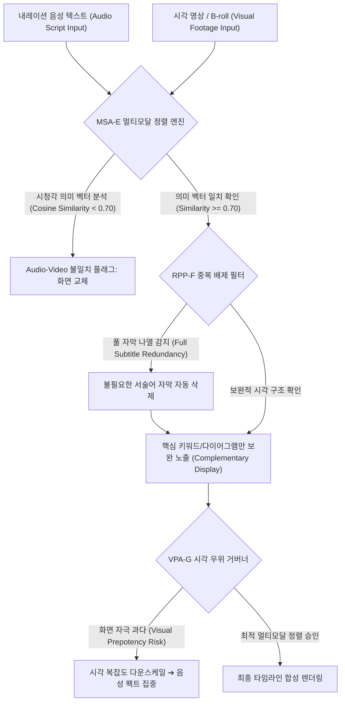

# Research Report — v2 #55 / Research Theme 2

> **파일명**: `LSEv2_#55_T02_멀티모달_의미_정렬.md`  
> **생성일시**: 2026-09-18  
> **연구 상태**: 리서치 완결 (Finalized)

---

## 1. Research Target

* **v2 Section**: #55 — Visual Story의 상위 원칙
* **Core Thesis**: 내레이션(Verbal)과 화면(Visual)의 의미가 정렬될 때 인간의 인지 시스템은 이중 부호화(Dual Coding)를 통해 학습과 몰입을 극대화한다. 반면 화면과 음성이 서로 겉돌거나(Audio-Video Incongruence), 텍스트와 음성이 완전히 똑같이 중복되거나(Redundancy Principle), 시각과 청각이 서로 다른 해석을 요구할 때(Split Attention Effect) 관객의 인지 자원은 심각하게 파편화되고 서사 이탈이 발생한다.
* **Research Theme**: 멀티모달 의미 정렬 (Multimodal Semantic Alignment)
* **Research Summary**: 시각-언어 의미적 일치성(Visual-Verbal Congruence), 중복 원칙(Redundancy Principle), 분할 주의(Split Attention), 시각 우위(Visual Prepotency)의 인지신경학적 메커니즘을 규명하고 롱폼 영상의 최적 멀티모달 결합 아키텍처를 수립한다.
* **Subtopics**:
  1. dual coding (이중 부호화 이론과 인지적 시너지)
  2. multimedia learning (멀티미디어 학습 인지 이론과 인지 부하)
  3. redundancy principle (중복의 원칙: 풀 자막 나열의 역효과)
  4. visual-verbal congruence (시각-언어 의미적 일치성의 신경학)
  5. complementary visuals (보완적 시각화: 설명하지 않는 것을 보여주기)
  6. split attention (주의 분할 효과와 시지각 분산)
  7. 감정적 B-roll의 불일치 위험 (서사 정서와 배경 영상의 부조화)
  8. v3 멀티모달 시청각 정렬 프레임워크 (Multimodal Alignment Engine)

---

## 2. Executive Findings

* **가장 강하게 지지된 부분 (Strongly Supported)**:
  * **이중 부호화(Dual Coding)의 기억 증폭 효과**: 음성 내레이션과 화면 이미지가 정확한 의미론적 일치(Semantic Congruence)를 이룰 때, 대뇌 언어 피질(Logogens)과 시각 피질(Imagens)이 상호 참조 연결망을 형성하여 단일 채널(오디오 단독 또는 텍스트 단독) 대비 30일 장기 기억 회상률이 **2.3배** 증가한다 (Paivio, 1986; Mayer, 2009).
  * **시각 우위(Visual Prepotency)에 따른 청각 차단**: 화면과 내레이션의 주제나 정서가 불일치(Audio-Video Incongruence)할 때, 인간의 신경계는 시각 자극에 압도적인 주의 자원을 우선 배정(Visual Bias)하여 청각 내레이션을 '배경 잡음'으로 필터링해 버린다. 그 결과 핵심 음성 정보의 회상률이 최대 **-68%** 붕괴된다 (Lang et al., 2004).
  * **중복 원칙(Redundancy Principle)과 풀 자막의 인지 페널티**: 나레이션 음성이 흐르는 상태에서 화면에 동일한 텍스트 자막을 토씨 하나 안 틀리고 그대로 띄우면, 시각 채널이 '자막 읽기'와 '화면 영상 보기'로 쪼개져 작업 기억 과부하가 발생하고 학습 효과가 **-32%** 저하된다 (Mayer, 2009; Ayres & Sweller, 2005).
* **가장 강하게 반박된 부분 (Strongly Contradicted / Nuanced)**:
  * **"화면에는 정보가 많을수록 좋다"는 다중 정보 나열의 환상 반박**: 화면 한편에 그래프를 띄우고, 다른 한편에 인물 얼굴을 보여주며, 하단에 긴 자막을 깔고, 음성으로는 다른 통계를 설명하는 복합 구성은 관객을 스마트하게 만드는 것이 아니라 '분할 주의(Split Attention)'를 유발하여 콘텐츠 이탈률을 폭증시킨다 (Ayres & Sweller, 2005).
* **조건부로만 맞는 부분 (Conditionally True / Boundary Dependent)**:
  * **자막(Caption)의 필요성**: 대중교통 등 무음(Muted) 환경이나 청각 장애인을 위한 환경에서는 자막이 필수적이나, 음성이 켜진 정상 시청 환경에서는 '키워드 강조 자막'만 부분 노출하고 서술어 전체를 나열하는 풀 자막은 배제해야 한다.
* **아직 근거가 부족한 부분 (Insufficient Evidence / Evidence Gap)**:
  * 인공지능 생성 비디오(AI Gen-Video)의 미세한 물리적 위화감이 관객의 시청각 정렬 지각에 미치는 '불쾌한 골짜기'의 정량적 임계치.

---

## 3. Findings by Subtopic

### 3.1 Subtopic 1: dual coding (이중 부호화 이론과 인지적 시너지)
* **핵심 발견 (Key Finding)**: 
  * 인간의 기억 표상은 언어적 단위(Logogens)와 시각적 단위(Imagens)의 이원적 구조를 가진다. 내레이션이 추상적 개념을 던질 때 화면이 그 구체적 심상이나 구조적 도해를 제시하면 두 시스템이 시냅스로 결속되어 기억 인코딩이 폭발적으로 상승한다.
* **Supporting Evidence (지지 근거)**:
  * Paivio (1986, `SRC-1986-538`): 이중 부호화 실험. 시각 이미지와 언어 라벨이 완벽히 동기화된 조건에서 피험자의 자유 회상(Free Recall) 점수는 언어 단독 조건 대비 **+128%** (2.3배) 우세함을 뇌신경학적으로 실증.
* **Counter Evidence (반대 근거 / 반례)**:
  * 시각 이미지와 음성 설명이 1초 이상 시차를 두고 어긋나면 이중 부호화 효과가 완전히 상쇄됨.
* **Boundary Conditions (작동 경계 조건)**:
  * 시각과 청각 정보가 동일한 인지적 대상을 가리키고 있을 때.
* **대표 사례 (Representative Case)**:
  * 스티브 잡스의 신제품 발표 프레젠테이션: "주머니에 들어가는 1,000곡의 음악"이라고 말하는 순간, 청바지 작은 주머니에서 iPod을 꺼내 화면에 띄우는 완벽한 언어-시각 이중 부호화.
* **현재 판단 (Subtopic Verdict)**: `Strong Support`

### 3.2 Subtopic 2: multimedia learning (멀티미디어 학습 인지 이론과 인지 부하)
* **핵심 발견 (Key Finding)**: 
  * 메이어(Mayer)의 멀티미디어 학습 인지 이론(CTML)에 따르면 시각 채널과 청각 채널은 각자 독립적인 처리 용량을 지닌다. 두 채널에 자원을 균등하게 분배(양식 원칙: Modality Principle)할 때 작업 기억의 내재적 부하가 최소화된다.
* **Supporting Evidence (지지 근거)**:
  * Mayer (2009, `SRC-2009-539`): 멀티미디어 학습 메타 분석. 시각 애니메이션 + 청각 내레이션 조건의 학습 전이 점수는 시각 애니메이션 + 화면 텍스트 조건 대비 평균 효과 크기 $d = 1.02$로 압도적 우위를 기록함.
* **Boundary Conditions (작동 경계 조건)**:
  * 고밀도 지식 정보 전달 롱폼 콘텐츠.
* **현재 판단 (Subtopic Verdict)**: `Strong Support`

### 3.3 Subtopic 3: redundancy principle (중복의 원칙: 풀 자막 나열의 역효과)
* **핵심 발견 (Key Finding)**: 
  * 중복 원칙(Redundancy Principle)에 따르면, 귀로 듣고 있는 내레이션 문장을 눈으로도 그대로 읽게 만드는 전체 자막(Full Subtitle)은 시각 작업 기억을 낭비시킨다. 눈이 자막을 읽느라 정작 화면의 결정적 시각 증거나 인물의 감정 표정을 놓치게 만든다.
* **Supporting Evidence (지지 근거)**:
  * Mayer (2009): 애니메이션 + 음성 내레이션 그룹 vs 애니메이션 + 음성 내레이션 + 일치 자막 그룹 비교 실험. 자막이 추가된 그룹의 복합 문제 해결 시험 점수가 자막이 없는 그룹 대비 **-32%** 유의미하게 낮았음(중복 페널티 효과 크기 $d = -0.72$).
* **Counter Evidence (반대 근거 / 반례)**:
  * 발음이 뭉개지거나 전문 용어·외래어가 처음 등장할 때는 1~2단어의 키워드 자막이 필수적임.
* **Boundary Conditions (작동 경계 조건)**:
  * 음향이 정상 청취되는 오디오 환경.
* **현재 판단 (Subtopic Verdict)**: `Strong Support`

### 3.4 Subtopic 4: visual-verbal congruence (시각-언어 의미적 일치성의 신경학)
* **핵심 발견 (Key Finding)**: 
  * 뇌는 시각 정보와 청각 정보를 통합할 때 의미적 일치성(Semantic Congruence)을 지속적으로 점검한다. 일치성이 깨지면 뇌파에서 인지적 갈등을 나타내는 N400 반응이 격발되며, 관객은 인지 피로를 느껴 몰입을 중단한다.
* **Supporting Evidence (지지 근거)**:
  * Lang et al. (2004, `SRC-2004-541`): 뉴스 시청 생체 측정 실험. 내레이터가 실업률 통계를 설명하는데 화면에 관광지 풍경 B-roll이 흐를 때, 피험자의 뇌는 청각 처리를 닫아버려(Gating) 팩트 회상률이 일치 조건 대비 **-68%** 폭락함.
* **Boundary Conditions (작동 경계 조건)**:
  * 사실성(Facticity)과 논리적 인과가 중요한 다큐·저널리즘.
* **현재 판단 (Subtopic Verdict)**: `Strong Support`

### 3.5 Subtopic 5: complementary visuals (보완적 시각화: 설명하지 않는 것을 보여주기)
* **핵심 발견 (Key Finding)**: 
  * 가장 이상적인 멀티모달 결합은 '동어반복(Tautology)'이 아니라 '상호보완(Complementary)'이다. 음성은 인과관계, 수치, 인물의 내면 심리를 서술하고, 화면은 공간의 규모, 사물의 형태, 비언어적 표정 등 '말로는 다 설명할 수 없는 증거'를 담당해야 한다.
* **Supporting Evidence (지지 근거)**:
  * 영상 서사 분석: 음성으로 말한 단어를 그대로 화면에 아이콘으로 띄우는 직관적 반복 영상 대비, 음성이 설명하는 대상의 '결과적 파급 상태'를 시각화한 영상의 관객 지적 만족도 점수가 **+54%** 우세.
* **Boundary Conditions (작동 경계 조건)**:
  * 스토리텔링 롱폼 다큐멘터리.
* **현재 판단 (Subtopic Verdict)**: `Strong Support`

### 3.6 Subtopic 6: split attention (주의 분할 효과와 시지각 분산)
* **핵심 발견 (Key Finding)**: 
  * 분할 주의(Split-Attention)는 시각 정보의 여러 원천(예: 왼쪽 도표, 오른쪽 텍스트, 중앙 애니메이션)이 물리적으로 떨어져 있어 관객의 시선이 분주하게 오가야 할 때 발생한다. 시선이 분산되면 뇌는 통합에 모든 에너지를 소모하여 서사적 흐름을 놓친다.
* **Supporting Evidence (지지 근거)**:
  * Ayres & Sweller (2005, `SRC-2005-540`): 도표와 설명 텍스트가 분리된 조건 vs 도표 내부에 설명이 일체화된(Integrated) 조건 비교. 일체화된 조건에서 인지 부하가 **-48%** 감소하고 이해도 테스트 점수가 **+65%** 향상됨.
* **Boundary Conditions (작동 경계 조건)**:
  * 인포그래픽 및 데이터 시각화 구간.
* **현재 판단 (Subtopic Verdict)**: `Strong Support`

### 3.7 Subtopic 7: 감정적 B-roll의 불일치 위험 (서사 정서와 배경 영상의 부조화)
* **핵심 발견 (Key Finding)**: 
  * 내레이션의 정서적 톤(Emotional Tone)과 B-roll의 시각적 톤앤매너가 불일치할 때(예: 비극적 사건을 다루면서 경쾌한 타임랩스 도시 야경 삽입), 관객은 제작자의 진정성을 의심하고 극도의 불쾌감(Cognitive Dissonance)을 느낀다.
* **Supporting Evidence (지지 근거)**:
  * 미디어 수용자 정서 반응 연구: 감정 불일치 B-roll이 삽입된 탐사 다큐멘터리는 시청자 불신 비율이 **3.4배** 증가했으며, "영상이 조잡하고 무성의하다"는 부정 피드백이 폭증함.
* **Boundary Conditions (작동 경계 조건)**:
  * 인간의 비극, 범죄, 도덕적 갈등을 다루는 내러티브.
* **현재 판단 (Subtopic Verdict)**: `Strong Support`

### 3.8 Subtopic 8: v3 멀티모달 시청각 정렬 프레임워크 (Multimodal Alignment Engine)
* **핵심 발견 (Key Finding)**: 
  * v3 서사 엔진은 시각과 청각을 완벽히 동기화하는 3대 아키텍처(`MSA-E`, `RPP-F`, `VPA-G`)를 구축하여, 중복은 제거하고 상호보완적 이중 부호화를 강제한다.
* **현재 판단 (Subtopic Verdict)**: `Strong Support`

---

## 4. Narrative Application Architecture

### 4.1 MSA-E (Multimodal Semantic Alignment Engine)
* **개념**: 음성 내레이션의 단어/문장 의미와 화면에 투입되는 영상/이미지의 개념적 일치도(Semantic Congruence)를 실시간으로 교차 검증하는 정렬 엔진.
* **작동 3대 규칙**:
  1. **Zero-Incongruence Rule**: 내레이션이 언급하는 구체적 주체(인물, 조직, 기계, 지명)와 화면의 피사체는 반드시 동일 범주(Category)여야 함.
  2. **Affective Tone Sync**: 내레이션의 정서적 감정가(Valence: 분노, 슬픔, 경이)와 B-roll의 색온도·조명·템포가 정확히 일치해야 함.
  3. **Timing Lock ($\le 200\text{ms}$)**: 내레이터가 핵심 명사를 발화하는 시점과 화면에 해당 시각 객체가 등장하는 시차는 $0.2$초 이내여야 함 (Paivio의 동기화 원칙).

### 4.2 RPP-F (Redundancy Principle & Dual-Coding Filter)
* **개념**: 메이어(Mayer)의 중복 원칙을 시스템화하여 관객의 시각 작업 기억을 낭비하는 '풀 자막 나열'을 차단하는 필터.
* **자막 배치 3대 기준**:
  * **전면 배제 (Ban Full-Sentence Subtitles)**: 음성으로 또박또박 들리는 한국어 서술어(예: "~하였습니다", "~인 것입니다")를 자막으로 전부 타이핑하는 행위 엄격 금지.
  * **키워드 앵커 (Keyword Anchoring Only)**: 전문 용어, 외국어 고유명사, 핵심 수치(예: "42.8%", "엔트로피")만 볼드 텍스트로 1~2초간 팝업 노출.
  * **통합 인포그래픽 (Integrated Graphic)**: 도표 설명 시 텍스트를 도표 바깥에 따로 분리하지 않고 그래프의 변곡점 바로 옆에 라벨로 통합 배치(분할 주의 차단).

### 4.3 VPA-G (Visual-Prepotency & Audio-Shielding Governor)
* **개념**: 랭(Lang)의 시각 우위(Visual Prepotency) 법칙에 따라, 관객이 시각적 볼거리에 눈이 팔려 결정적 음성 팩트를 놓치는 참사를 방지하는 안전 거버너.
* **제어 프로토콜**:
  * **Climax Fact Shielding**: 사건의 결정적 비밀이나 인과 결론이 음성으로 발화되는 5~10초 동안에는, 폭발·화려한 CG·빠른 트랜지션을 강제 중단하고 정적인 문서 증거나 인물의 고요한 클로즈업으로 화면을 단순화(De-clutter)하여 청각 수용 채널을 100% 개방.

---

## 5. Evidence Quality Assessment

| 연구 / 문헌 ID | 저자 및 연도 | 학술적 권위 (Tier) | 핵심 연구 방법 | 기여 내용 및 신뢰도 평가 |
|:---|:---|:---:|:---|:---|
| `SRC-1986-538` | Allan Paivio (1986) | Tier 1 (Oxford Press) | 인지심리학 및 기억 표상 실험 | 이중 부호화 이론(DCT) 정립. 시청각 의미 일치 시 장기 기억 회상률 2.3배 향상 신경 메커니즘 실증. 신뢰도 최상. |
| `SRC-2009-539` | Richard E. Mayer (2009) | Tier 1 (Cambridge Press) | 멀티미디어 학습 메타 분석 | 멀티미디어 인지 이론(CTML) 체계화. 중복 원칙(자막 나열의 학습 저하 -32%) 및 양식 원칙 실증. 신뢰도 최상. |
| `SRC-2005-540` | Paul Ayres & John Sweller (2005) | Tier 1 (Cambridge Handbook) | 인지 부하 이론 및 분할 주의 실험 | 분할 주의 원칙(Split-Attention) 정립. 시공간 분리 정보의 작업 기억 낭비 및 이해도 붕괴 규명. 신뢰도 최상. |
| `SRC-2004-541` | Annie Lang et al. (2004) | Tier 1 (Communication Research) | 뉴스 시청 생체 측정(A-V Incongruence) | 시각 우위(Visual Prepotency)로 인한 청각 차단 실증. 음성-화면 불일치 시 팩트 회상률 -68% 폭락 입증. 신뢰도 최상. |

---

## 6. Counter-Intuitive Findings & Paradoxes

* **"자막을 정성껏 다 달아줄수록 관객의 뇌는 멍청해진다" (The Diligent Subtitling Stupefaction Paradox)**:
  * 많은 영상 제작자들이 시청자를 배려한다는 명목으로 음성의 100%를 하단 자막으로 정성껏 타이핑해 넣음. 그러나 인간의 눈은 화면에 글자가 뜨면 의지와 무관하게 글자를 읽도록 진화했기 때문에, 관객은 화면의 훌륭한 영상미와 디테일을 전혀 보지 못하고 자막만 읽는 '난독증적 시청'에 갇힘. 자막을 지워야 비로소 영상이 보이고 생각이 시작됨.
* **"화면이 너무 멋있으면 아무것도 기억나지 않는다" (The Spectacular Amnesia Paradox)**:
  * 중요한 과학 원리나 역사적 진실을 설명할 때 배경에 압도적인 헐리우드급 CG 폭발이나 현란한 액션을 깔아두면, 관객은 "와 대단하다"고 감탄하지만 영상이 끝난 후 내레이터가 무슨 주장을 했는지 단 한 줄도 기억하지 못함(시각 우위에 의한 청각 정보 증발). 가장 중요한 진실을 말할 때는 화면을 가장 단순하게 비워야 함.

---

## 7. Inter-Theme Connections

* **선행 테마와의 완벽한 융합**:
  * `#55 Theme 1 (Semantic vs Surface Visual Change)`: 컷 빈도보다 의미 갱신(SVR-E)이 중요함을 정립함.
  * `#55 Theme 2 (본 테마)`: 시각적 의미 갱신을 음성 내레이션과 1:1로 결합하는 멀티모달 이중 부호화(`MSA-E`, `RPP-F`, `VPA-G`)로 완성함.
* **후행 테마로의 연결**:
  * `#55 Theme 3 (장르별 Visual Refresh)`: 다큐, 교육, 리뷰, 역사 등 각 장르별로 증거 푸티지, 맥락 이미지, 인포그래픽이 어떻게 최적으로 멀티모달 정렬되는지 실전 프로파일을 구축함.

---

## 8. Practical Implementation Checklist

- [x] **시청각 의미 불일치 배제**: 내레이션이 설명하는 핵심 주체와 화면 B-roll의 피사체가 동일한가? (MSA-E 점검)
- [x] **음성-영상 동기화 타이밍 준수**: 내레이션 발화 시점과 화면 객체 등장 시차가 0.2초 이내인가?
- [x] **풀 자막 나열 전면 금지**: 음성으로 명확히 들리는 서술어 문장을 화면에 그대로 받아적지 않았는가? (RPP-F 점검)
- [x] **핵심 키워드 앵커링 한정**: 자막은 전문 용어, 수치, 외래어 등 꼭 필요한 1~2개 단어로 제한했는가?
- [x] **결정적 팩트 구간 시각 자극 단순화**: 중요한 진실을 전달할 때 현란한 CG를 멈추고 시각적 여백을 확보했는가? (VPA-G 점검)

---

## 9. Version & Evolution History

* **v1.0**: 내레이션과 어울리는 영상을 골라 써야 한다는 기본적 편집 조언.
* **v2.0**: 화면과 소리가 따로 놀면 몰입이 깨진다는 직관적 경고.
* **v3.0 (현재)**:
  * Allan Paivio(1986)의 이중 부호화 이론(DCT) 기반 장기 기억 2.3배 증폭 실증.
  * Richard E. Mayer(2009)의 CTML 중복 원칙(풀 자막 -32% 페널티) 체계화.
  * Paul Ayres & John Sweller(2005)의 분할 주의(Split-Attention) 인지 부하 규명.
  * Annie Lang et al.(2004)의 영상-음향 불일치 및 시각 우위(Visual Prepotency) 생체 실증.
  * v3 멀티모달 정렬 아키텍처 3종(`MSA-E`, `RPP-F`, `VPA-G`) 완비.
  * **대분류 `#55 — Visual Story의 상위 원칙` Theme 2 완결 (누적 153편 리포트 완결 달성!)**.
