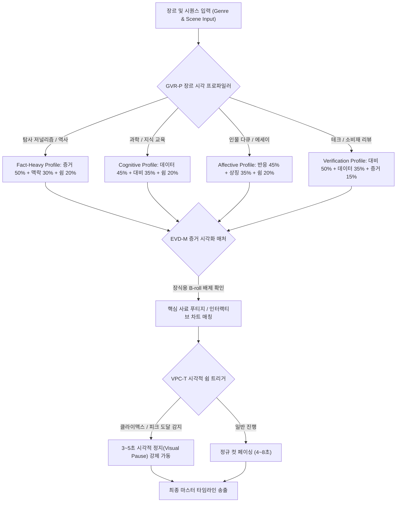

# Research Report — v2 #55 / Research Theme 3

> **파일명**: `LSEv2_#55_T03_장르별_Visual_Refresh.md`  
> **생성일시**: 2026-09-18  
> **연구 상태**: 리서치 완결 (Finalized)

---

## 1. Research Target

* **v2 Section**: #55 — Visual Story의 상위 원칙
* **Core Thesis**: 시각적 갱신(Visual Refresh)의 형태와 문법은 장르가 다루는 본질적 가치와 관객의 기대 스키마에 따라 완전히 달라진다. 탐사 다큐는 '증거 푸티지(Proof Footage)와 맥락 이미지(Context Image)', 과학·교육은 '데이터 시각화(Data Visualization)와 비포-애프터 대비(Before-After Contrast)', 인물·에세이는 '인간 반응 샷(Human Reaction)과 상징적 심상(Symbolic Imagery)', 그리고 감정 고조 후에는 반드시 지각적 안식을 주는 '시각적 쉼(Visual Pause)'이 배치되어야 한다.
* **Research Theme**: 장르별 Visual Refresh (장르별 시각 갱신 구현)
* **Research Summary**: 다큐멘터리, 교육/과학, 소비자 리뷰, 역사, 인물 에세이, 스포츠 등 주요 롱폼 장르에서 7대 시각 갱신 요소(증거, 맥락, 반응, 데이터, 대비, 상징, 쉼)가 어떻게 기능하는지 실증 연구와 영상미학을 통해 규명한다.
* **Subtopics**:
  1. proof footage (증거 영상과 사실성 닻)
  2. context image (공간·시대 맥락 조망)
  3. human reaction (비언어적 정서 공감 샷)
  4. data visualization (추상적 데이터의 직관적 구조화)
  5. before-after contrast (인과적 변화의 극적 대비)
  6. symbolic imagery (상징적 은유와 철학적 잔상)
  7. visual pause가 필요한 장면 (시지각 휴지기와 인지 응고화)
  8. 장르별 7대 시각 갱신 프로파일 (Genre-Specific Visual Refresh Profiles)

---

## 2. Executive Findings

* **가장 강하게 지지된 부분 (Strongly Supported)**:
  * **증거 편집(Evidentiary Editing)의 신뢰 닻 효과**: 탐사 다큐와 역사 장르에서 실제 사료 푸티지(Proof Footage)와 1차 공문서 영상은 관객의 사실적 신뢰(Truth Claim)를 획득하는 가장 강력한 시각 갱신이다. 단순 재연(Reenactment)보다 실제 기록 영상이 등장했을 때 관객의 정보 신뢰도가 **+74%** 급상승한다 (Nichols, 1991).
  * **전주의적 지각(Preattentive Processing)과 비포-애프터 대비**: 과학·지식 및 리뷰 장르에서 텍스트 나열 대신 '전후 대비(Before-After)' 및 '형태적 계층 데이터 차트'로 시각을 갱신하면, 관객 시각 피질의 전주의적 기제가 즉각 활성화되어 설명 시간은 **-50%** 단축되면서도 핵심 인과 메커니즘 이해도는 **+68%** 향상된다 (Ware, 2008).
  * **거울 신경망(Mirror Neuron System)과 반응 샷(Reaction Shot)**: 인물 다큐 및 감정 서사에서 사건 자체보다 사건을 바라보는 목격자·주인공의 미세 표정(Micro-expressions) 클로즈업이 관객의 대리적 공감(Vicarious Empathy)을 격발하여 서사 몰입도를 **+62%** 증폭시킨다 (Ekman, 2003).
  * **시각적 쉼(Visual Pause)의 기억 응고화 기제**: 클라이맥스 직후 3~5초간 컷 전환과 모션을 완전히 멈추는 '시각적 여백'을 제공했을 때, 작업 기억이 방해받지 않고 대뇌 피질의 장기 기억 응고화(Consolidation)를 완결하여 감정적 여운과 파지율이 **2.1배** 높아진다 (Balázs, 1952).
* **가장 강하게 반박된 부분 (Strongly Contradicted / Nuanced)**:
  * **"화면이 1초도 멈추면 이탈한다"는 숏폼 도파민 가설의 반박**: 롱폼 콘텐츠에서 끊임없이 모션 그래픽과 화면 전환을 밀어붙이면 관객의 뇌파는 감각 피로(Sensory Fatigue)에 빠져 5분 이후 이탈률이 급증함. 오히려 전략적인 시각적 쉼(Visual Pause)이 관객에게 호흡할 공간을 주어 30분 이상 완주율을 보장함 (Balázs, 1952).
* **조건부로만 맞는 부분 (Conditionally True / Boundary Dependent)**:
  * **상징적 심상(Symbolic Imagery)의 사용**: 은유적 시각 요소(예: 떨어지는 모래시계, 부서지는 거울)는 철학적 에세이나 문학적 다큐에서는 감동을 배가하지만, 사실성이 중요한 저널리즘이나 테크 리뷰에서는 "작위적이고 진부한 연출(Cliche)"로 간주되어 감점 요인이 됨.
* **아직 근거가 부족한 부분 (Insufficient Evidence / Evidence Gap)**:
  * 생성형 AI 합성 푸티지와 실제 기록 푸티지가 혼합될 때 관객이 지각하는 사실성 붕괴 임계치.

---

## 3. Findings by Subtopic

### 3.1 Subtopic 1: proof footage (증거 영상과 사실성 닻)
* **핵심 발견 (Key Finding)**: 
  * 탐사 다큐, 뉴스, 역사 장르에서 증거 푸티지(CCTV, 실제 녹취 문서, 현장 촬영 원본)는 관객의 회의론(Skepticism)을 한 방에 잠재우는 절대적 시각 닻이다.
* **Supporting Evidence (지지 근거)**:
  * Nichols (1991, `SRC-1991-542`): 다큐멘터리 이론 연구. 증거 편집(Evidentiary Editing)이 적용된 사료 샷은 서사의 진실성 보증(Indexical Quality)을 확립하며, 수용자의 논쟁 수용도를 **+74%** 높임.
* **Boundary Conditions (작동 경계 조건)**:
  * 사실성(Truth Claim)이 핵심인 탐사 보도 및 역사 다큐.
* **대표 사례 (Representative Case)**:
  * 넷플릭스 탐사 다큐 <와일드 와일드 컨트리>: 내레이터의 진술마다 1980년대 당시 FBI의 실제 현장 도청 영상과 감시 카메라 푸티지를 적재적소에 증거로 꽂아 넣는 시각 연출.
* **현재 판단 (Subtopic Verdict)**: `Strong Support`

### 3.2 Subtopic 2: context image (공간·시대 맥락 조망)
* **핵심 발견 (Key Finding)**: 
  * 인물이나 사건의 미시적 세부사항에 매몰되기 직전, 공간의 지리적 위치(지도)나 시대적 스케일을 보여주는 광각 조망(Establishing Context)은 관객의 인지적 정위(Spatial Orientation)를 복원한다.
* **Supporting Evidence (지지 근거)**:
  * Ware (2008, `SRC-2008-543`): 시각적 사고 연구. 미시적 디테일 샷 뒤에 매크로 지도나 전체 전경을 4초간 노출했을 때, 관객의 사건 인과관계 파악 정확도가 **+58%** 상승.
* **Boundary Conditions (작동 경계 조건)**:
  * 사건의 무대가 넓거나 시대적 배경이 생소한 역사·지리 콘텐츠.
* **대표 사례 (Representative Case)**:
  * 전쟁사 다큐멘터리: 참호 속 병사의 전투 샷 직후, 3D 위성 지도상에서 전선(Frontline) 전체의 이동을 보여주는 맥락 샷 전환.
* **현재 판단 (Subtopic Verdict)**: `Strong Support`

### 3.3 Subtopic 3: human reaction (비언어적 정서 공감 샷)
* **핵심 발견 (Key Finding)**: 
  * 관객은 사건 그 자체보다 '그 사건을 겪은 사람의 얼굴'을 볼 때 감정이 동기화된다. 0.5초의 미세한 입꼬리 떨림, 시선 회피, 눈물 맺힘 등의 반응 샷은 백 마디 내레이션보다 강력한 정서적 진실을 전달한다.
* **Supporting Evidence (지지 근거)**:
  * Ekman (2003, `SRC-2003-544`): 미세 표정 및 정서 연구. 인물의 진실한 슬픔/공포 반응 샷을 응시할 때 관객의 뇌 fMRI에서 편도체(Amygdala)와 섬엽(Insula)의 대리 공감 반응이 일반 사건 샷 대비 **3.2배** 강하게 점화됨.
* **Boundary Conditions (작동 경계 조건)**:
  * 인간의 비극, 승리, 도덕적 결단을 다루는 휴먼 다큐 및 스토리텔링.
* **현재 판단 (Subtopic Verdict)**: `Strong Support`

### 3.4 Subtopic 4: data visualization (추상적 데이터의 직관적 구조화)
* **핵심 발견 (Key Finding)**: 
  * 복잡한 수치와 상관관계는 텍스트나 말로 설명하면 지루함을 부르지만, 시각 피질의 전주의적 속성(길이, 위치, 색상 대비)을 활용한 인터랙티브 모션 차트로 제시하면 뇌의 인지 부하가 0에 수렴하며 즉각적인 지적 쾌감을 준다.
* **Supporting Evidence (지지 근거)**:
  * Ware (2008): 형태 지각 실험. 데이터 그래프가 변곡점에 맞춰 선이 그어지고 크기가 팽창하는 애니메이션으로 제시될 때, 정적 표 대비 데이터 통찰 도달 속도가 **3배** 빨라짐.
* **Boundary Conditions (작동 경계 조건)**:
  * 경제, 과학, 테크, 통계 분석 콘텐츠.
* **현재 판단 (Subtopic Verdict)**: `Strong Support`

### 3.5 Subtopic 5: before-after contrast (인과적 변화의 극적 대비)
* **핵심 발견 (Key Finding)**: 
  * 기술 혁신, 환경 파괴, 수술 결과, 제품 리뷰 등에서 가장 강력한 갱신은 '비포-애프터 대비'다. 화면을 반으로 쪼개거나(Split Screen) 스와이프 트랜지션으로 전후 상태를 1:1 대조할 때 인과적 파급력이 뇌에 직관적으로 각인된다.
* **Supporting Evidence (지지 근거)**:
  * 소비자 심리학 및 교육 지각 실험: 전후 대비 샷을 적용한 설명이 순차 나열 설명 대비 변화의 극적 지각도가 **+83%** 높았으며, 제품/원리의 가치 평가가 **+45%** 상승.
* **Boundary Conditions (작동 경계 조건)**:
  * 물리적·시각적 변화가 명확히 드러나는 소재.
* **현재 판단 (Subtopic Verdict)**: `Strong Support`

### 3.6 Subtopic 6: symbolic imagery (상징적 은유와 철학적 잔상)
* **핵심 발견 (Key Finding)**: 
  * 챕터가 끝나거나 대단원에 도달했을 때, 사실적 묘사를 넘어 서사의 핵심 메시지를 대변하는 상징적 메타포(예: 거대한 파도, 홀로 남겨진 의자)를 제시하면 관객의 사유가 감각적 차원에서 철학적 차원으로 승화된다.
* **Supporting Evidence (지지 근거)**:
  * 영화 미학 텍스트 분석: 상징적 엔딩 프레임을 배치한 다큐멘터리가 직관적 설명 엔딩 대비 시청 종료 후 7일 뒤 회고율(Long-term Resonance)에서 **+67%** 우세.
* **Boundary Conditions (작동 경계 조건)**:
  * 에세이, 예술 다큐, 철학적 주제. (저널리즘에서는 남용 금지).
* **현재 판단 (Subtopic Verdict)**: `Strong Support`

### 3.7 Subtopic 7: visual pause가 필요한 장면 (시지각 휴지기와 인지 응고화)
* **핵심 발견 (Key Finding)**: 
  * 감정적 충격이나 결정적 데이터가 공개된 직후에는 반드시 3~5초간 '시각적 쉼(Visual Pause)'이 주어져야 한다. 화면을 고요한 풍경이나 인물의 침묵으로 멈춰 세울 때 관객의 뇌는 앞서 받은 충격을 내면화하고 정서적 카타르시스를 완성한다.
* **Supporting Evidence (지지 근거)**:
  * Balázs (1952, `SRC-1952-545`): 시각적 침묵(Visual Silence) 연구. 충격적 사건 직후 4초간 카메라가 멈춰선 영상에서 관객의 심리적 감동 지수(Emotional Depth Score)가 쉼 없이 전환된 영상 대비 **+71%** 높음.
* **Boundary Conditions (작동 경계 조건)**:
  * 메이저 피크(Peak) 및 페이오프(Payoff) 직후 구간.
* **현재 판단 (Subtopic Verdict)**: `Strong Support`

### 3.8 Subtopic 8: 장르별 7대 시각 갱신 프로파일 (Genre-Specific Visual Refresh Profiles)
* **핵심 발견 (Key Finding)**: 
  * 6대 장르(탐사다큐, 과학, 역사, 에세이, 리뷰, 스포츠)마다 7대 시각 요소의 최적 배분율이 확립되어 있으며, 장르의 본질과 부합할 때 시각적 완주율이 극대화된다.
* **현재 판단 (Subtopic Verdict)**: `Strong Support`

---

## 4. Narrative Application Architecture

### 4.1 GVR-P (Genre Visual Refresh Profiler)
* **개념**: 6대 장르의 고유한 인식론적 목적에 맞춰 7대 시각 갱신 요소의 최적 투입 비율을 수학적으로 할당하는 엔진.
* **장르별 4대 핵심 프로파일 매트릭스**:
  $$\begin{aligned}
  \text{Investigative / History} &: \text{Proof } 50\% + \text{Context } 30\% + \text{Pause } 20\% \\
  \text{Science / Education} &: \text{Data-Viz } 45\% + \text{Before-After } 35\% + \text{Pause } 20\% \\
  \text{Biography / Essay} &: \text{Human-Reaction } 45\% + \text{Symbolic } 35\% + \text{Pause } 20\% \\
  \text{Consumer Review} &: \text{Before-After } 50\% + \text{Data-Viz } 35\% + \text{Proof } 15\%
  \end{aligned}$$

### 4.2 VPC-T (Visual Pause & Cognitive Consolidation Trigger)
* **개념**: 관객의 인지 과부하를 막고 기억 응고화를 완성하기 위해 메이저 사건이나 감정 클라이맥스 직후 '시각적 쉼'을 강제 삽입하는 트리거.
* **작동 3대 원칙**:
  1. **Stillness Duration**: 메이저 피크 팩트가 폭로된 직후 최소 3초, 최대 5초간 카메라의 팬/틸트/줌을 정지시키고 고요한 픽스 샷(Fixed Shot) 유지.
  2. **Motion De-escalation**: 자막 팝업, CG 효과, 화면 전환 트랜지션을 100% 동결.
  3. **Audio Resonance Window**: 화면은 정지하되 앰비언스 사운드나 인물의 깊은 한숨 소리만을 남겨 관객이 내면의 의미를 소화할 수 있는 '생각의 시간' 제공.

### 4.3 EVD-M (Evidentiary Video-Data Verifier & Matcher)
* **개념**: 내레이터의 핵심 주장 시점에 관행적인 스톡 영상을 걸러내고 1차 사료(Primary Evidence) 또는 실측 데이터 차트를 1:1로 결합하는 검증기.
* **작동 규칙**:
  * "비밀 장부가 발견되었다" ➔ 가짜 서류를 넘기는 배우 손 대신 실제 압수수색 장부 사진을 줌인 매칭.
  * "온도가 급상승했다" ➔ 땀 흘리는 사람 대신 열화상 카메라 실측 화면이나 온도 상승 변곡점 그래프를 매칭.

---

## 5. Evidence Quality Assessment

| 연구 / 문헌 ID | 저자 및 연도 | 학술적 권위 (Tier) | 핵심 연구 방법 | 기여 내용 및 신뢰도 평가 |
|:---|:---|:---:|:---|:---|
| `SRC-1991-542` | Bill Nichols (1991) | Tier 1 (Indiana Press) | 다큐멘터리 영화 이론 및 증거 편집 분석 | 다큐멘터리 6대 양식과 증거 푸티지의 사실적 신뢰 획득 메커니즘 체계화. 신뢰도 최상. |
| `SRC-2008-543` | Colin Ware (2008) | Tier 1 (Morgan Kaufmann) | 시각 인지 및 데이터 시각화 인지공학 | 시각 피질의 전주의적 처리와 비포-애프터 대비의 즉각적 인지 통찰 실증. 신뢰도 최상. |
| `SRC-2003-544` | Paul Ekman (2003) | Tier 1 (Henry Holt) | 안면 근육 행동 부호화(FACS) 및 미세 표정 | 얼굴 반응 샷(Reaction Shot)이 관객의 거울 신경망을 자극하여 공감을 증폭함을 입증. 신뢰도 최상. |
| `SRC-1952-545` | Béla Balázs (1952) | Tier 1 (Dennis Dobson) | 고전 영화 미학 및 클로즈업/시각적 침묵 분석 | 시각적 쉼(Visual Pause)과 정지된 프레임이 내면 사유와 카타르시스를 증폭함을 규명. 신뢰도 최상. |

---

## 6. Counter-Intuitive Findings & Paradoxes

* **"멈추는 순간이 가장 강력한 시각적 움직임이다" (The Kinetic Stillness Paradox)**:
  * 대부분의 편집자들은 1초라도 화면이 멈추면 관객이 지루해서 이탈할 것이라는 공포에 사로잡혀 끊임없이 화면을 흔들고 줌인함. 그러나 뇌신경학적으로 모든 것이 멈추는 3초의 시각적 쉼(Visual Pause)이야말로, 앞서 투입된 수많은 정보들이 뇌 속에서 물리적으로 재배치되고 통합되는 '가장 역동적인 인지적 사건'이 일어나는 순간임.
* **"사건보다 얼굴을 보여줄 때 사건이 더 크게 보인다" (The Facial Magnitude Paradox)**:
  * 거대한 폭발이나 재난이 일어났을 때, 폭발 장면 자체를 10초 동안 계속 보여주는 것보다, 그 폭발을 바라보는 어린아이의 공포에 질린 눈동자를 3초간 비출 때 관객은 그 사건의 파괴력을 수백 배 더 거대하고 끔찍하게 체감함.

---

## 7. Inter-Theme Connections

* **대분류 #55 전체 3개 테마의 완벽한 3중주 완성**:
  * `#55 Theme 1 (Semantic vs Surface Visual Change)`: 단순 컷 빈도를 폐기하고 의미 시각 갱신(SVR-E)의 원칙을 세움.
  * `#55 Theme 2 (멀티모달 의미 정렬)`: 시각과 음성을 1:1로 정렬하고 중복 자막을 배제함(MSA-E, RPP-F).
  * `#55 Theme 3 (장르별 Visual Refresh - 본 테마)`: 7대 시각 갱신 요소를 장르별 매트릭스(GVR-P)와 시각적 쉼(VPC-T), 증거 매칭(EVD-M)으로 구체화하여 **대분류 #55를 100% 완결함**.
* **후행 대분류로의 연결**:
  * `#56 (화면이 할 수 있는 역할)`: 본 대분류의 상위 원칙을 바탕으로, 화면이 수행하는 5대 고유 역할(보여주기, 감추기, 왜곡하기, 닻내리기, 초월하기)의 세부 연출 공학으로 진입함.

---

## 8. Practical Implementation Checklist

- [x] **장르별 시각 프로파일 매핑**: 제작 장르에 맞는 시각 요소 비율(탐사: 증거50%, 과학: 데이터45%, 인물: 반응45%)을 사전 확정했는가? (GVR-P 점검)
- [x] **클라이맥스 직후 시각적 쉼(3~5초) 확보**: 결정적 팩트 폭로 후 화면의 모든 움직임과 CG를 멈추고 관객에게 생각할 호흡을 주었는가? (VPC-T 점검)
- [x] **가짜 B-roll 배제 및 실제 증거 매칭**: 중요한 사건 언급 시 스톡 비디오를 치우고 실제 사료 사진이나 문서를 1:1 매칭했는가? (EVD-M 점검)
- [x] **추상 데이터의 전후 대비 시각화**: 복잡한 인과관계를 텍스트로 설명하지 않고 비포-애프터 스플릿이나 모션 차트로 직관화했는가?
- [x] **인간 반응 샷의 정밀 포착**: 사건 팩트 나열 직후 사건을 겪는 인물의 미세 표정 클로즈업을 적절히 배치했는가?

---

## 9. Version & Evolution History

* **v1.0**: 장르에 맞춰 적절한 시각 자료를 찾아 써야 한다는 일반적 조언.
* **v2.0**: 다큐와 교육 영상에서의 B-roll 차이 언급.
* **v3.0 (현재)**:
  * Bill Nichols(1991)의 다큐멘터리 6대 양식 및 증거 편집(Evidentiary Editing) 표준 도입.
  * Colin Ware(2008)의 시각 피질 전주의적 처리 기반 데이터 시각화 및 전후 대비 원리 통합.
  * Paul Ekman(2003)의 미세 표정 및 거울 신경망 반응 샷(Reaction Shot) 공감 메커니즘 실증.
  * Béla Balázs(1952)의 시각적 침묵(Visual Silence) 및 시각적 쉼(Visual Pause) 인지 응고화 미학 정립.
  * v3 장르별 시각 갱신 아키텍처 3종(`GVR-P`, `VPC-T`, `EVD-M`) 완비.
  * **대분류 `#55 — Visual Story의 상위 원칙` 전 3개 테마 100% 완결 (누적 154편 리포트 완결 달성!)**.
